# Análisis y notificaciones

## Navegar por el entorno

### Tutoriales en vídeo

**Actividad comercial** — Planifica toda tu actividad comercial.

  <iframe src="https://www.youtube.com/embed/MDseTany64U" frameborder="0" allowfullscreen></iframe>

**Autor:** Daniel Lutz

**Coberturas** — Define la cobertura de tus cuentas para cumplimentar objetivos y fidelizar a los clientes.

  <iframe src="https://www.youtube.com/embed/55CmhTpKhdA" frameborder="0" allowfullscreen></iframe>

**Autor:** Daniel Lutz

**Objetivos** — Define los objetivos de tu equipo de comerciales.

  <iframe src="https://www.youtube.com/embed/UvIsvcf_84w" frameborder="0" allowfullscreen></iframe>

**Autor:** Daniel Lutz

Una vez hemos iniciado sesión accederemos al CRM y visualizaremos un panel de inicio (*Dashboard*) o cuadro de mando en el que, de un solo vistazo al gráfico de embudo, podremos conocer la situación en tiempo real de nuestras oportunidades.

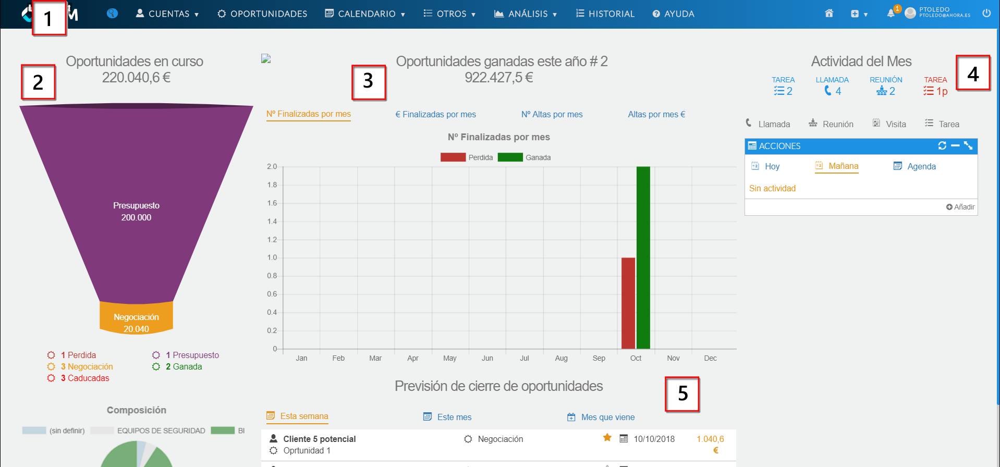
*Fig.1 - Panel de inicio (Dashboard).*

- Barra superior, menú de navegación.
- Embudo (funnel plot o sales funnel).
- Gráficos de oportunidades finalizadas y altas.
- Actividad del mes.
- Previsión de cierre.

La barra de menú de navegación nos proporcionará el acceso a todas las funcionalidades disponibles en el CRM: buscador, cuentas, oportunidades, calendario, otros, análisis, historial, ayuda, inicio, botón **+**, avisos, información de usuario y configuración, y botón de desconexión.

El buscador de la aplicación se activará en el momento en que nos posicionemos sobre él con el ratón.

*Fig.3 - Buscador.*

Podremos buscar cualquier contenido en la caja de texto y nos devolverá todas las coincidencias que encuentre.

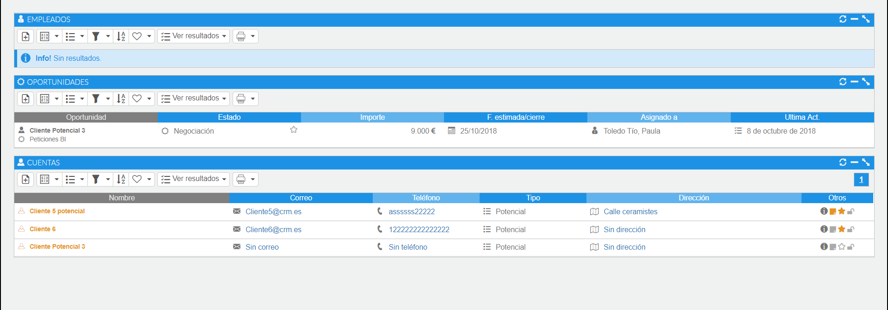
*Fig.4 - Resultados del buscador.*

## Embudo

El embudo de ventas nos ayudará a visualizar las fases de la venta, medir y conocer mucho mejor a los clientes potenciales.

Es el proceso por el que las oportunidades potenciales de venta son cualificadas y seleccionadas para convertirlas en oportunidades reales que terminan en transacciones reales.

Una operación saldrá del embudo si es rechazada o aceptada. Los colores más cálidos corresponden a la salida del embudo, y los fríos al inicio.

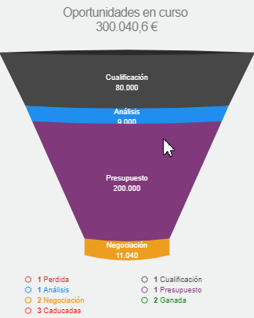
*Fig.5 - Embudo.*

## Gráficos de oportunidades finalizadas y altas

En la sección central disponemos de un contenedor con cuatro gráficos que nos aportan, de un solo vistazo, la información relativa a oportunidades dadas de alta y finalizadas, así como sus estados mediante una leyenda de color.

Estos cuatro gráficos, además de facilitarnos el análisis de forma visual, permiten realizar comparativas entre los distintos estados de la oportunidad: podemos excluir los estados pulsando sobre la leyenda, lo que ocultará las barras que hayamos seleccionado.

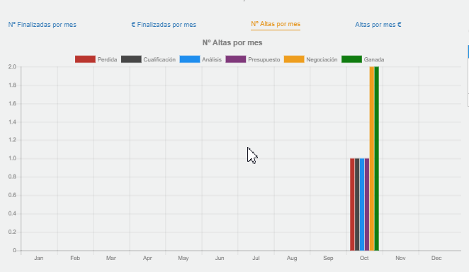
*Fig.6 - Gráficas panel de inicio.*

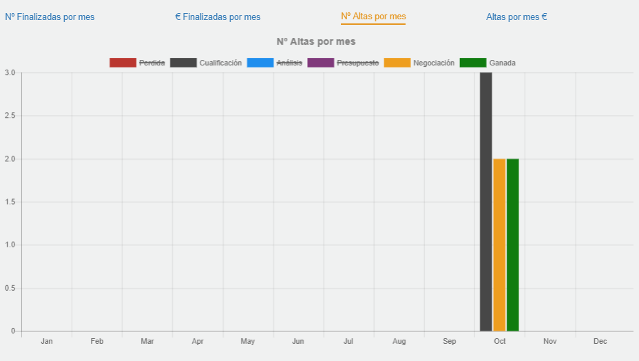
*Fig.7 - Gráficas panel de inicio.*

## Actividad del mes

En el apartado de la derecha se encuentran las herramientas de gestión comercial: un resumen de la actividad que hemos realizado en el mes, y un calendario con tres modos que podemos alternar entre ver la actividad de hoy, de mañana y la agenda en el calendario.

En el panel superior encontraremos, a modo de título y resumen, la actividad realizada en el mes a fecha de hoy. Si se nos quedó algo pendiente de realizar, saldrá en rojo, sea de este mes o de uno anterior. Si hacemos clic en cualquiera de los resúmenes, podremos consultar el listado de actividad correspondiente a la casilla.

Además de un resumen de las actividades pendientes y completadas a fecha de hoy, mañana y en el mes, disponemos de accesos directos para dar de alta cualquier tipo de actividad de forma rápida y eficaz.

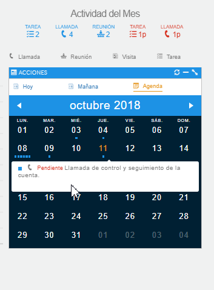
*Fig.8 - Actividad del mes.*

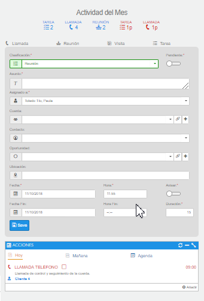
*Fig.9 - Actividad del mes.*

## Previsión de cierre

En la parte inferior del Dashboard tenemos un resumen en forma de lista y por períodos de tiempo.

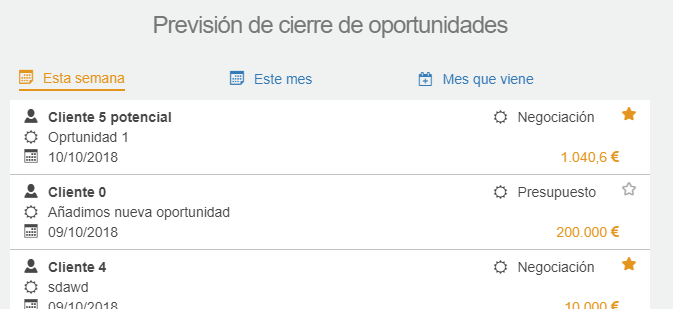
*Fig.10 - Previsión de cierre.*

## Notificaciones

En la parte superior derecha tenemos el símbolo de una campana que se ilumina cuando el sistema nos avisa de algún acontecimiento.

En este caso, cada semana nos avisará de las oportunidades cuya fecha de vencimiento se encuentre en los próximos 7 días, siempre que estemos asignados a la oportunidad, siendo responsables, supervisores o seguidores de la misma.

Podremos acceder a esta lista haciendo clic directamente en el aviso. Para indicar que hemos leído el aviso, pulsaremos el botón **OK**.

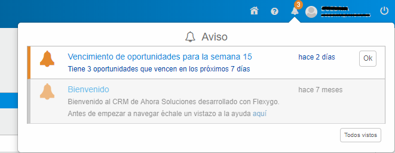
*Fig.11 - Alerta de oportunidades que vencen en los próximos 7 días.*

## Análisis de datos de ventas y cobros

Si disponemos del producto AHORA ERP, en el menú de Análisis-Ventas y cobros, pulsando en Global, nos encontraremos con un panel de información extraída de la gestión del ERP.

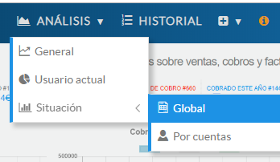
*Fig.12 - Acceso.*

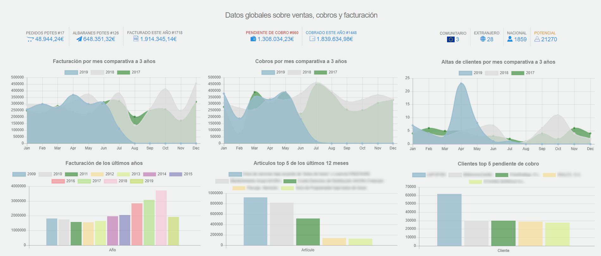
*Fig.13 - Dashboard de ventas, cobros y facturación.*

Esta información nos indica cantidades e importes de pedidos pendientes, albaranes, cobros, clientes por tipos, etc.

## Análisis de datos de ventas y cobros agrupado por clientes

En el menú de Análisis-Ventas y cobros, pulsando en Por cuentas, se nos da la posibilidad de realizar un filtrado de cuentas, donde veremos una serie de informes y gráficas relativas a pedidos, albaranes, facturas y cobros.

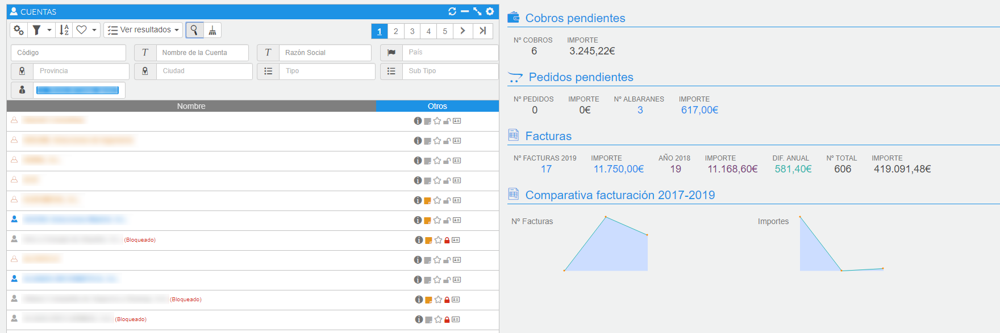
*Fig.14 - Filtrado de información filtrando cuentas.*

## Análisis de datos de cobros y facturación para un cliente en concreto

Desde la ficha de un cliente, en el apartado superior tenemos la opción **+Info**, que nos permitirá acceder a la información relativa a pedidos, albaranes, cobros y facturación que gestiona el producto AHORA ERP.

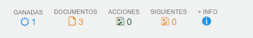
*Fig.15 - Acceso al panel de información ERP de cliente.*

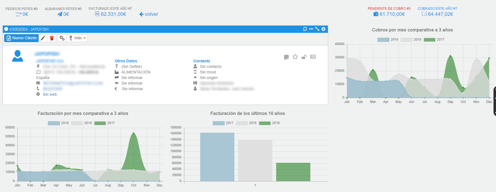
*Fig.16 - Información de cliente.*
