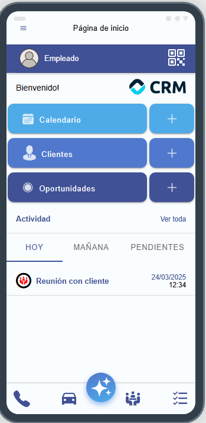
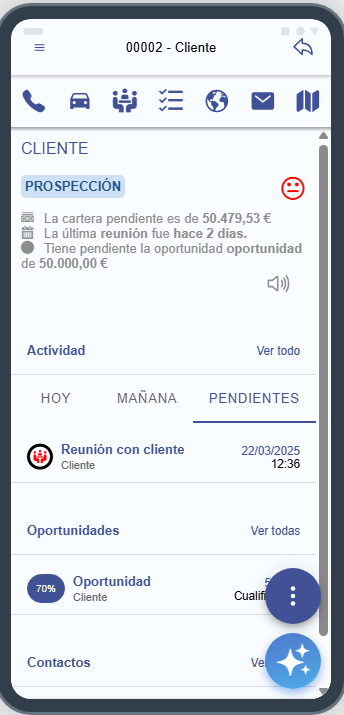

# Aplicación Offline

Con esta utilidad podrá gestionar actuaciones, clientes y oportunidades directamente desde un entorno offline. En este apartado explicaremos cómo trabajar con esta funcionalidad.

## Inicio

La pantalla de inicio de la aplicación está organizada en estas secciones principales:

1. **Calendario**: permite acceder al listado de actuaciones y dar de alta una nueva actuación.
2. **Clientes**: permite acceder al listado de clientes y dar de alta un nuevo cliente.
3. **Oportunidades**: permite acceder al listado de oportunidades y dar de alta una nueva oportunidad.
4. **Actividad**: permite visualizar rápidamente las actuaciones pendientes para hoy, mañana y aquellas pendientes en otra fecha.

Además, en esta pantalla también podrás encontrar:

- **Asistente IA**: un botón que abre el asistente de inteligencia artificial de la aplicación, diseñado para ayudarte con tu gestión comercial. Para más información puedes consultar la sección [Inteligencia artificial](Inteligencia%20artificial.md).
- **QR de contacto**: en la parte superior de la pantalla encontrarás un código QR con tus datos de contacto, que te permitirá compartir tu información de manera rápida y sencilla con otros usuarios, simplemente escaneando el código con su dispositivo móvil.
- **Accesos directos**: botones para dar de alta actuaciones rápidamente.

*Fig.1 - Pantalla de inicio.*

## Calendario

En esta sección puedes gestionar tus actuaciones. Desde aquí puedes:

- Ver tus actuaciones.
- Dar de alta nuevas actuaciones.
- Editar actuaciones.
- Eliminar actuaciones.

## Clientes

En esta sección puedes gestionar tus clientes. Desde aquí puedes:

- Ver tus clientes.
- Dar de alta nuevos clientes.
- Editar clientes.
- **Eliminar clientes**: solo podrás eliminar aquellos clientes que hayas dado de alta en la aplicación offline.
- Añadir notas del cliente.
- Dar de alta actuaciones y oportunidades.
- **Asistente IA**: un botón que abre el asistente de inteligencia artificial de la aplicación, diseñado para ayudarte con tu gestión comercial. Para más información puedes consultar la sección [Inteligencia artificial](Inteligencia%20artificial.md).
- **Resumen del cliente**: al acceder a un cliente veremos un pequeño resumen del estado del cliente y la posibilidad de reproducirlo por audio.
- **Accesos directos**: botones para dar de alta actuaciones rápidamente, ver la página del cliente, acceder al correo electrónico y ver la ubicación.

*Fig.2 - Pantalla de cliente.*

## Oportunidades

En esta sección puedes gestionar tus oportunidades. Desde aquí puedes:

- Ver tus oportunidades.
- Dar de alta nuevas oportunidades.
- Editar oportunidades.
- Dar de alta actuaciones.
- **Dar de alta ofertas**: desde este apartado puedes dar de alta ofertas tanto a nivel de cabecera como de líneas. **Importante**: para obtener el precio de los artículos es necesario contar con una conexión a internet activa; si no tienes acceso a internet tendrás que introducir los precios manualmente.
