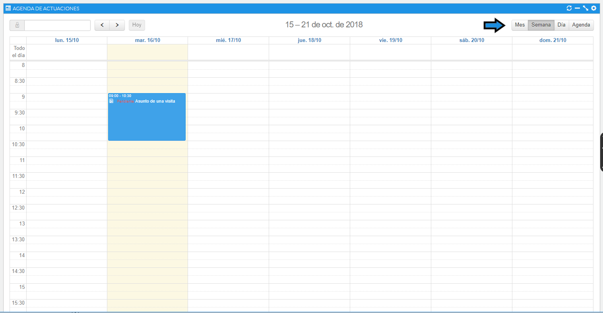
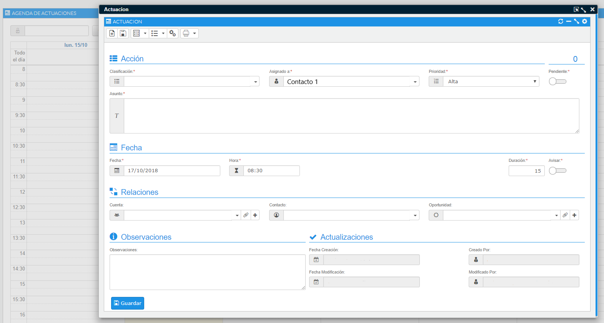
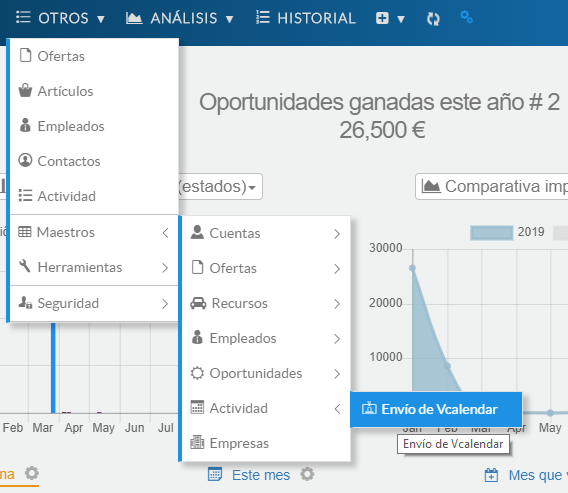
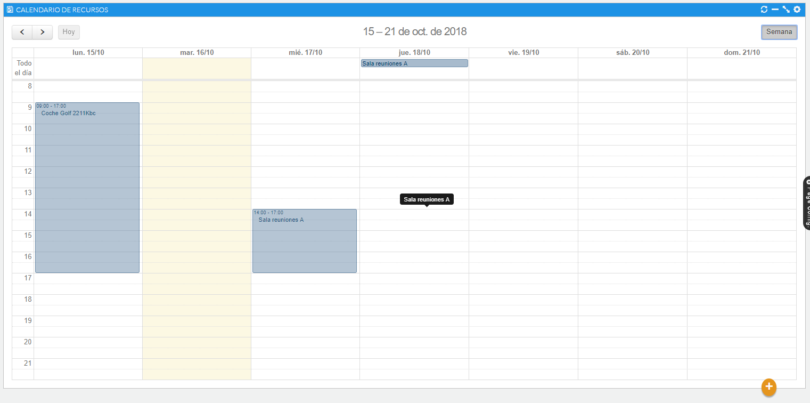

# Calendario

Si pulsamos la sección de calendario desde la barra de navegación superior, encontraremos dos opciones: Actividad y Reservas.

La opción **Actividad** nos mostrará un calendario donde podremos visualizar todas las acciones que hayamos dado de alta, así como añadir las que sean necesarias. Pueden ser de tipo llamada, reunión, tarea o visita, y nos ayudarán a llevar un seguimiento sobre la cuenta. En el Dashboard tenemos una sección que nos muestra el resumen en un timeline.

En el panel del usuario (*Dashboard*) se visualiza a su vez una sección que nos muestra el resumen en una línea de tiempo (*Timeline*).

### Tutoriales en vídeo

**Actividad comercial** — Planifica toda tu actividad comercial.

  <iframe src="https://www.youtube.com/embed/MDseTany64U" frameborder="0" allowfullscreen></iframe>

**Autor:** Daniel Lutz

**Actividad de cobro** — Gestiona los cobros fácilmente.

  <iframe src="https://www.youtube.com/embed/BtU-MWg6jvY" frameborder="0" allowfullscreen></iframe>

**Autor:** Daniel Lutz

El calendario dispone de cuatro tipos de visualización: mes vista, semana vista, día vista y agenda.

Para añadir una actividad, seleccionaremos el día y realizaremos un doble clic que abrirá el formulario de una nueva actuación. Una vez cumplimentada, aparecerá en nuestro calendario.

En el menú superior de la ficha de una actuación se visualiza la barra de acciones. Estas acciones nos permiten crear una actuación nueva, guardar, editar e imprimir.

Algunas acciones, como las visitas y reuniones, permiten enviar un email para sincronizar la actividad con el correo del usuario (el email definido en la ficha de empleado) mediante el estándar vCalendar. Estas acciones se pueden configurar desde el maestro de acciones por un usuario administrador.

*Fig.1 - Calendario de actividades.*

*Fig.2 - Formulario de una actividad.*

*Fig.3 - Configurar envío de vCalendar (solo administradores).*

La funcionalidad **Reservas** servirá para poder reservar los recursos de la organización que tengamos disponibles, como pueden ser vehículos, equipamiento y salas.

Desde la misma vista de calendario, mediante el botón **+**, podremos realizar alta rápida de nuevas reservas.

*Fig.4 - Calendario de reservas.*
