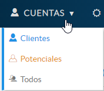
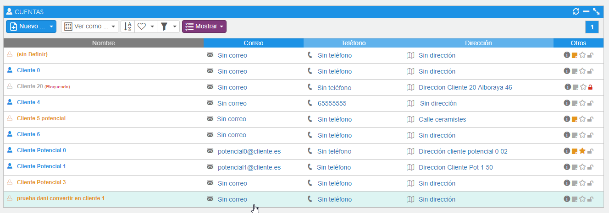
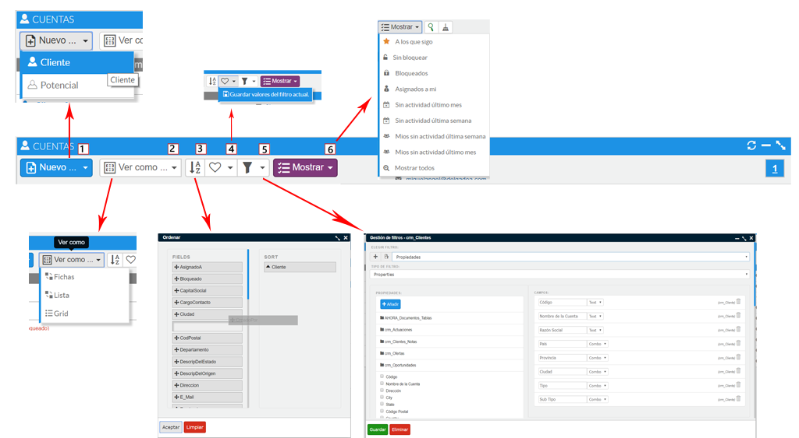
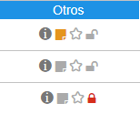
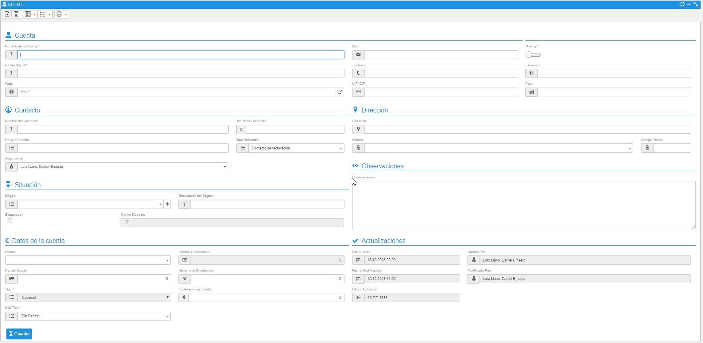

# Cuenta

La opción de cuentas engloba tanto los **clientes** como los **clientes potenciales**. Desde esta opción podremos consultar nuestros clientes, los clientes potenciales, así como visualizarlos todos de forma conjunta.

Si pulsamos la opción de **todos** veremos un listado como el que se muestra a continuación.

*Fig.1 - Opción cuentas.*

### Tutoriales en vídeo

**Definición de cuentas y jerarquía** — En este tutorial veremos cómo funcionan las cuentas, su definición, tipos y jerarquías. Daremos un paseo por el formulario de visualización.

  <iframe src="https://www.youtube.com/embed/Clm9hs8YFX0" frameborder="0" allowfullscreen></iframe>

**Autor:** Daniel Lutz

**Importador de cuentas** — En este vídeo explicaremos cómo importar nuevas cuentas fácilmente a partir de un fichero de texto plano con formato .csv, usando la funcionalidad del CRM Importador de cuentas.

  <iframe src="https://www.youtube.com/embed/Qs4tXT-5MGc" frameborder="0" allowfullscreen></iframe>

**Autor:** Daniel Lutz

*Fig.2 - Listado de cuentas.*

Ahora CRM utiliza un código de colores para identificar los clientes de forma rápida:

- Clientes
- Clientes potenciales
- Clientes bloqueados

En la cabecera del listado tenemos una serie de acciones:

*Fig.3 - Barra de acciones del listado de cuentas.*

- **Botón nuevo** (1), daremos de alta clientes o clientes potenciales.
- **Ver cómo** (2), permite alternar la visualización de las cuentas.
- **Ordenar** (3), abre un formulario para establecer el orden en el que visualizaremos los registros. Arrastraremos los campos a la sección de la derecha y aceptaremos.
- **Guardar valores del filtro actual** (4).
- **Filtro** (5), abrirá un formulario donde podremos configurar de forma sencilla los campos que queremos, guardaremos los cambios y los tendremos disponibles.
- **Menú contextual mostrar** (6), nos facilitará una serie de filtros o análisis predefinidos que agilizarán el trabajo del usuario.

En la visualización del listado de cuentas, en la columna **Otros** tenemos una serie de iconos como accesos directos a una serie de acciones, por cada uno de los registros.

Entre estas acciones se encuentran: la visualización de la ficha, visualización de las notas, marcar como favorito y visualizar si un cliente se encuentra bloqueado mediante el icono del candado. Para el caso de un cliente bloqueado, si pasamos el ratón por encima veremos el motivo del bloqueo.

*Fig.4 - Acciones rápidas por registro.*

## Dar de alta una cuenta

Para dar de alta una cuenta (cliente o potencial), tendremos diferentes caminos para la creación del registro:

- Desde el listado de cuentas, la primera opción en la parte izquierda de la barra de herramientas corresponde a la acción de nuevo cliente o cliente potencial.
- Desde el formulario de visualización de una cuenta, nos volvemos a encontrar en primer lugar la opción de nuevo en la barra de herramientas.
- Desde el formulario de edición de una oportunidad, en el campo **cuenta** está disponible la opción **+** para el nuevo registro de una cuenta.
- Desde el formulario de edición de una oferta, en el campo **cuenta** está disponible la opción **+** para el nuevo registro de una cuenta.
- En todo momento, mientras navegamos por Ahora CRM disponemos de la barra superior, donde el icono **+** permite generar diferentes registros, entre ellos cuentas.

Independientemente de desde dónde accedamos para dar de alta, se abrirá la ficha de la cuenta. En ambos casos de alta (potencial y cliente), el campo tipo saldrá con el valor deshabilitado para que el usuario no tenga que estar pendiente de modificarlo.

La ficha de cliente contiene los siguientes campos a rellenar. Aunque demos de alta un cliente potencial y no sea necesario rellenar todos los campos, cuantos más tengamos cumplimentados, menos datos tendremos que solicitarle al contacto una vez realicemos el proceso de convertirlo en cliente.

También nos servirá para explotar la información de las cuentas en nuestra aplicación de BI (datos demográficos, fechas de inicio, facturación, capital social).

*Fig.5 - Formulario de creación de cuenta.*
