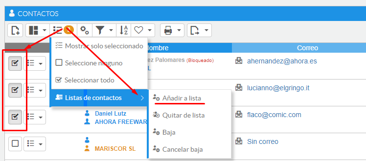
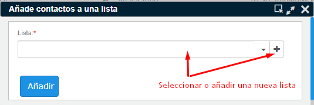
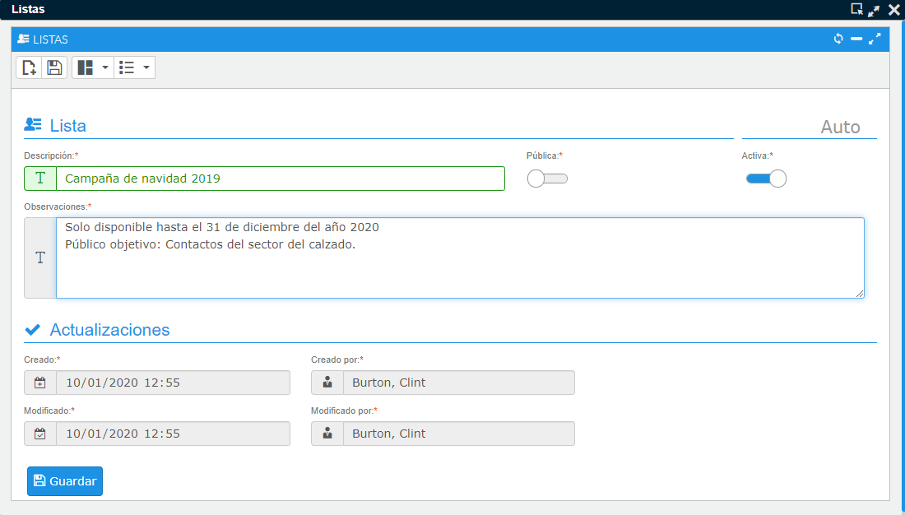
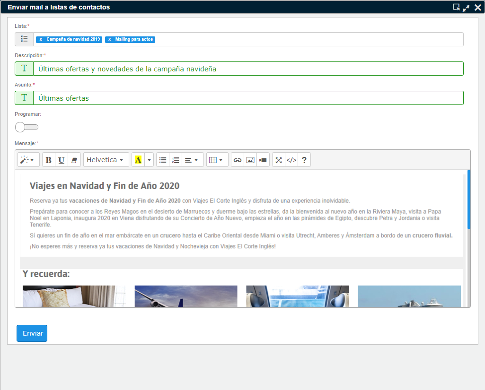
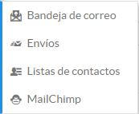
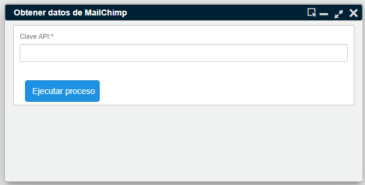
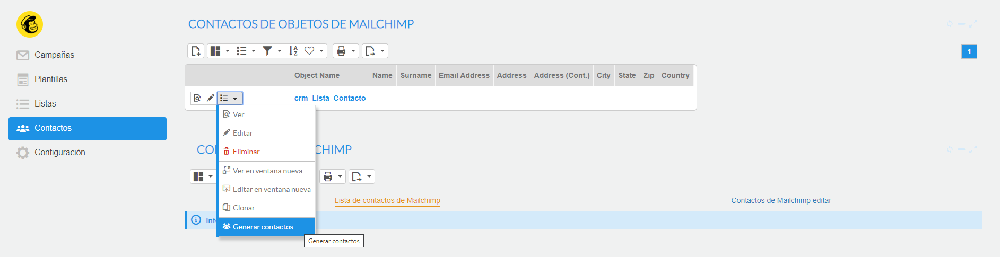
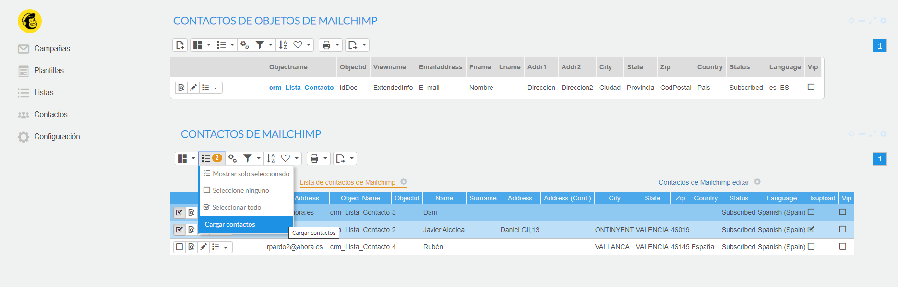
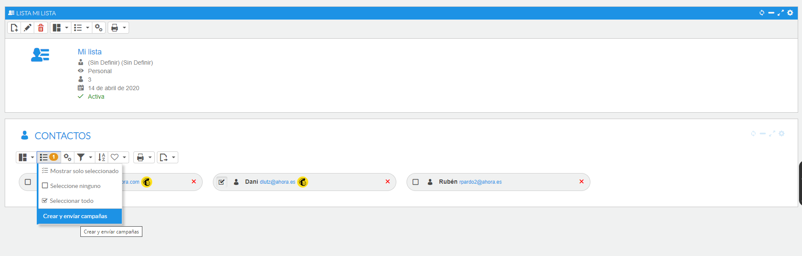
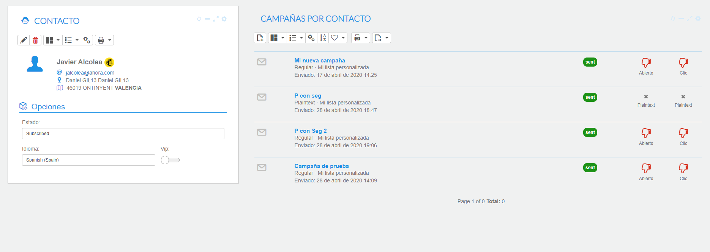

# Envío masivo de correos y listas de contactos

Con esta utilidad podrá generar listas de contacto o listas de público objetivo para generar envíos masivos de correo utilizando los emails de cada contacto.

Cada usuario podrá definir listas de contactos, incluso hacer que estas sean públicas para que puedan ser usadas por otros usuarios de la aplicación.

El uso de estas listas se remite a la gestión de envíos, donde podremos enviar un email a una o varias listas de contactos.

### Tutoriales en vídeo

**Campañas con MailChimp y mucho más** — Aprende a crear contactos asociados a las cuentas y comunícate con tus clientes utilizando las listas de envíos de correo.

  <iframe src="https://www.youtube.com/embed/aCthwESgaIw" frameborder="0" allowfullscreen></iframe>

**Autor:** Daniel Lutz

**Contactos y listas de envíos** — Aprende a crear contactos asociados a las cuentas y comunícate con tus clientes utilizando las listas de envíos de correo.

  <iframe src="https://www.youtube.com/embed/j7xES9tgDx4" frameborder="0" allowfullscreen></iframe>

**Autor:** Daniel Lutz

## Cómo generar una lista de contactos

Primero debe acceder a un listado de cuentas o de contactos, realizar una selección, y desde el menú superior seleccionar **añadir a lista**.

Puede asociar los contactos seleccionados a una o varias listas existentes, o también tiene la opción de crear una lista nueva.

Cuando crea una lista, por defecto se genera como activa, pero en cualquier momento puede dejarla inactiva para que no se pueda utilizar en ningún envío. Además tiene la opción de hacerla visible para otros usuarios activando la opción pública.

*Fig.1 - Selección de contactos o cuentas.*

*Fig.2 - Proceso de asignación de contactos a listas.*

*Fig.3 - Pantalla de creación/edición de lista.*

## Generar un envío

Vaya al menú Otros-Gestión de correos-Envíos.

En la lista de envíos pulse el botón Nuevo envío, presente en la cabecera del formulario de lista. En la pantalla del proceso seleccione las listas que desea utilizar, escriba una descripción, asunto y defina el cuerpo del mensaje. Puede también programar la fecha y hora en la que se realizará el envío.

*Fig.4 - Crear un envío.*

**Cómo funciona**: al generar el envío se genera un email para cada correo de cada contacto de la lista. No se enviarán correos a aquellos contactos que estén bloqueados o dados de baja en el sistema de listas. Un proceso estándar del sistema se encargará de enviar los correos de forma paginada, para intentar evitar que el correo entre en la lista de spam.

Utiliza la cuenta de correo de envío por defecto del sistema, de modo que esta debe estar configurada para que funcione.

Para saber si los correos se han enviado con éxito debe entrar en la pantalla del envío y visualizar el estado de los correos. En el caso de que algún correo haya fallado (seguramente por problemas con el receptor o cuentas de correo inactivas), el sistema lo informará con un mensaje de error.

## Más opciones

En el caso de las cuentas de clientes y potenciales, al añadirlos a la lista se añade el contacto que tiene definido como contacto principal en la ficha de cliente.

En las listas de clientes y contactos puede visualizar rápidamente a qué listas están suscritos, posicionando el cursor sobre el botón de listas. También puede entrar en la ficha del contacto para ver a qué listas se ha añadido.

El sistema también le da la opción de dar de baja contactos del sistema de envíos, para que no sean tenidos en cuenta en los procesos de mailing. Estos serán visibles en la lista mediante un icono en rojo.

## Integración con MailChimp

Ahora ya puede disfrutar de las funcionalidades de MailChimp desde su CRM. En esta sección podrá generar contactos de MailChimp a partir de sus listas de contactos, y modificar, crear o borrar sus campañas, listas o plantillas.

Puede acceder desde el menú **Otros → Gestión de correos**. Inicialmente, en la integración se podrá trabajar con los contactos que se hayan generado a través de las listas de contactos del CRM.

*Fig.5 - Menú Gestión de correos.*

**Primeros pasos**:

- Informe la ApiKey que puede obtener en MailChimp. Si tiene dificultades para generarla, puede obtener información adicional en el [enlace de ayuda de MailChimp sobre claves API](https://mailchimp.com/es/help/about-api-keys/). Este proceso puede tardar varios minutos dependiendo del volumen de información que haya en su cuenta de MailChimp. Tras informar la ApiKey se importará la información principal relacionada con las listas, plantillas y campañas. A través de los procesos *Obtener campañas*, *Obtener plantillas*, *Obtener listas* y *Obtener información de la campaña* podrá sincronizar la información posteriormente.

*Fig.6 - Informar clave API.*

- Lance el proceso de generación de contactos para crearlos a partir de los contactos que tiene en las listas del CRM. Una vez generados, puede subirlos a MailChimp. Aquellos contactos subidos correctamente tendrán el check marcado en "IsUpload".

*Fig.7 - Generar contactos.*

*Fig.8 - Subir contactos.*

- En el área de listas de contactos del CRM tiene la opción de crear y enviar campañas a los contactos que desee. También tiene la posibilidad de visualizar la información relacionada con ese contacto haciendo clic en el icono de MailChimp.

*Fig.9 - Crear y enviar una campaña.*

*Fig.10 - Información de contacto.*
