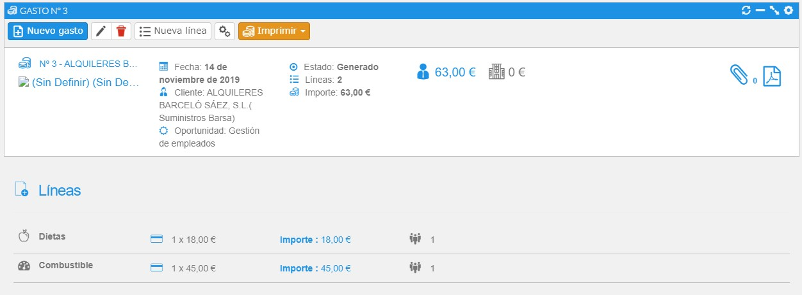
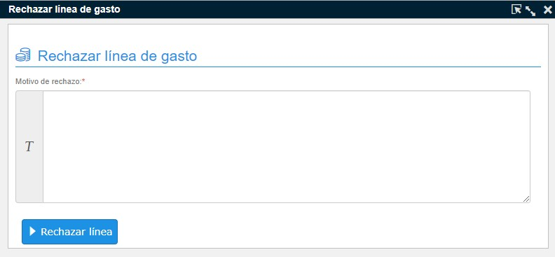
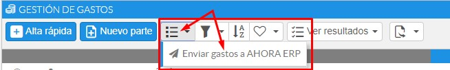
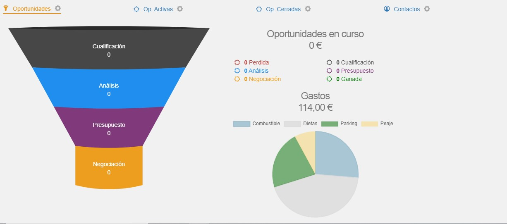
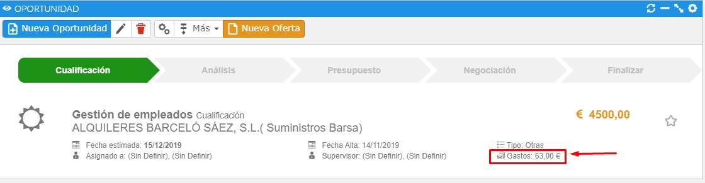

# Gastos

Llamamos gasto a la actividad comercial que implica un reembolso al empleado o a la empresa. Por ejemplo, el uso o alquiler de un vehículo, la compra de combustible, dietas o pernoctas. En este apartado explicaremos cómo trabajar con esta funcionalidad.

### Tutoriales en vídeo

**Gestión de gastos** — Aprende a gestionar y liquidar los gastos imputados por todo tu equipo de ventas.

  <iframe src="https://www.youtube.com/embed/nTn3ZgFabeI" frameborder="0" allowfullscreen></iframe>

**Autor:** Daniel Lutz

**Imputación de gastos** — Aprende a ingresar tus gastos y tickets al sistema.

  <iframe src="https://www.youtube.com/embed/zOQkEAk6gwQ" frameborder="0" allowfullscreen></iframe>

**Autor:** Daniel Lutz

## Configuración de gastos

En el apartado de Otros-Maestros-Gastos encontramos dos opciones: **Tipos de gastos** y **Tipos de pago**. Por defecto el sistema proporciona un conjunto de registros ya predefinidos o estándar.

**Tipos de gasto**: el tipo explica brevemente en qué consiste el gasto, puede ser por alojamiento, dietas, combustible, etc. Puede establecer el comportamiento de cada tipo de gasto a la hora de informarlo en un parte, como pueden ser su visibilidad en los desplegables, el importe por defecto, si el importe es editable o el tipo de pago por defecto. También puede aplicar un importe por defecto a partir de una fecha específica: en función de la fecha del parte se incluirá un importe u otro. Por ejemplo, si en enero de 2020 el importe por kilometraje aumenta de 0,21€ a 0,25€, deberá poner como importe 0,25€, aplicar desde 01/01/2020, y en importe anterior poner 0,21€.

**Tipos de pago**: indica con qué método ha sido abonado el importe en el establecimiento, y si este corre por cuenta del empleado o de la empresa. Por ejemplo, podemos especificar si el gasto se efectuó con una tarjeta de débito de empresa o particular del empleado, de modo que a la hora de reembolsar los gastos podamos diferenciar si el gasto corrió por cuenta de la empresa o por cuenta del empleado.

## Acceso

Cada usuario podrá acceder a su lista de gastos desde el menú Gastos-Mis gastos. También tiene la opción de filtrar los gastos por diferentes criterios utilizando las opciones de filtro (por cliente, tipo, fecha, etc.) o con los accesos rápidos que brinda el botón ver resultados.

## Imputación de gastos

Se pueden imputar desde diferentes puntos de la aplicación:

- Desde el menú superior, con el icono **+**.
- Desde la lista de gastos (menú Gastos-Mis gastos) tendremos un botón de alta rápida, útil cuando tenemos automatizado el comportamiento de los tipos de gastos.

<flx-navbutton type="execprocess" processname="CRM_Gasto_GenerarGastoFast" objectname="crm_Gastos" objectwhere="(crm_Gastos.IdEmpleado=0)" targetid="new" excludehist="false">
    <button class="btn btn-outstanding">Alta rápida</button>
</flx-navbutton>

- Existe un proceso para añadir gastos, tanto desde una oportunidad como desde una cuenta, accesible desde el botón **Más → Añadir gasto**.

Todo gasto, como cualquier línea de detalle, debe ir asociado a una cuenta y opcionalmente a una oportunidad. Por defecto las líneas de gasto heredan la cuenta y la oportunidad de la cabecera, pero pueden ser distintas si el usuario así lo decide.

Pulsando en el clip podrá ver o adjuntar imágenes, como pueden ser los justificantes de las líneas (tickets y facturas). Por último, tendremos la opción de visualizar el informe con el fin de imprimir o generar un PDF.

*Fig.1 - Asistente de introducción rápida de gastos (accesible desde una cuenta o una oportunidad), pantalla de edición de cabecera y líneas, y pantalla de visualización.*

## Estados

Los estados posibles de un parte de gastos son generado, rechazado, aceptado, enviado y recibido.

- **Generado**: estado que adopta el gasto al darlo de alta.
- **Rechazado**: estado que indica el gestor al haber una disconformidad con los importes, estados, etc. En tal caso debe indicar un motivo de rechazo.
- **Aceptado**: estado que indica el gestor para transmitir que es válido y/o que debe ser reembolsado.
- **Enviado**: indica que el sistema, de forma transparente, ha enviado la información del gasto al sistema AHORA ERP.
- **Recibido**: indica que el empleado ha recibido el reembolso correspondiente de cada línea del parte.

El flujo del proceso sería el siguiente: en el momento en que damos de alta el parte de gastos, este se queda en estado generado. Luego un gestor revisa los partes y cambia su estado a aceptado o, en caso de disconformidad, lo rechaza indicando un motivo. En el caso de que se opte por enviar los partes de gasto al sistema AHORA ERP, el sistema los pondrá en estado enviado. Por último, el empleado del parte deberá indicar si ha recibido el reembolso en aquellos partes que han sido aceptados o enviados al sistema AHORA ERP.

## Gestión

Este apartado sirve para la aprobación de los gastos con el fin de reembolsar los importes a los empleados.

Acceden los usuarios con permisos a este apartado específico, ubicado en el menú Gastos-Gestión. Por defecto acceden los usuarios administradores, o cualquier usuario del CRM con la facultad de gestor de gastos.

Una vez dentro de la pantalla de gestión se listan todos los partes de gastos. Se debe acceder a cada parte de gastos y aceptar o rechazar líneas pulsando el botón correspondiente presente en cada registro.

En el encabezado del parte de gastos aparece la información correspondiente: el importe total, el importe a reembolsar al empleado y el importe correspondiente al gasto por parte de la empresa. Para que el gasto sea aceptado se deben aceptar todas las líneas, aunque el importe a reembolsar al empleado sea cero.

En el caso de tener que rechazar una línea, el sistema le pedirá introducir un motivo.

También tenemos la opción de ver y/o adjuntar imágenes, como pueden ser los justificantes de las líneas (tickets y facturas). Por último, tendremos la opción de visualizar el informe con el fin de imprimir o generar un PDF.

*Fig.4 - Rechazar línea de gasto.*

## Envío de datos a AHORA ERP

En el caso de disponer del sistema de gestión AHORA ERP, se puede configurar para que CRM by flexygo envíe los gastos al ERP con la finalidad de derivar la gestión a dicho sistema de información.

Desde la gestión de gastos, pulsando en el botón de procesos, tendrá la opción de enviar datos a AHORA ERP.

*Fig.5 - Enviar gastos al sistema AHORA ERP.*

Para que esto funcione, antes debe definir las correspondencias de datos con el sistema ERP y activar ciertos parámetros, como se describe a continuación.

Los datos, una vez enviados, no se pueden volver a editar; solamente el usuario asignado al parte puede cambiar el estado de la línea a recibido.

### Correspondencias con el sistema ERP

Debe definir los códigos de correspondencia con los gastos de ERP entrando en cada tipo de gasto y tipo de pago, y completar los campos **Referencia ERP** y **Domiciliación ERP**.

- **Referencia ERP**: dato correspondiente al `IdTipoGasto` en la tabla `TiposGastos_Definiciones`.
- **Domiciliación ERP**: dato correspondiente a la domiciliación de empresa. Campo `IdDomiciliación` de la tabla `Empresas_Domiciliaciones`.

### Parámetros

Entrando como usuario administrador en modo desarrollo, desde el apartado de administración debe entrar en parámetros y acceder a la pantalla de edición.

Una vez dentro, debe activar el parámetro `crm_ExpensesToERP` poniendo el valor a `true`, y por último indicar un valor entre 0 y 1 en el parámetro `crm_ExpensesToERPStateId`. Este último indica en qué estado deben estar las líneas de los partes de gasto para poder enviarlas al ERP.

- `crm_ExpensesToERP`: true
- `crm_ExpensesToERPStateId`: 0 (generado), 2 (aceptado)

## Dashboard

Desde la ficha de cliente o de la oportunidad podremos ver un totalizador de gastos imputados, y haciendo clic en él podremos navegar a los gastos en cuestión.

*Fig.6 - Gráfico de gastos en ficha de clientes.*

*Fig.7 - Información de gastos relacionados con la oportunidad.*
