# Glosario general

## Conceptos

Cuando empiece a trabajar con Ahora CRM le será de utilidad conocer algunos conceptos y términos clave. Estos surgen con frecuencia cuando interactúa con el producto, nuestra documentación y nuestros profesionales de asistencia, y le ayudan a comprender cómo funciona Ahora CRM.

### Conceptos técnicos

| Concepto | Descripción |
| --- | --- |
| Servidor | El despliegue de Ahora CRM se realiza bajo un servidor de aplicaciones. En este caso se debe configurar a través de Internet Information Services. |
| Internet Information Services | Tecnología que activa servicios web para internet o una intranet, donde el equipo que tenga instalado dicho servicio es capaz de publicar páginas web tanto local como remotamente. |
| Usuario | Como toda intranet, Ahora CRM proporciona el acceso a un número de usuarios dependiendo de la licencia contratada. Estos usuarios representan cada uno de nuestros empleados almacenados en nuestro sistema de información Ahora ERP. |
| Objeto | Cuando nos referimos a objeto hablamos de la unidad mínima de representación de un registro en la tabla de nuestro origen de datos, que en Ahora CRM se refleja como una ficha de información gestionable. |
| Colección | Conjunto de objetos de un mismo origen. Por ejemplo: colección Usuarios – objeto Usuario. |
| Página | Espacio disponible donde visualizar información y facilitar al usuario llevar a cabo las funciones necesarias. |
| Módulo | Bloques de información basada en el sistema de datos Ahora ERP, plasmados en diferentes páginas. |
| Versión | Ahora CRM se entrega en su primera versión. Dispone de su propia gestión de entregas y actualizaciones de software. |
| Licencia | Conjunto de permisos para la distribución, uso y/o modificación de Ahora CRM. Para más información acceda a las [tarifas de Flexygo](https://www.flexygo.com/tarifas/). |

### Conceptos CRM

| Concepto | Descripción |
| --- | --- |
| Cuenta | La gestión de cuentas hace alusión a una forma de gestionar las relaciones comerciales con los clientes, incluyendo el historial de actividades, los contactos importantes y el historial de comunicaciones con los clientes. Una cuenta va más allá de lo que conocemos como la empresa del cliente: en una cuenta de cliente tendremos distintos contactos a los que podremos vender diferentes productos o servicios, recogeremos toda la actividad comercial relacionada con ella y podremos realizar tanto análisis como prescripciones de nuevos productos o servicios. Dentro de la terminología cuenta surge la figura del Key Account Management, una filosofía de gestión comercial que propicia una aproximación al logro de relaciones a largo plazo con compradores estratégicos y a la aportación de soluciones de valor añadido. |
| Cliente potencial | Un cliente potencial es aquel con el que vamos a iniciar una relación comercial y, aún sin ser cliente de la organización, se recogerán todos los datos posibles en una ficha para posteriormente convertirlo en cliente. No será necesario tener NIF/CIF del potencial, pero si lo recogemos es un paso que adelantamos para el momento de convertirlo en cliente. En Ahora CRM, con el cliente potencial iniciaremos una oportunidad de negocio que, siguiendo el curso natural, se podrá convertir en oferta y finalizar cerrando la operación. |
| Cliente | Un cliente o cliente definitivo implica que ya ha tenido alguna relación comercial u operación financiera con nuestra organización; será el objeto que dé nombre a la cuenta. La ficha del cliente tendrá los mismos datos que la ficha del cliente potencial. |
| Contacto | Un cliente puede tener dos tipos de contactos: contactos habituales y contacto de facturación. Los **contactos** son aquellas personas que tenemos como referencia de comunicación en el cliente, y pueden proceder de distintas áreas de la organización. El **contacto de facturación y/o envío** es la persona que puede tener acceso a las facturas, a quien remitiremos estos documentos de venta y con quien realizaremos las gestiones relativas a la facturación. |
| Calendario | En esta sección se encuentran las funcionalidades de Actividad (llamadas, reuniones, visitas) y las Reservas de recursos de la empresa (salas, vehículos, equipos u otros elementos). |
| Gastos | En esta sección se encuentran las funcionalidades Mis gastos y Gestión de gastos (disponible solamente para usuarios administradores). **Mis gastos**: todo usuario de la aplicación accederá a las opciones de imputación de partes de gastos con el fin de reportar diferentes actividades que puedan resultar reembolsables por parte de la empresa, como por ejemplo el uso o alquiler de un vehículo, dietas, etc. **Gestión**: sirve para gestionar la aprobación de los partes de gastos imputados por los usuarios de la aplicación, y proceder a emitir reembolsos o informes. |
| Oportunidad | El concepto de oportunidad de negocio está presente en el mercado empresarial. Consiste en aprovechar una necesidad de los consumidores, de un cliente potencial o de un cliente de la organización, para satisfacer una demanda o presentar un servicio o artículo. Se cuantifica sin entrar en mucho detalle, ya que una vez que la oportunidad va a consolidarse se convertirá en otro documento comercial llamado oferta. Una oportunidad puede contener ninguna, una o varias ofertas, pero solo podrá tener una oferta sincronizada (heredará los valores de esa oferta). |
| Oferta | Una oferta o presupuesto comercial es un documento en el que se presenta una negociación anticipada de una transacción comercial. Consiste en valorar o estimar el coste que implicará un producto o servicio, obra o proyecto, con el fin de convencer al cliente para conseguir una venta. Tendrá un ciclo de vida desde su inicio hasta su fin. |
| Kanban | La metodología Kanban, proveniente de Japón, es un símbolo visual que se utiliza para desencadenar una acción. A menudo se representa en un tablero Kanban para reflejar los procesos del flujo de trabajo. Este flujo se representa mediante una tarjeta Kanban que se mueve a través de las diversas etapas de su trabajo hasta su finalización; a menudo se habla de él como un método de extracción, ya que permite a los usuarios mover libremente las tareas en un entorno de trabajo basado en equipo. En el CRM, el tablero Kanban se utiliza para visualizar el ciclo de vida de las oportunidades y ofertas. |

## Administrador CRM

El administrador de Ahora CRM es un usuario de CRM que desempeña tareas de administración del sistema y otras funciones de vital importancia. Los administradores son responsables de la configuración de Ahora CRM para sus organizaciones y de asegurarse de que funciona correctamente.

| Opción | Descripción | Imagen |
| --- | --- | --- |
| **Desarrollador** - Área de diseño | Disponibilidad del panel de administrador, dando libertad para configuraciones y creación de desarrollos. | 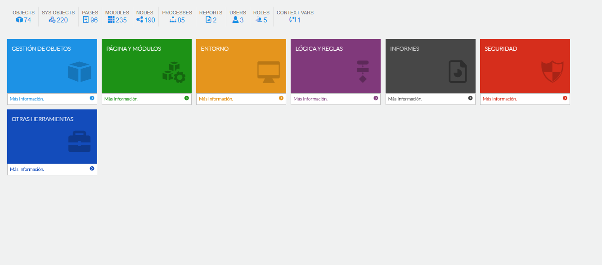 |
| **Desarrollador** - Ayuda | Acceda o cree sus propias páginas de información técnica y funcional sobre la plataforma. | 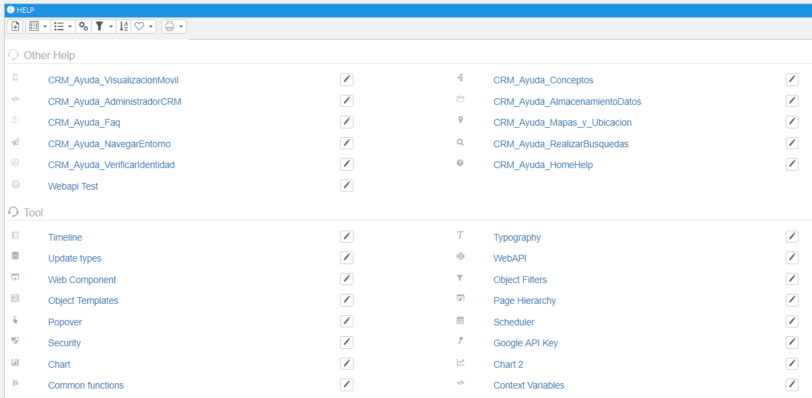 |
| **Página** - Propiedades de la página | Podrá visualizar los módulos que dispone, la seguridad y configuración de la página. Existen diferentes tipos, como genéricas, lista de colección, visualización de objeto, etc. ¡Cree la suya propia personalizada! | 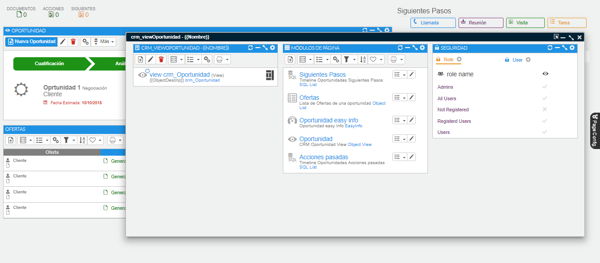 |
| **Objeto** - Configuración / Ver objeto | ¿Quiere saber cómo están creados los objetos de Ahora CRM? El gestor de objetos le permite navegar por la configuración de todos los objetos existentes: módulos asociados, seguridad, páginas, programación de procesos. | 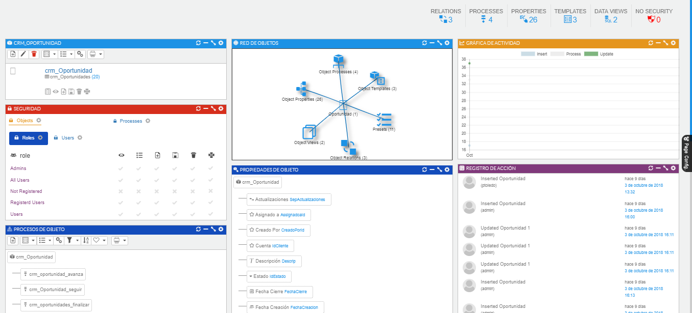 |
| **Objeto** - Asistente | A través del asistente de objetos encontramos la forma más sencilla de llevar a cabo la creación de objetos para funciones personalizadas. | 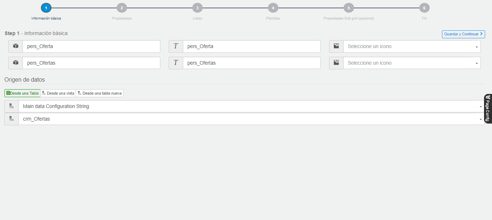 |
| **Colección** - Configuración | Conozca el origen de datos sobre la colección seleccionada y la configuración estándar disponible. | 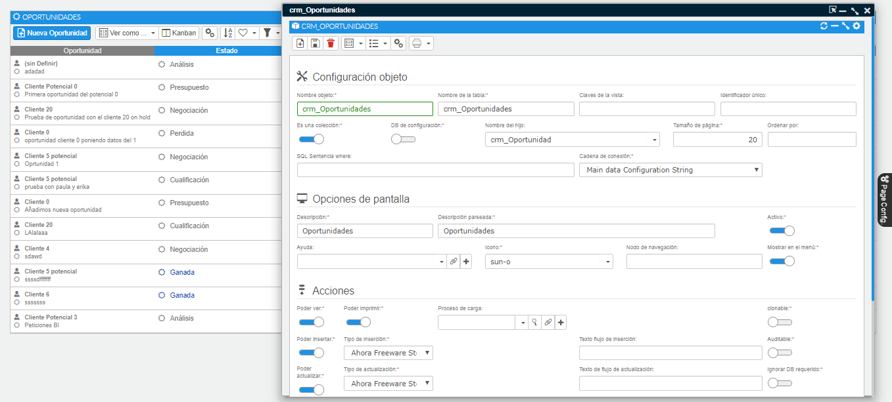 |
| **Módulos** - Gestión de módulos | ¿Qué información componen las pantallas? Cualquier tipo de página contiene diversos módulos de información donde podrá modificar la disposición del espacio y crear módulos personalizados. | 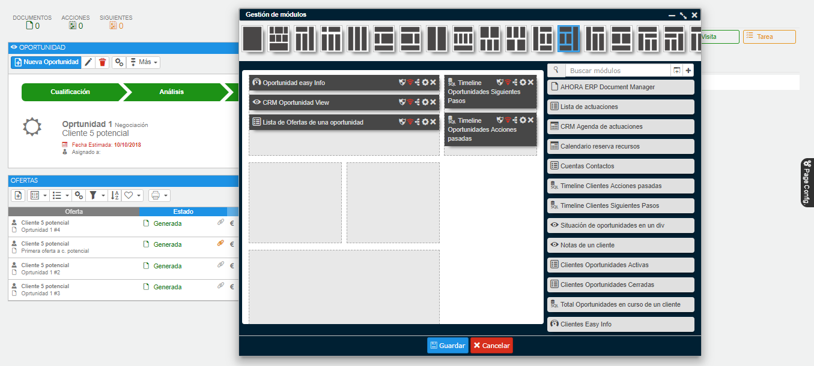 |
| **Seguridad** - Objeto / Proceso / Propiedades | Cuando instalamos Ahora CRM, por defecto, no existe ningún tipo de seguridad hacia los objetos y procesos estándar. Con el perfil de administrador es posible definir la seguridad a nivel de objetos y sus propiedades, módulos, procesos y páginas, tanto por grupos como por usuarios de forma individual. | 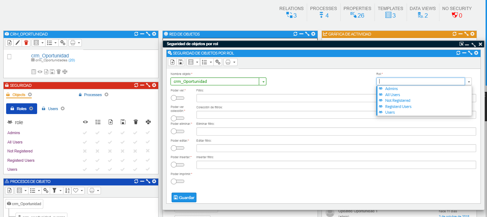 |

### Licencia

¿Cómo funciona el gestor de licencias? Muy fácil: pulse sobre el icono visible en la parte izquierda del menú superior de la ventana. Registre la dirección de correo responsable de gestionar la licencia e introduzca el código de activación proporcionado.

Recuerde que cada licencia se registra en una base de datos donde se almacena el nombre del servidor, el nombre del proyecto, etc.

La instalación de Ahora CRM cuenta con una licencia gratuita de evaluación que proporciona acceso a tres usuarios. Acceda de nuevo al gestor de licencias para ampliar el acceso de usuarios.

- [Infografía de licencias](https://www.flexygo.com/wp-content/uploads/2018/03/infografia_licencias.pdf)
- [Gestor de licencias](https://license.flexygo.com/)

### Recursos adicionales

¿Está buscando más recursos? Consulte nuestras hojas de sugerencias, guías de implementación, vídeos y presentaciones en [flexygo.com](https://flexygo.com/).

## Mapas y ubicación

Desde la ficha de la cuenta, si pulsamos sobre una dirección o localización, el navegador nos abrirá la aplicación Google Maps web o la app (dependiendo del dispositivo donde se esté trabajando).

Actualmente el CRM no tiene mapas integrados, ya que es necesario configurarlo mediante una API key solicitada a Google u otro proveedor de geolocalización.

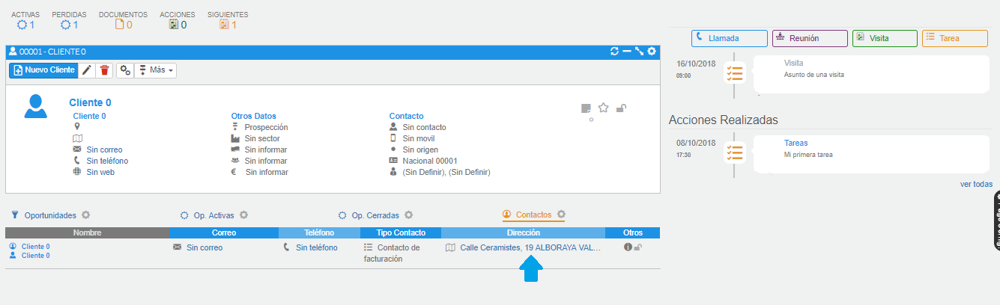

## Verificar identidad

Una vez dado de alta como usuario, se recibirá un email de bienvenida. Este email contiene un vínculo al sitio de CRM de la empresa y la información de inicio de sesión.

A continuación indicamos cómo iniciar sesión por primera vez:

1. Consulte su email en busca de su información de inicio de sesión.
2. Haga clic en el vínculo que se proporciona en el email.
3. El vínculo le inicia sesión en el sitio de forma automática.
4. El sitio le solicita establecer una contraseña y repetirla para confirmar.

### Inicio de sesión

La pantalla donde iniciaremos sesión tiene el siguiente aspecto. Una vez hemos registrado nuestra contraseña, iniciaremos sesión en la aplicación.

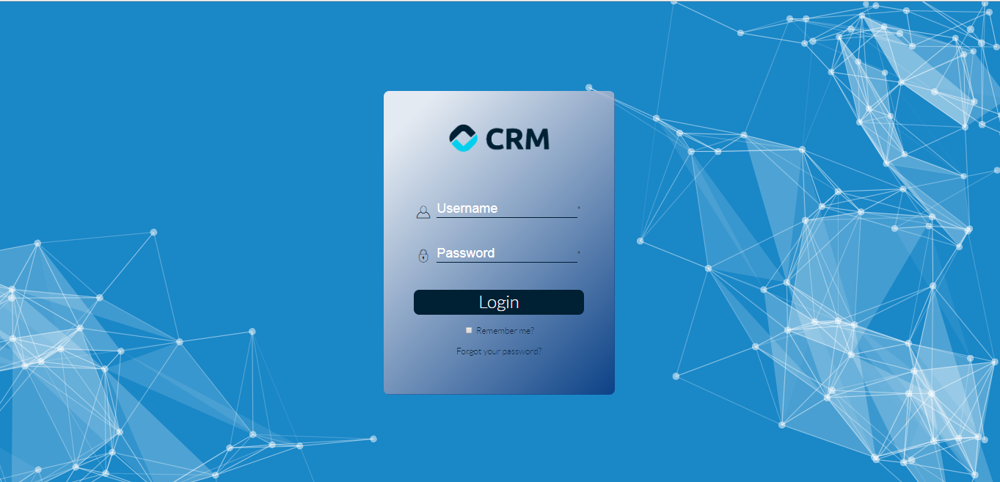
*Fig.1 - Pantalla de acceso del usuario.*

### Cambio de contraseña

Para proteger la privacidad de sus datos, debe cambiar su contraseña de forma periódica.

1. Desde su configuración personal, escriba "Contraseña" en el cuadro de búsqueda rápida y, a continuación, seleccione **Cambiar mi contraseña**.
2. Introduzca la información de contraseña solicitada.

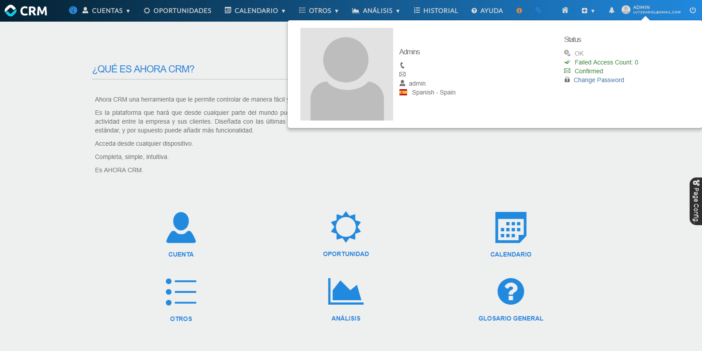
*Fig.2 - Cambiar contraseña.*

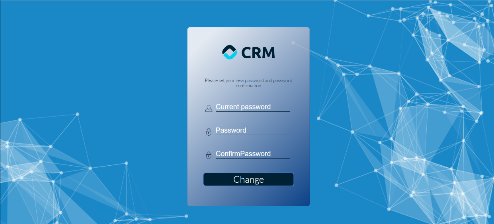
*Fig.3 - Formulario para cambiar contraseña.*

## Configurar imágenes de los empleados

Las imágenes de los empleados son las imágenes del ERP. Estas imágenes están ubicadas en el destino indicado por el parámetro del ERP **PATHIMAGENES_EMPLEADOS**. Normalmente vuestro IIS no tendrá acceso a la carpeta de las imágenes, por lo que deberéis configurar el impersonate, que consiste en indicar un usuario que tenga acceso a dicha carpeta.

Para ello, siendo administradores, deberéis entrar en el panel derecho y seleccionar la opción Desarrollador > Área de diseño, y seleccionar la tarjeta de Entorno. Dentro de dicha tarjeta, seleccionar la opción parámetros y pulsar el botón de editar.

En modo edición deberemos rellenar los campos:

1. **Impersonate Domain**: nombre del dominio.
2. **Impersonate UserName**: nombre del usuario que se va a utilizar para el impersonate.
3. **Impersonate Password**: contraseña de ese usuario.
4. **Impersonate Enabled**: a `true`.

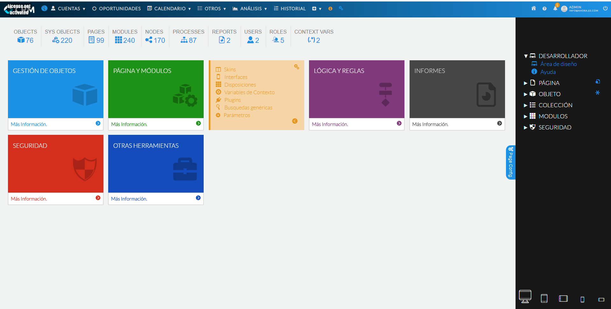
*Fig.1 - Acceso.*

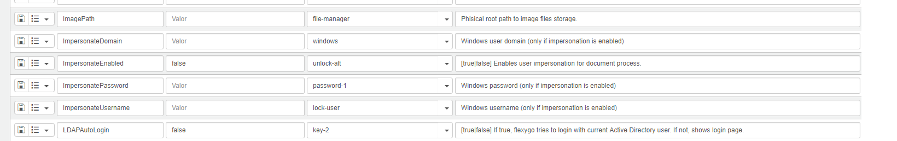
*Fig.2 - Edición de parámetros.*
