# Google Integration Console

Para configurar su App en Google Cloud, previa a la [integración con Google](Integraci%C3%B3n%20con%20Google.md), debe seguir los siguientes pasos.

## Crear un proyecto nuevo

- Al ingresar por primera vez hay que aceptar los Términos y Servicios.
- Seleccionar / Crear proyecto.

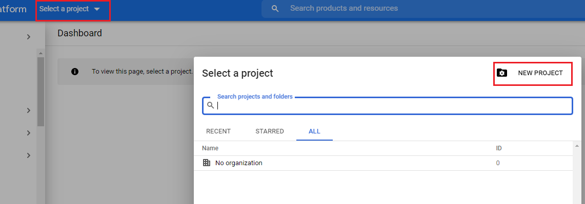
*Fig.1 - Seleccionar proyecto.*

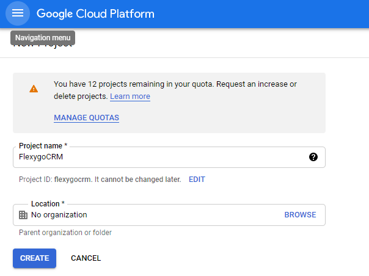
*Fig.2 - Crear proyecto.*

## Configurar consentimiento

- Configurar las credenciales desde el apartado **APIs Services** - **Pantalla de consentimiento**.
- Seleccionar el tipo Externo y crear.

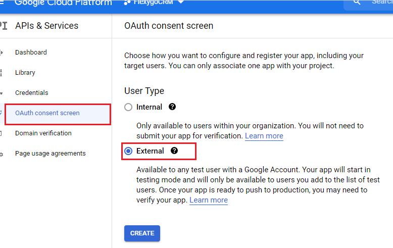
*Fig.3 - Crear consentimiento.*

- En la siguiente pantalla, rellenar los campos requeridos. Si se rellena el campo logo, deberá verificar la aplicación siguiendo los criterios de verificación de Google.

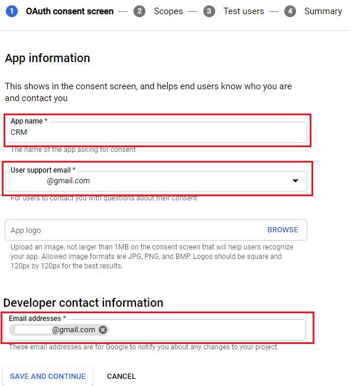
*Fig.4 - Información de App.*

- La siguiente pantalla la dejamos como está.
- En esta pantalla incluir el correo de los usuarios que van a usar la integración; los usuarios que no estén incluidos no tendrán acceso (solo mientras la publicación esté en modo Prueba).

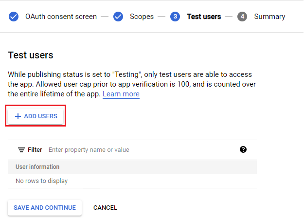
*Fig.5 - Incluir usuarios.*

- En la última pantalla tendremos un resumen de la configuración; si está todo correcto, pulsamos **Volver**.

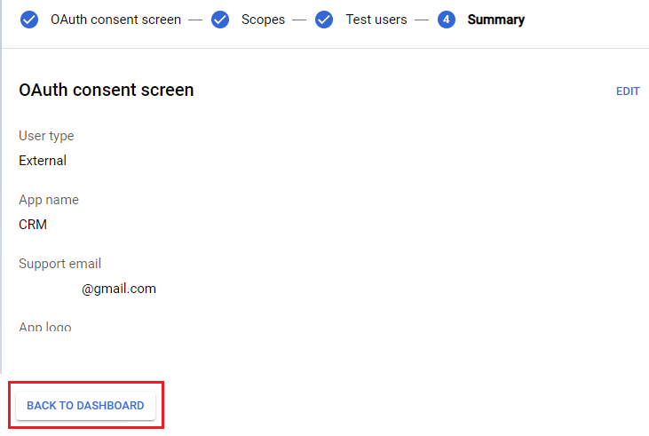
*Fig.6 - Resumen consentimiento.*

## Publicar

Para que cualquier usuario pueda usar la integración hay que publicarla, por lo que el apartado de usuarios de prueba ya no hace falta mantenerlo.

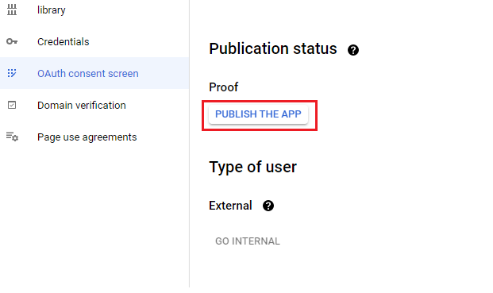
*Fig.7 - Publicar.*

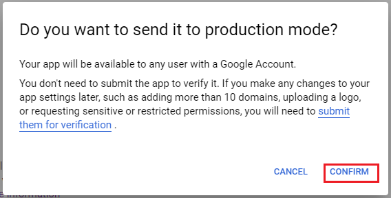
*Fig.8 - Confirmar publicación.*

## Configurar credenciales

- Para poder usar los servicios de Google hay que configurar las credenciales del tipo *OAuth client ID* desde el apartado **APIs Services** - **Credentials**.
- Rellenar los campos correspondientes; en el apartado de URIs, sustituir el texto seleccionado por la URL de su aplicación.

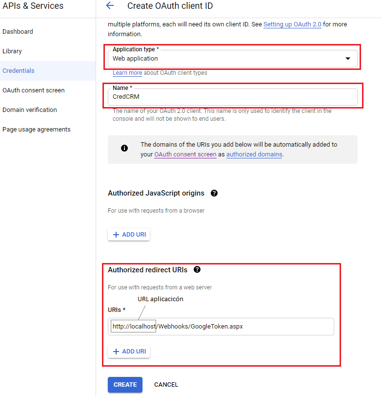
*Fig.9 - Crear credenciales.*

Una vez creado, obtendremos unas claves las cuales debemos copiar en los settings de Flexygo:

<flx-navbutton type="execprocess" processname="sysEditSettings" objectname="sysSettings" objectwhere="(Settings.[SettingName] IN ('GoogleClient', 'GoogleSecret'))" targetid="popup" excludehist="false" showprogress="false">
    Settings de Flexygo
</flx-navbutton>

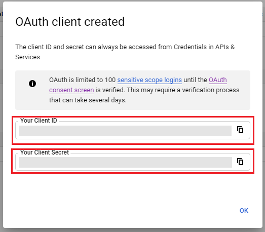
*Fig.10 - Info OAuth.*

## Habilitar API para Contactos y Calendario

Por último, habilitar la API de Contactos y Calendario desde el apartado de Biblioteca.

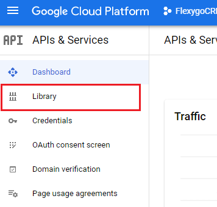
*Fig.11 - Biblioteca.*

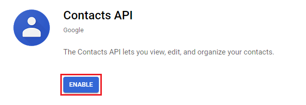
*Fig.12 - Habilitar API Contactos.*

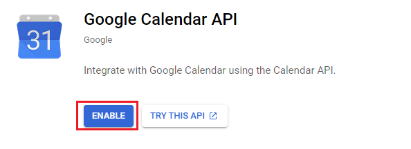
*Fig.13 - Habilitar API Calendario.*
