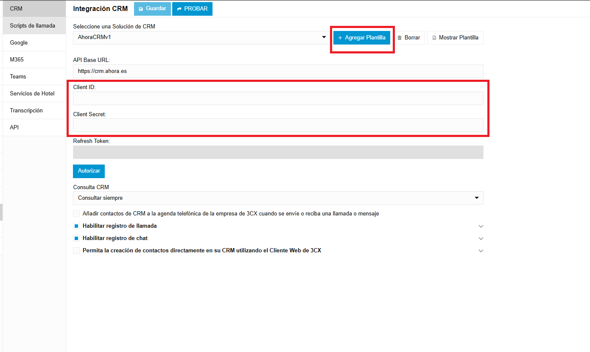

# Integración con 3CX

!!! note
    El parámetro **AppPath** debe estar activo para configurar esta integración.

{ width="500" }

Puede integrar el sistema **3CX PBX** con **AHORA CRM** para registrar interacciones y acceder a los datos del **CRM** durante sus llamadas.

Si necesita asesoramiento experto, puede [contactar con nosotros aquí](mailto:abh@ahora.es?subject=3CX%20PBX%20Integration).

Al iniciar la integración se creará automáticamente un usuario llamado **Api3CX** con acceso exclusivo a la **WebAPI**. Para completar el proceso debe indicar el correo electrónico, la contraseña y la URL de su instancia de **3CX**. Asegúrese de disponer de al menos un usuario disponible en su licencia de **AHORA CRM**. También se aplicará la configuración de base de datos necesaria para habilitar la comunicación entre ambas plataformas. La URL de su instancia de **3CX** se guardará como parámetro de la aplicación.

!!! note
    Como parte del proceso de integración, la **WebAPI** se activará automáticamente.

## Ejecutar el proceso

Puede lanzar el proceso de integración pulsando:

<flx-navbutton type="execprocess" processname="GenerarIntegracion3CX" targetid="popup" excludehist="false" showprogress="false">
    <button class="btn btn-info">Generar integración <b>3CX</b></button>
</flx-navbutton>

## Pasos a seguir en 3CX

1. Registre los datos de la aplicación externa. Esta información es necesaria en el entorno **3CX** para permitir la comunicación, y se genera automáticamente con la integración.

<flx-navbutton type="openpage" pagetypeid="edit" objectname="WebAPI_App" objectwhere="(AppName='3CX')" targetid="slideleft" excludehist="false">
    <button class="btn btn-tools">Ver datos</button>
</flx-navbutton>

2. Suba este archivo **XML** a 3CX. Es necesario para completar la integración entre **AHORA CRM** y **3CX**.

<flx-navbutton type="execprocess" processname="ComprobarIntegracion3CX" defaults="{'urlXML':'~/crm/3CX/Retell/crm-retell.xml'}" targetid="popup" excludehist="false" showprogress="false">
    <button class="btn btn-success">Descargar documento <b>XML</b></button>
</flx-navbutton>

*Imagen 1. Diagrama de la integración con 3CX.*
