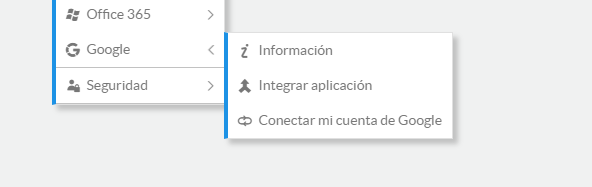
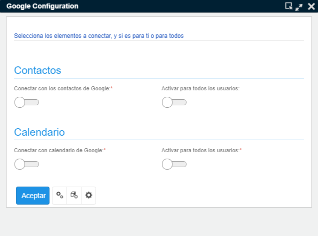
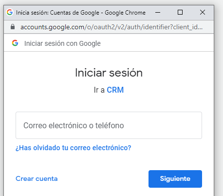
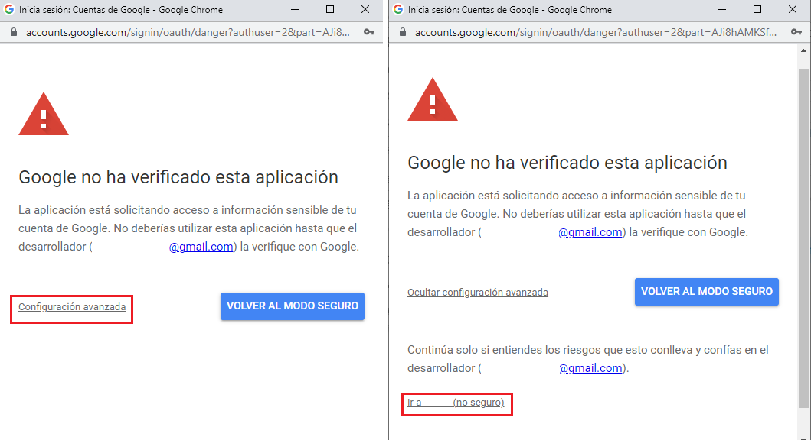
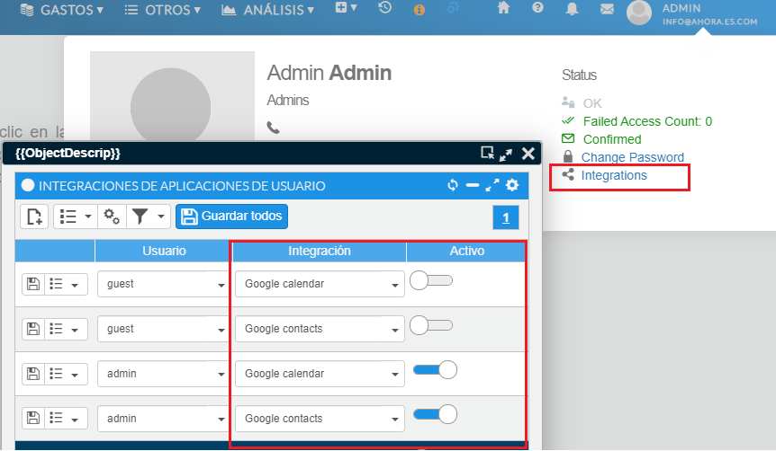

# Integración con Google

Para usar la integración con Google, previamente debe tener configurada la App en [Google Cloud](https://console.cloud.google.com/). Consulte [Google Integration Console](Google%20Integration%20Console.md) para ver cómo configurarla.

Ahora puede tener actualizados en su cuenta de Google los contactos y las actuaciones de su CRM. Esta primera versión del conector permite enviar la actividad y los contactos a la cuenta de Google de todos y cada uno de los usuarios del CRM.

## Requisitos previos

- Antes que nada, para que funcione la comunicación, el CRM debe estar alojado en un servidor con certificado de seguridad, de modo que se acceda mediante HTTPS.
- El usuario de la aplicación previamente debe disponer de una cuenta de Google y conocer sus credenciales de acceso, como nombre de usuario y contraseña.

## Cómo activar la conectividad con Google

Un usuario con permisos de administrador será el encargado de activar esta nueva utilidad.

Se activa desde el menú **Otros → Google → Integrar aplicación**. Se abrirá una pantalla, como muestra la imagen a continuación, que establecerá una primera configuración con una serie de cambios en la aplicación para que cada usuario pueda conectar su cuenta de Google.

*Fig.1 - Menú Google.*

*Fig.2 - Proceso de integración.*

Los controles de la izquierda activan la funcionalidad por tipo de elemento: Calendario y Contactos. Los parámetros de la derecha habilitarán la conexión a Google para todos los usuarios.

## Cómo conectar con mi cuenta de Google

Una vez un administrador haya activado la funcionalidad, cada usuario podrá conectar su cuenta.

- Debe acceder al menú **Otros → Google → Conectar mi cuenta**.
- A continuación, el sistema le pedirá que introduzca sus credenciales para conectar con su cuenta de Google. Si le abre 2 ventanas, tendrá que indicar la cuenta en ambas; de no visualizarlas, compruebe que no se hayan quedado ocultas detrás del navegador u otra ventana de aplicación que tenga abierta.
- Si, tras seguir los pasos, no le pidió aún la autenticación de inicio de sesión en Google, puede forzarlo pulsando el botón "home" del menú superior.

*Fig.3 - Inicio de sesión en Google.*

Esta pantalla aparecerá mientras la App no esté verificada; si desea que no aparezca deberá verificar su App siguiendo los [criterios de verificación de Google](https://support.google.com/cloud/answer/7454865?hl=es-419).

*Fig.4 - App no verificada.*

## Cómo enviar mis contactos a mi cuenta de Google

- A medida que cree o modifique contactos, estos se enviarán automáticamente a su cuenta (\*).
- También dispone de una utilidad en el menú de procesos de cada contacto para enviarlo, o puede hacer una selección de contactos y enviarlos a su cuenta desde la opción de procesos de lista (\*).

## Cómo enviar la actividad al calendario de Google

- A medida que genere o modifique acciones en el CRM, estas se enviarán automáticamente a su calendario de Google (\*).
- En el caso de querer enviar toda la actividad desde una fecha determinada, tiene una opción en el menú Calendario – Exportar mis actuaciones a Google (\*).
- También dispone de una utilidad en el menú de procesos de cada acción para poder enviarla, o puede hacer una selección de acciones y enviarlas a su cuenta desde la opción de procesos de lista (\*).

\* El envío de datos a la cuenta de usuario de Google puede tardar un máximo de 5 minutos desde el momento en que se guarda o modifica el registro, aunque el tiempo de sincronización puede cambiarse de acuerdo a la necesidad de la empresa.

## Preguntas frecuentes

**¿Puedo desactivar el envío a Google?**

Sí. Debe ir al acceso a su perfil, en la esquina superior derecha, y hacer clic en la opción de integraciones. En la ventana que se abre puede desactivar los elementos que quiera dejar de enviar a su cuenta y guardar los cambios. A partir de aquí el sistema dejará de enviar los elementos que haya seleccionado, pudiéndolo volver a activar en cualquier momento desde el menú Otros-Google-Conectar mi cuenta.

*Fig.5 - Integraciones del usuario.*

**¿Puedo desactivar la utilidad de integración con Google?**

Sí. Un usuario con privilegios de administrador puede ir a los parámetros de la aplicación y desactivar la integración mediante el parámetro "GoogleIntegration".

<flx-navbutton type="execprocess" processname="sysEditSettings" objectname="sysSettings" objectwhere="(Settings.[GroupName]='flx-google')" targetid="popup" excludehist="false" showprogress="false">
    Parámetros de la aplicación
</flx-navbutton>

**¿Puedo acelerar el tiempo máximo de envío?**

Sí. Un usuario administrador puede acceder al cron job encargado de realizar la sincronización con las cuentas y cambiar el tiempo de espera. Debe acceder al área de administración – Lógica y reglas – Tareas Cron, y entrar en la edición de las tareas `crm_google_calendar` y `crm_google_contactos`. Por defecto se ejecutan cada 5 minutos.
