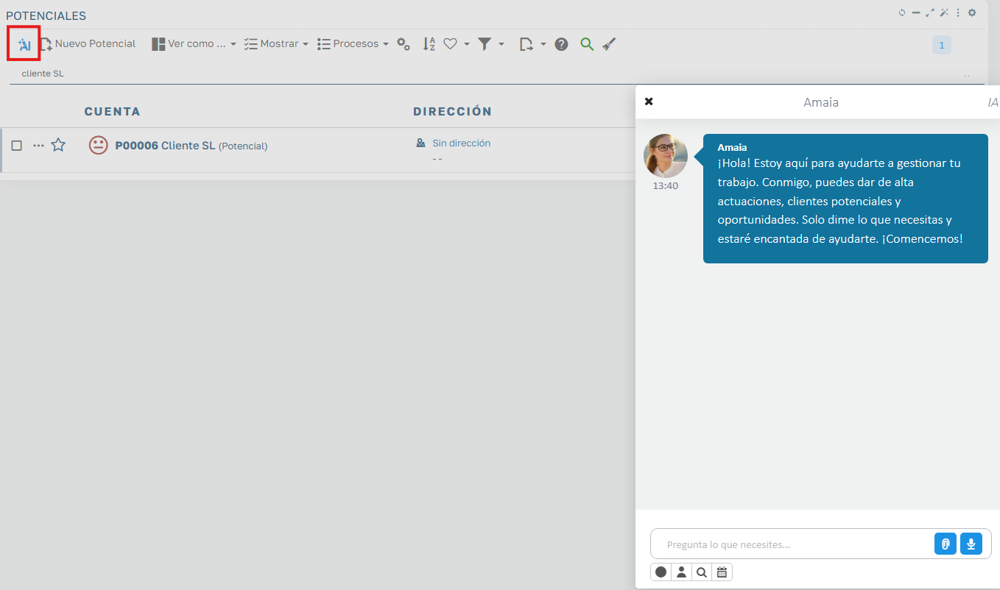
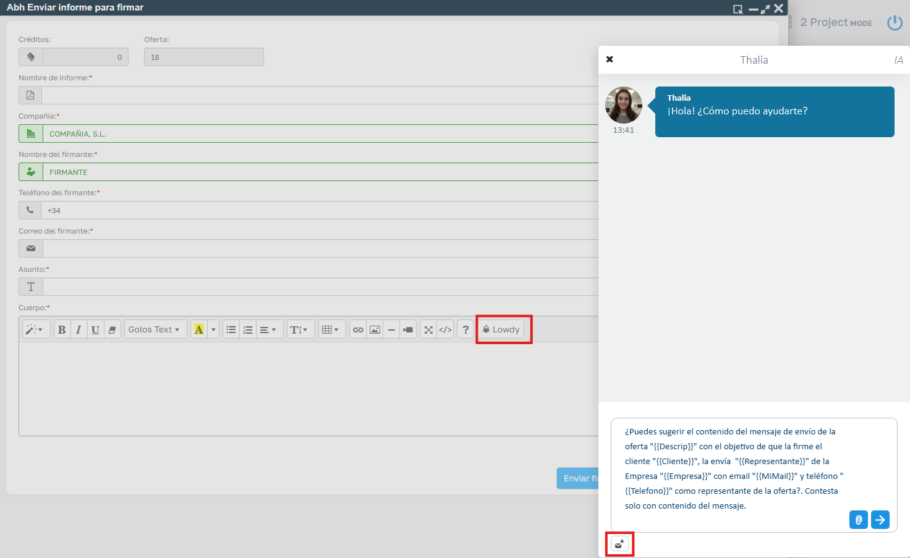
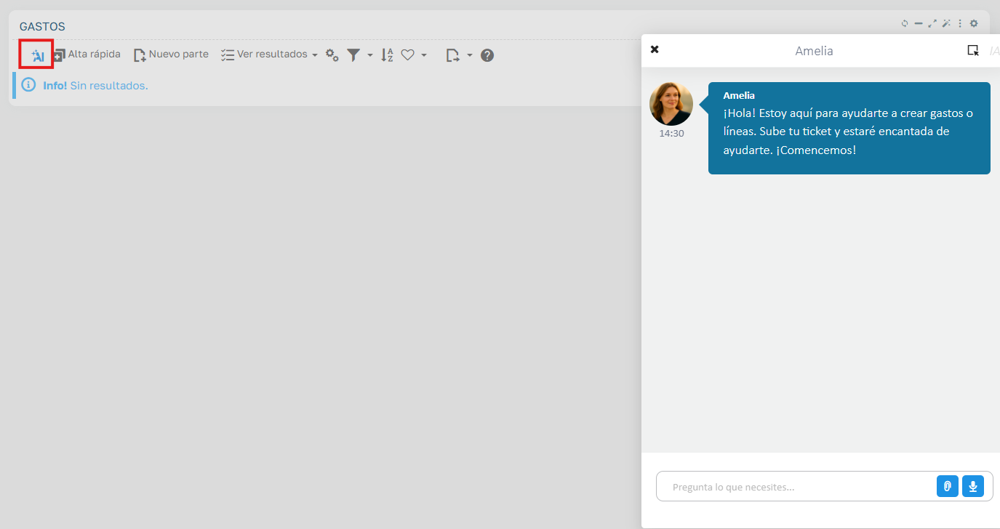
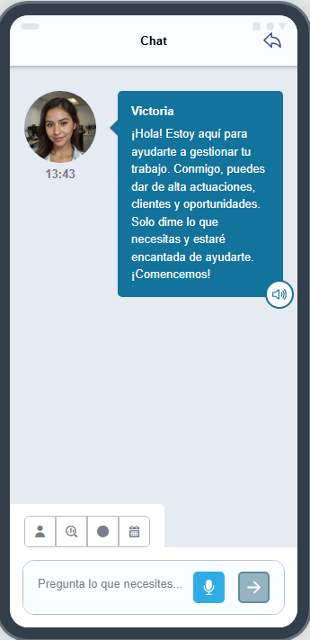

# Inteligencia artificial

Ahora CRM lleva incorporados ciertos asistentes de IA que nos ayudarán con la gestión comercial, tanto en un entorno online como offline, gracias a la integración con OpenAI que incorpora Flexygo.

## Configuración de asistente IA

Para poder empezar a utilizar esta funcionalidad es necesario obtener una key de OpenAI para utilizar ChatGPT y asignarla a los asistentes. Para más información puede consultar la ayuda de Flexygo sobre la integración con OpenAI.

## Asistente IA

El asistente IA de la aplicación está diseñado para ayudarte a realizar diversas acciones de manera rápida. Dentro de la aplicación podemos encontrar el acceso al asistente en el listado de clientes potenciales, oportunidades y actividades.

Las acciones que puede llevar a cabo son:

- **Crear un cliente**: solo necesitarás proporcionarle el nombre del cliente. Opcionalmente puedes añadir el código postal, dirección, correo electrónico, población/localidad y teléfono del cliente.
- **Crear una actuación**: necesitarás proporcionar un asunto y la clasificación. Opcionalmente puedes especificar el cliente, fecha, hora y añadir observaciones.
- **Crear una oportunidad**: necesitarás proporcionar una descripción, la fecha estimada de cierre y el cliente asociado. Opcionalmente puedes añadir una probabilidad de éxito e importe.
- **Buscar y crear un cliente o varios**: solo necesitarás proporcionarle el nombre del cliente para buscarlo en Google, y dará de alta un cliente con el primer resultado. Para poder utilizar esta funcionalidad debes tener configurada la API key de Google y el Id Engine.
- **Consultas**: puedes consultar sobre clientes, oportunidades y ofertas.

*Fig.1 - Asistente IA online.*

A la hora de enviar una oferta al cliente podemos encontrar otro asistente que nos puede ayudar a redactar el contenido del correo.

*Fig.2 - Asistente IA online.*

En el listado/visualización de gastos podemos encontrar otro asistente que nos puede ayudar a dar de alta un gasto con su línea correspondiente, adjuntando el ticket en el chat.

*Fig.3 - Asistente IA online.*

## Asistente IA offline

El asistente IA de la aplicación offline está diseñado para ayudarte a realizar diversas acciones de manera rápida. Dentro de la aplicación podemos encontrar el acceso al asistente desde la pantalla de inicio y la visualización del cliente.

Las acciones que puede llevar a cabo son:

- **Crear un cliente**: solo necesitarás proporcionarle el nombre del cliente. Opcionalmente puedes añadir el código postal, dirección, correo electrónico, población/localidad y teléfono del cliente.
- **Crear una actuación**: necesitarás proporcionar un asunto y la clasificación. Opcionalmente puedes especificar el cliente, fecha, hora y añadir observaciones.
- **Crear una oportunidad**: necesitarás proporcionar una descripción, la fecha estimada de cierre y el cliente asociado. Opcionalmente puedes añadir una probabilidad de éxito e importe.
- **Consultar la situación de un cliente**: solo necesitarás proporcionarle el nombre del cliente.
- **Abrir la ficha de un cliente**: solo necesitarás proporcionarle el nombre del cliente.
- **Consultar la dirección de un cliente**: solo necesitarás proporcionarle el nombre del cliente.

*Fig.4 - Asistente IA offline.*
