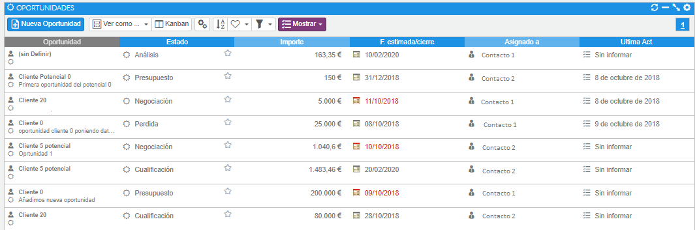
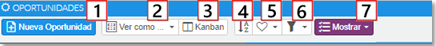
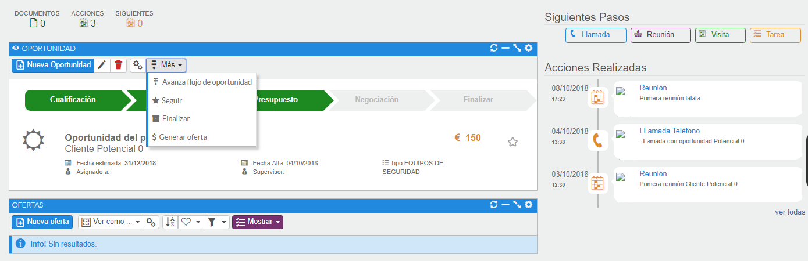
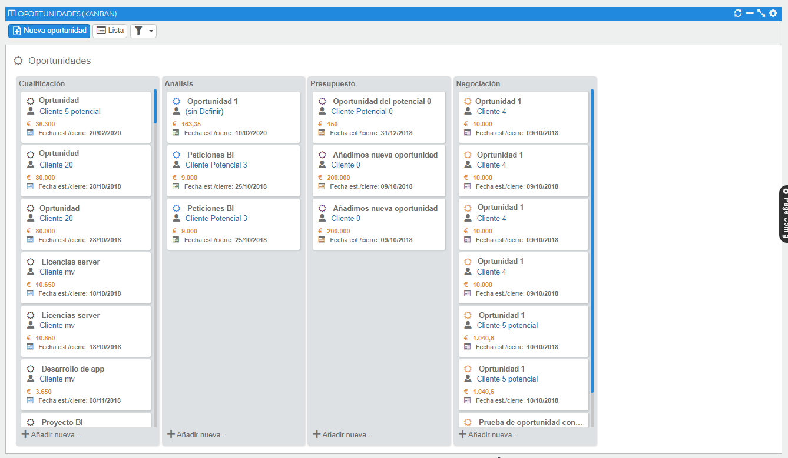

# Oportunidad

Una oportunidad se considera cualquier oportunidad de negocio que tengamos con la cuenta (con cualquier contacto de la cuenta). La pantalla de oportunidades tiene el siguiente aspecto:

*Fig.1 - Listado de oportunidades.*

### Tutorial en vídeo

**Gestión de oportunidades** — Gestiona la herramienta principal que mide la fuerza de los equipos de ventas.

  <iframe src="https://www.youtube.com/embed/5t2XNTnnQk0" frameborder="0" allowfullscreen></iframe>

**Autor:** Daniel Lutz

En la cabecera encontramos una serie de acciones:

*Fig.2 - Barra de acciones del listado de oportunidades.*

- **Nueva oportunidad** (1), permite crear nuevas oportunidades.
- **Ver cómo** (2), se podrá escoger la visualización en forma de lista o Grid.
- **Kanban** (3), tablero Kanban donde podremos pasar de estado la oportunidad.
- **Ordenar** (4), abre un formulario para establecer el orden en el que visualizaremos los registros. Arrastraremos los campos a la sección de la derecha y aceptaremos.
- **Guardar valores del filtro actual** (5).
- **Filtro** (6), abrirá un formulario donde podremos configurar de forma sencilla los campos que queremos, guardaremos los cambios y los tendremos disponibles.
- **Menú contextual mostrar** (7), nos facilitará una serie de filtros o análisis predefinidos que agilizarán el trabajo del usuario.

## Dar de alta una oportunidad

La oportunidad la daremos de alta desde distintas vías, al igual que sucedía con las cuentas:

- Desde el listado de oportunidades, la primera opción en la parte izquierda de la barra de herramientas corresponde a la acción de nuevo registro de oportunidad.
- Desde el formulario de visualización de una oportunidad ya existente, la primera opción de la barra de herramientas nos permite generar una nueva oportunidad.
- Desde el formulario de visualización de una cuenta, en la barra de acciones está disponible la opción **[Más]** para el nuevo registro de una oportunidad.
- En todo momento, mientras navegamos por Ahora CRM disponemos de la barra superior, donde el icono **+** permite generar diferentes registros, entre ellos oportunidades.
- Un último camino: en el formulario de edición de una oferta disponemos del icono **+** en el campo donde asociamos la oportunidad.

### Ciclo de vida de una oportunidad

Cuando damos de alta una nueva oportunidad se inicia su ciclo de vida. Este ciclo de vida comienza con la fase de cualificación por defecto y dependerá del usuario ir avanzando por estas fases.

En la siguiente captura visualizamos, mediante las flechas coloreadas, la fase en la que se encuentra la oportunidad. No es obligatorio seguir el orden de todas las fases del ciclo de vida: podemos avanzarla directamente desde la fase de cualificación hasta la de negociación o finalización.

Otro método de avanzar en el ciclo de vida es, desde el propio formulario de la oportunidad, usar la opción **[Más]** de la barra de herramientas e indicar *Avanza flujo de oportunidad*.

Por último, también podremos avanzar las fases a través del Kanban mediante drag and drop.

*Fig.4 - Opción [Más] del formulario de oportunidad.*

*Fig.5 - Oportunidades visualizadas en Kanban.*

### Procesos de una oportunidad

Sobre la oportunidad disponemos de tres funciones más: seguir, finalizar y generar oferta.

- **Seguir**: si seguimos una oportunidad, cuando carguemos el listado de todas ellas, podremos encontrar las que más nos interesan.
- **Finalizar**: podremos cambiar el estado de la oportunidad directamente a finalizada.
- **Generar oferta**: con esta opción generaríamos una o varias ofertas asociadas a nuestra oportunidad, pero solo una oferta puede estar sincronizada a esta. Con lo cual el precio final de la oferta lo hereda como importe total la oportunidad.
