# Actividad de cobro

Llamamos actividad de cobro a una tarea de cualquier tipo (llamada, tarea, visita, etc.) que nos permita gestionar la recepción de dinero.

Para crear una actividad de cobro basta con generar una actividad seleccionando la opción de cobro. También es posible indicar si se ha percibido alguna cantidad de dinero al respecto.

### Tutorial en vídeo

**Actividad de cobro** — Gestiona los cobros fácilmente.

  <iframe src="https://www.youtube.com/embed/BtU-MWg6jvY" frameborder="0" allowfullscreen></iframe>

**Autor:** Daniel Lutz

## Añadir actividad de cobro

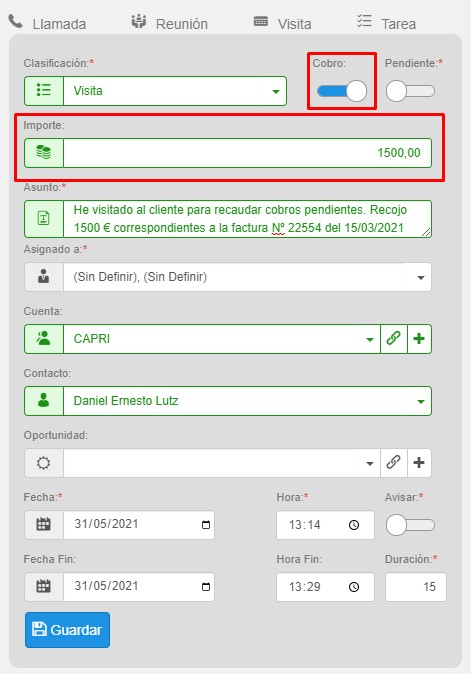

Una vez haya generado su actividad de cobro, podrá filtrar la lista de actuaciones desde el menú Otros-Actividad, estableciendo el filtro predefinido "Actividad de cobro" y combinándolo con los demás filtros disponibles, de modo que pueda obtener, por ejemplo, los cobros realizados por cualquier empleado y/o cuenta en un período de tiempo.

También tiene disponibles dos informes, accesibles desde el menú de procesos, donde puede imprimir en formato report (exportable a PDF y Excel) todos los registros filtrados, o los que haya seleccionado previamente.

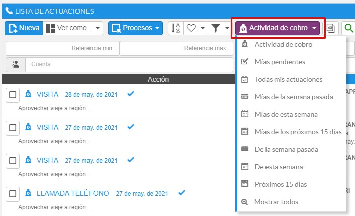
*Fig.1 - Lista de actuaciones. Filtrado de actividad de cobro.*

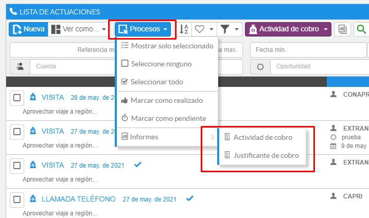
*Fig.2 - Informes estándar disponibles.*

## Cartera de cobros

Aquellas instalaciones de AHORA CRM que utilicen como origen de datos AHORA ERP podrán disponer de la visualización de los efectos pendientes de cobro de los clientes.

### Activar

Un usuario administrador será el encargado de activar la funcionalidad desde el apartado del menú Otros-Maestros-Cartera de cobros-Activar. A partir de aquí podrá visualizar los efectos de clientes, clasificarlos y añadir actividad relacionada a estos.

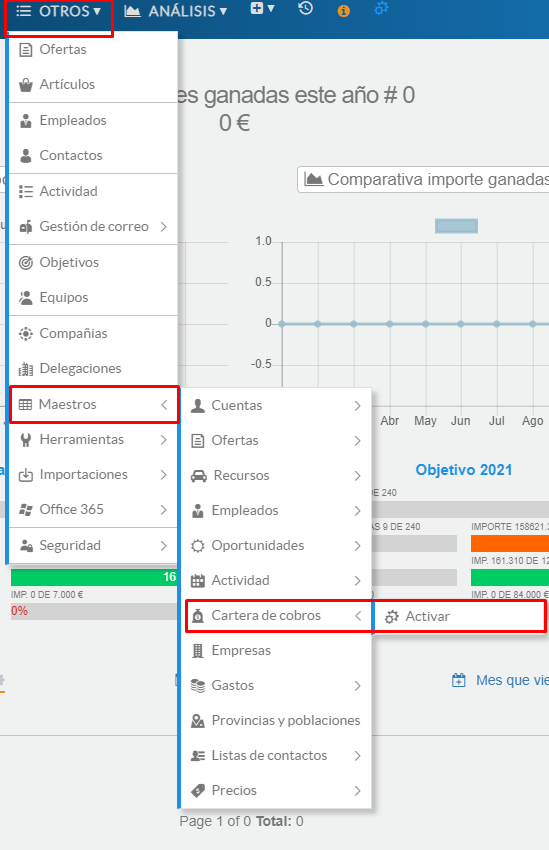
*Fig.3 - Acceso al proceso de activación.*

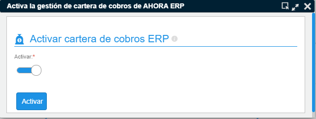
*Fig.4 - Ventana del proceso de activación de efectos.*

Para acceder a la cartera tiene un acceso directo desde el menú contextual del cliente - Cobros y facturación - Gestión.

### Funcionalidad

Las opciones disponibles tienen como objeto poder generar anotaciones sobre el efecto, añadir una clasificación comercial (solo visible en CRM) y asociar, a uno o varios efectos, actividad del CRM como visitas, tareas y llamadas.

Además, podrá acceder al informe de las facturas relacionadas y enviar justificantes de cobro por email.

**La funcionalidad que otorga el CRM no reemplaza a la gestión de cobros de AHORA ERP.**

Los efectos visibles serán solamente los pendientes de cobro, es decir, aquellos que en el ERP consten con estado recibido, aceptado, asignado a remesa, impagado o deteriorado (0, 1, 2, 3, 5, 8).

### Resumen de cobros por concepto

En este apartado verá los efectos agrupados por factura (si tuvieran). Además, pulsando en el botón Ver Factura accederá al impreso de factura.

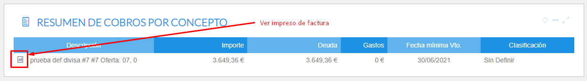
*Fig.5 - Resumen de cobros por concepto.*

### Motivo de la deuda

En este apartado podrá gestionar fácilmente el motivo por el cual el cliente no ha realizado el cobro, por ejemplo indicando una clasificación o escribiendo una anotación (la anotación es un texto libre, visible desde el grid de cartera de AHORA ERP).

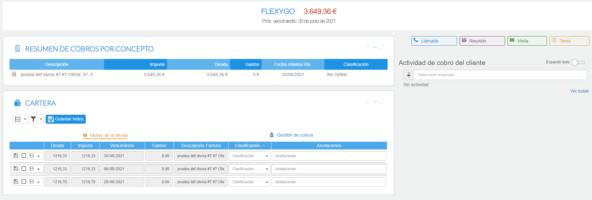
*Fig.6 - Motivo de la deuda.*

Para añadir las clasificaciones será necesario acceder, como usuario administrador, al apartado de Maestros-Cartera de cobros.

### Gestión de cartera

En esta sección podrá añadir fácilmente actividad relacionada a uno o varios efectos, simplemente seleccionando uno o varios efectos y lanzando el proceso Añadir actividad de cobro.

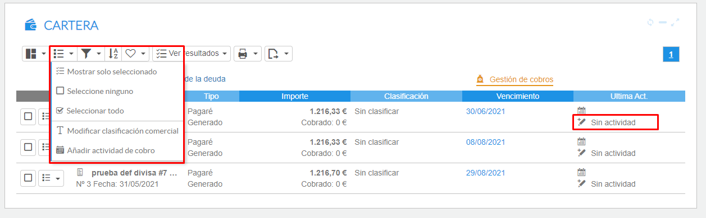
*Fig.7 - Opciones de marcado.*

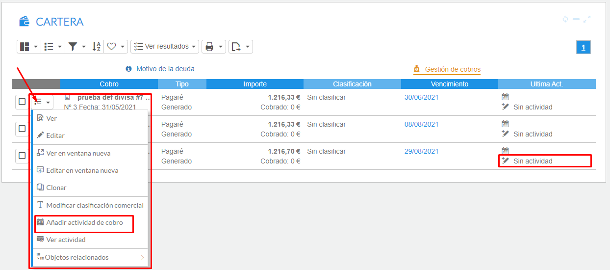
*Fig.8 - Opciones para cada efecto.*

#### Añadir actividad de cobro

Este proceso permite generar la actividad relacionada con los efectos, además de enviar automáticamente un correo con un PDF que lista la actividad descrita, junto con un texto indicando que el comercial ha recibido el dinero.

Al generar la actividad de cobro, el sistema envía el correo a la cola de salida y genera una notificación donde el usuario podrá consultar si el correo ha sido enviado correctamente.

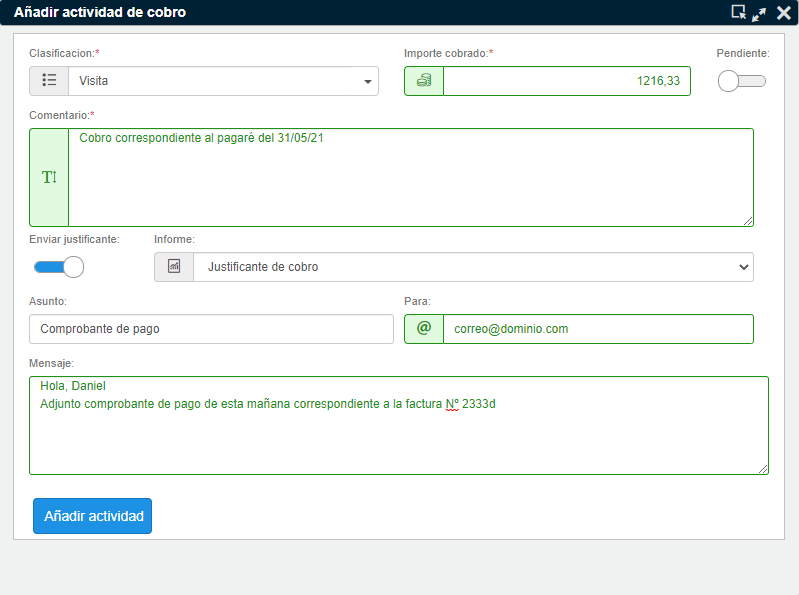
*Fig.9 - Añadir actividad y opciones de envío de justificante.*

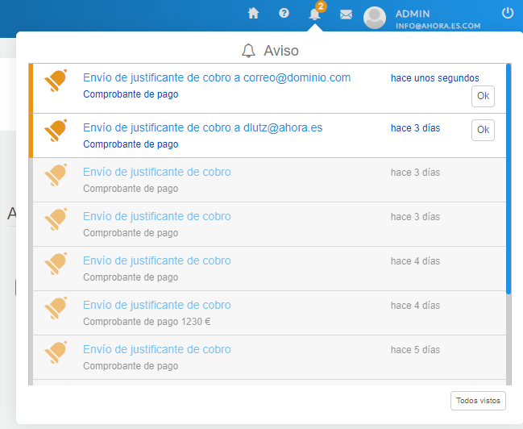
*Fig.10 - Aviso de correo en cola.*

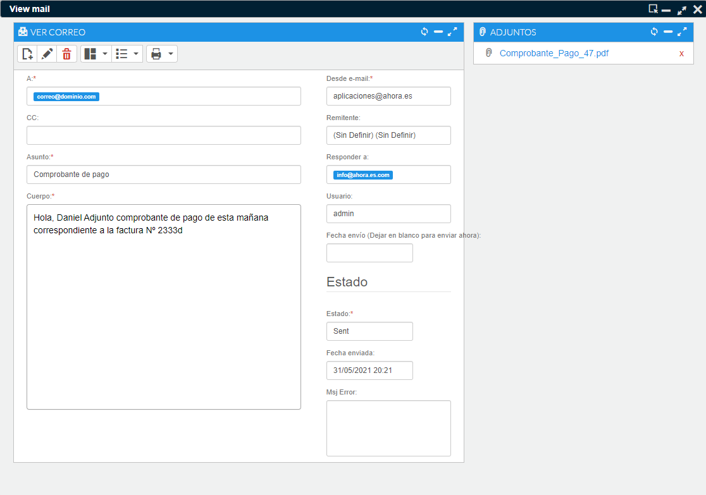
*Fig.11 - Visualizar correo enviado.*

También puede acceder desde la ficha del cliente, pulsando en el botón "+info" en el apartado correspondiente a los cobros pendientes - Ver más. En esta pantalla también tiene un resumen de los efectos pendientes de cobro, e incluso puede visualizar la factura asociada.

### Personalizar informes

Puede personalizar los informes relacionados, pero tenga en cuenta que para ello no debe reemplazar los informes estándar, sino crear los nuevos informes de Crystal Reports en la carpeta "custom" de la aplicación.

Puede dar de alta sus nuevos informes y, si lo desea, desactivar los informes estándar para que no salgan en las opciones de envío.
