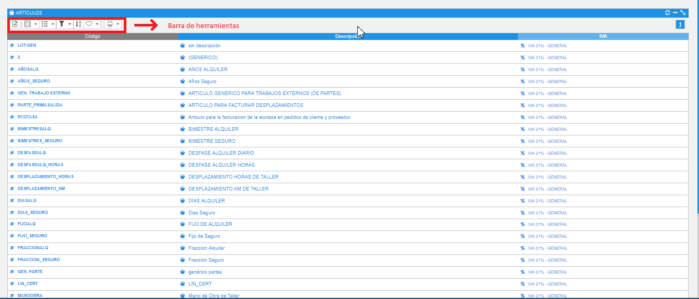
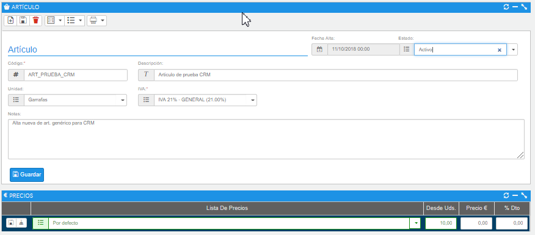

# Artículos

La opción de artículos mostrará el listado de artículos que tengamos cargados en el ERP; en caso de no tener ningún artículo, saldrán los artículos genéricos que se encuentran en la base de datos vacía.

### Tutorial en vídeo

**Artículos, precios y divisas** — ¿Necesitas más artículos para detallar tus ofertas? Aprende a gestionar los artículos y el histórico de precios.

  <iframe src="https://www.youtube.com/embed/beSpLaUhITY" frameborder="0" allowfullscreen></iframe>

**Autor:** Daniel Lutz

*Fig.1 - Listado de artículos.*

- **Nuevo artículo** (1), permite crear nuevos artículos.
- **Ver cómo** (2), se podrá escoger la visualización en forma de lista o Grid.
- **Procesos** (3), menú contextual con las acciones posibles sobre los artículos.
- **Filtro** (4), búsqueda sobre los campos código, descripción y estado.
- **Ordenar** (5), abrirá un formulario donde podremos configurar de forma sencilla los campos que queremos; guardaremos los cambios y los tendremos disponibles.
- **Búsquedas guardadas** (6), guarda los valores de la búsqueda actual.
- **Imprimir** (7), nos facilitará la exportación de los datos listados en diferentes formatos.

## Dar de alta un artículo

Desde el menú **Otros**, en la parte superior de la pantalla, se encuentra el acceso al listado de artículos.

Al dar de alta un artículo y guardar, nos saldrá en la parte inferior del formulario la información a cumplimentar de la lista de precios.

*Fig.2 - Formulario de un artículo.*
