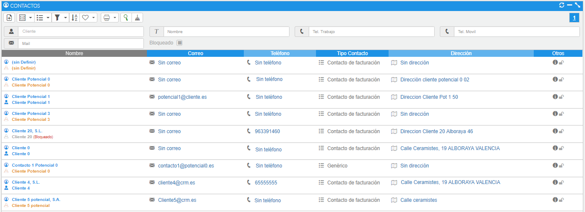
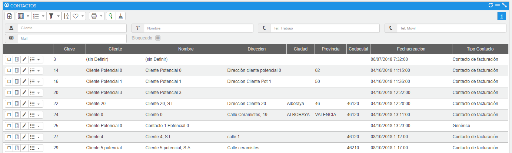

# Contactos

En esta sección podremos consultar los contactos, dar de alta nuevos contactos y realizar acciones sobre ellos.

### Tutoriales en vídeo

**Campañas con MailChimp y mucho más** — Aprende a crear contactos asociados a las cuentas y comunícate con tus clientes utilizando las listas de envíos de correo.

  <iframe src="https://www.youtube.com/embed/aCthwESgaIw" frameborder="0" allowfullscreen></iframe>

**Autor:** Daniel Lutz

**Contactos y listas de envíos** — Aprende a crear contactos asociados a las cuentas y comunícate con tus clientes utilizando las listas de envíos de correo.

  <iframe src="https://www.youtube.com/embed/j7xES9tgDx4" frameborder="0" allowfullscreen></iframe>

**Autor:** Daniel Lutz

**Cómo integrar tu cuenta de Mailchimp** — Vincula tu cuenta de Mailchimp al CRM y envía tus contactos y campañas desde un único lugar.

  <iframe src="https://www.youtube.com/embed/gNtugm-hWbc" frameborder="0" allowfullscreen></iframe>

**Autor:** Daniel Lutz

Según con qué plantilla visualicemos los contactos obtendremos una visualización diferente; a continuación podemos ver las diferencias.

Si escogemos la plantilla nombrada como **Lista**, en la parte derecha de cada uno de los registros encontraremos una serie de acciones que podremos realizar sobre cada registro del listado.

*Fig.1 - Listado de contactos - Lista.*

En cambio, si escogemos la plantilla de tipo Grid, las acciones se realizan desde el menú contextual de procesos de cada registro del listado, o bien accediendo a la visualización de cada uno de ellos.

*Fig.2 - Listado de contactos - Grid.*
