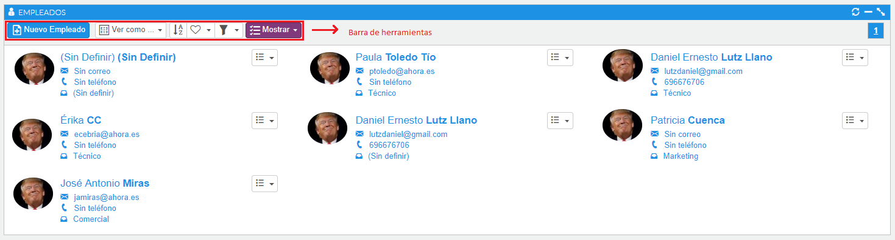
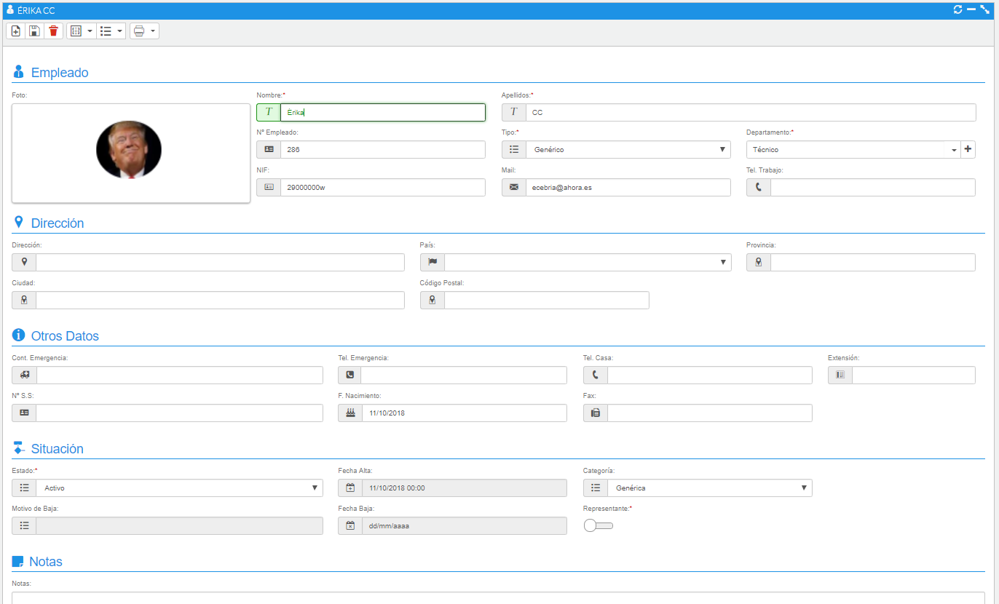

# Empleados

Mediante esta opción visualizaremos los empleados que tengamos dados de alta y se encuentren activos. Como en todos los listados, dispone de su propia barra de herramientas.

### Tutorial en vídeo

**Empleados, equipos y usuarios de la aplicación** — Se explica cómo crear empleados, equipos y usuarios en AHORA CRM: el proceso de creación y administración de estos elementos, desde la asignación de roles y departamentos hasta la configuración de usuarios con acceso a la plataforma.

  <iframe src="https://www.youtube.com/embed/_7mukuInRl4" frameborder="0" allowfullscreen></iframe>

**Autor:** Daniel Lutz

*Fig.1 - Listado de empleados.*

- **Nuevo empleado** (1), permite crear nuevos empleados.
- **Ver cómo** (2), se podrá escoger la visualización en forma de lista o Grid.
- **Ordenar** (3), abrirá un formulario donde podremos configurar de forma sencilla los campos que queremos; guardaremos los cambios y los tendremos disponibles.
- **Búsquedas guardadas** (4), guarda los valores de la búsqueda actual.
- **Filtro** (5), búsqueda sobre los campos código, descripción y estado.
- **Mostrar** (7), nos facilitará búsquedas predefinidas.

## Dar de alta un empleado

Podremos dar de alta empleados mediante el botón nuevo, cargar una imagen y rellenar su ficha, siendo campos requeridos el nombre, el apellido, tipo y departamento.

*Fig.2 - Formulario de edición de un empleado.*
