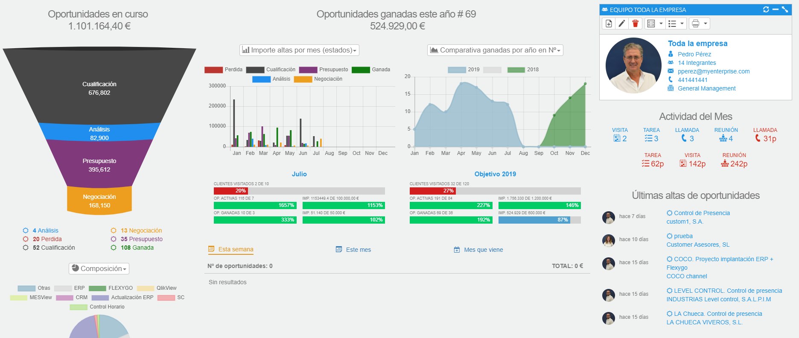
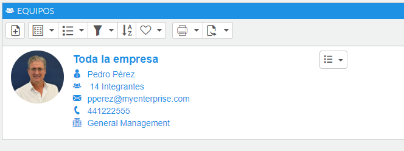
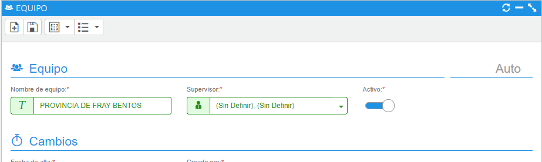
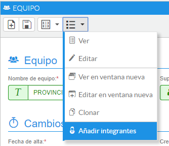
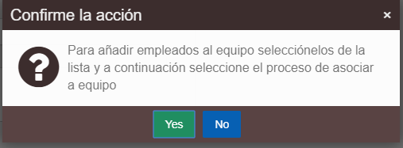
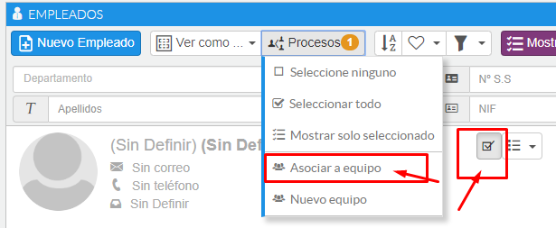
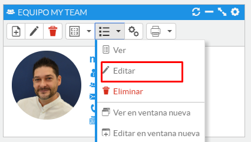
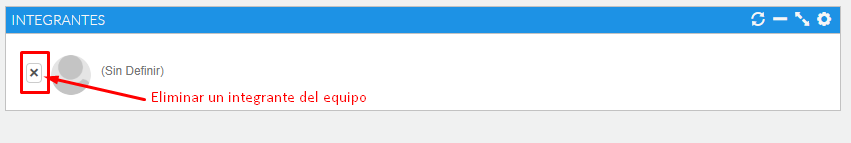

# Equipos

Mediante esta opción podremos definir equipos de empleados para poder visualizar un cuadro de mandos con la información agrupada de todos los que conforman el equipo.

Antes deberíamos haber definido los objetivos individuales de cada empleado.

### Tutorial en vídeo

**Empleados, equipos y usuarios de la aplicación** — Se explica cómo crear empleados, equipos y usuarios en AHORA CRM: el proceso de creación y administración de estos elementos, desde la asignación de roles y departamentos hasta la configuración de usuarios con acceso a la plataforma.

  <iframe src="https://www.youtube.com/embed/_7mukuInRl4" frameborder="0" allowfullscreen></iframe>

**Autor:** Daniel Lutz

*Fig.1 - Cuadro de mandos de equipo.*

## Dar de alta un equipo

Desde el menú Otros - Equipos accederemos al listado de equipos. Desde el listado pulsaremos el botón nuevo y accederemos a la pantalla de alta del equipo, donde indicaremos el nombre del equipo y el empleado supervisor o líder de equipo.

A continuación completaremos los objetivos para cada mes, donde tendremos la opción en el menú de establecer el mismo objetivo para los siguientes meses.

Otra opción válida para crear equipos es ir al menú de empleados, seleccionar los integrantes del equipo y pulsar el botón de procesos - Nuevo equipo, donde nos pedirá indicar el nombre y el líder del equipo para presentarnos el dashboard de equipo.

*Fig.2 - Lista de equipos.*

*Fig.3 - Alta/edición de equipo.*

## Añadir integrantes

Una vez creado el equipo, debemos añadir los integrantes.

Desde la ficha de edición o el propio dashboard, vamos al menú de procesos y seleccionamos la opción **Añadir integrantes**. Nos saldrá un mensaje de confirmación; le damos a Sí y nos llevará a la lista de empleados.

*Fig.4 - Proceso para añadir integrantes.*

*Fig.5 - Confirmar la acción.*

Lo siguiente es seleccionar los empleados de la lista y pulsar en procesos, donde podremos asignar los empleados seleccionados a un equipo existente o crear un equipo nuevo.

*Fig.6 - Seleccionar empleados y menú asociar a equipo.*

## Eliminar integrantes

Desde la ficha de edición del equipo accederemos a la lista de integrantes. Cada integrante tendrá una cruz que nos permitirá fácilmente quitarlo del equipo.

*Fig.7 - Acceso a la ficha de edición del equipo.*

*Fig.8 - Eliminar integrantes del equipo.*
