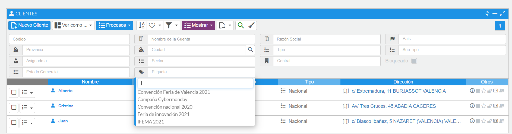
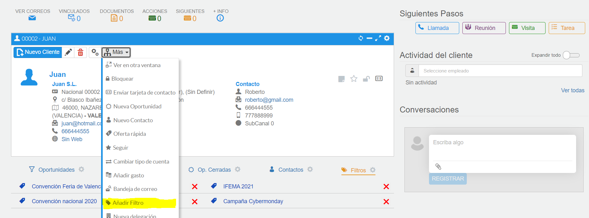
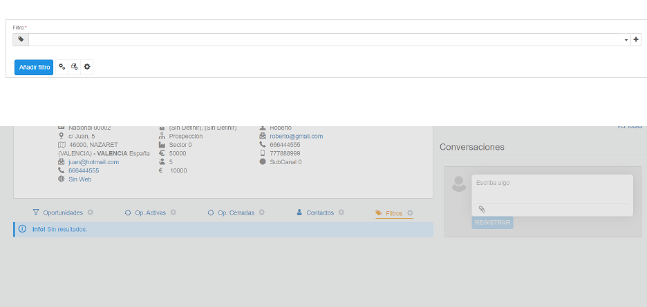
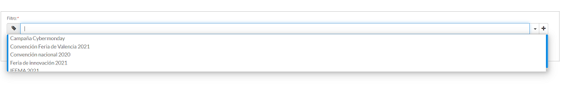
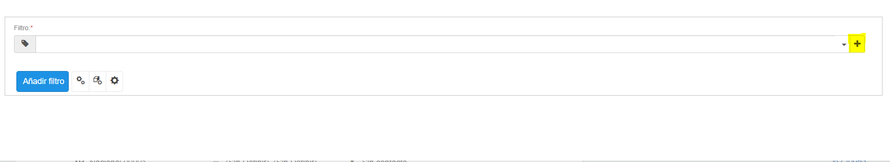
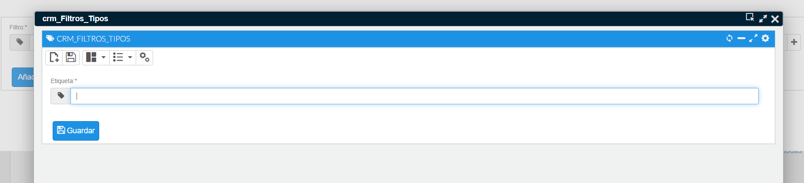
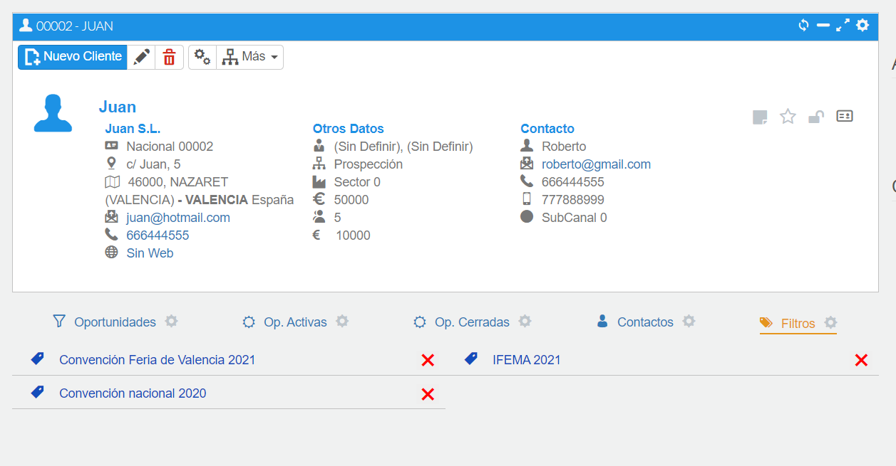

# Etiquetas

Las etiquetas o filtros de cliente sirven para filtrar la lista de clientes mediante una serie de etiquetas, de modo que solo aparezcan los clientes con dichas etiquetas asignadas.

*Fig.1 - Filtrar por etiquetas.*

## Añadir etiqueta

Primero debemos desplegar el menú de procesos y seleccionar el proceso de Añadir etiqueta. Una vez se abre el menú, seleccionamos la etiqueta que deseamos asignar al cliente en la lista desplegable, y pulsamos el botón de añadir.

También puede añadir una etiqueta a varias cuentas a la vez, realizando una selección en el listado y pulsando en el botón de procesos del menú superior de la lista, con la opción "Añadir etiqueta".

*Fig.2 - Proceso añadir etiqueta.*

*Fig.3 - Menú proceso.*

*Fig.4 - Lista de etiquetas.*

## Crear etiqueta

Para crear una etiqueta, primero debemos lanzar el proceso de añadir una etiqueta a un cliente. Posteriormente, pulsar el botón de añadir etiqueta y, por último, indicar el nombre de la nueva etiqueta a crear.

*Fig.5 - Botón crear etiqueta.*

*Fig.6 - Crear etiqueta.*

## Desasignar etiqueta

Si queremos desasignar una etiqueta a un cliente, lo único que debemos hacer es pulsar el botón rojo que aparece junto a la etiqueta que queremos desasignar.

También puede eliminar una etiqueta y todas sus relaciones desde el apartado Otros-Maestros-Etiquetas de cliente, y en el menú contextual de la etiqueta seleccionar la opción "Eliminar etiqueta y relaciones".

*Fig.7 - Desasignar etiqueta.*
