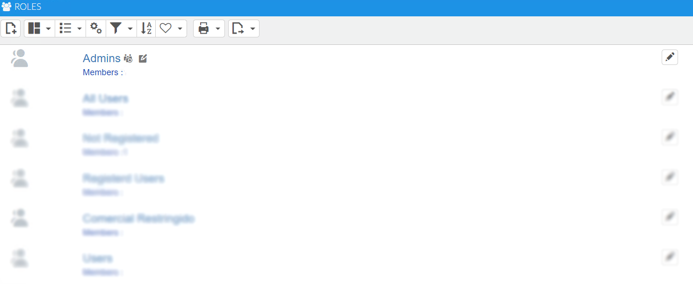
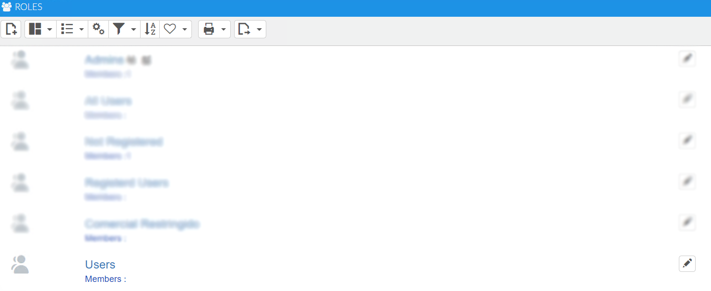
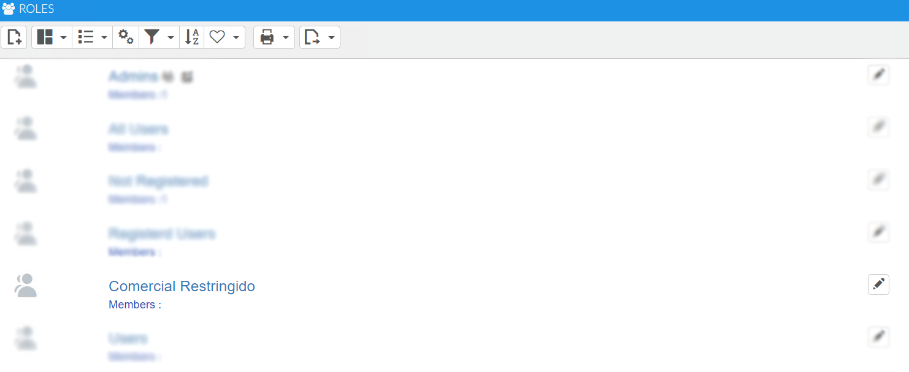

# Grupos de usuarios

Los grupos de usuarios son grupos previamente desarrollados cuya función principal es servir de capa que restringe el acceso a la aplicación. Se han generado tres grupos de usuarios principales, cuya limitación de permisos se restringe de forma ascendente: **Admin**, **Usuario** y **Comercial Restringido**. Al crear un empleado puede asociarse solo a uno de dichos grupos.

### Tutorial en vídeo

**Empleados, equipos y usuarios de la aplicación** — Se explica cómo crear empleados, equipos y usuarios en AHORA CRM: el proceso de creación y administración de estos elementos, desde la asignación de roles y departamentos hasta la configuración de usuarios con acceso a la plataforma.

  <iframe src="https://www.youtube.com/embed/_7mukuInRl4" frameborder="0" allowfullscreen></iframe>

**Autor:** Daniel Lutz

## Admin

Los empleados pertenecientes a este grupo de usuarios tienen acceso total a toda la capa de desarrollo (gestión de objetos, procesos, formularios de edición) sin ningún tipo de restricciones.

## Usuario

Los empleados de este grupo de usuarios pueden acceder a todo, excepto:

- No puede ver el apartado Gestión de Gastos ni Herramientas de Otros.
- No puede borrar empleados, aunque tiene permisos para modificar su información.
- No tiene permisos para realizar modificaciones ni el borrado de actividades que no le corresponden.

## Comercial Restringido

Comercial Restringido ha sido creado con la finalidad de poder centrar la gestión de un empleado a base de las cuentas que le pertenecen.

**Cuentas**:

- Puede crear, modificar y borrar aquellas cuentas a las que está asignado, sin ninguna limitación, accediendo a toda su gestión.

**Oportunidades**:

- Tiene acceso tanto a las oportunidades que ha creado como a las que crean otros empleados y que están relacionadas con sus cuentas.

**Calendario**:

- No tiene permisos para borrar ni modificar las actividades y las reservas de otros empleados.

**Gastos**:

- No tiene acceso al apartado Gestión.

**Otros**:

- Puede ver y gestionar todas las ofertas relacionadas con sus cuentas, aunque estén creadas por otros empleados.
- No puede modificar ni borrar artículos, empleados (salvo la modificación de su propio perfil), objetivos ni equipos.
- No puede acceder al apartado Maestros, Seguridad ni Herramientas.

**Análisis**:

- No puede ver el apartado General.
