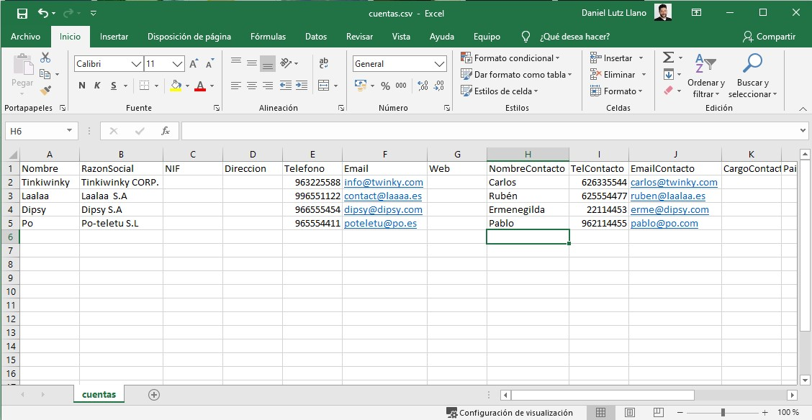
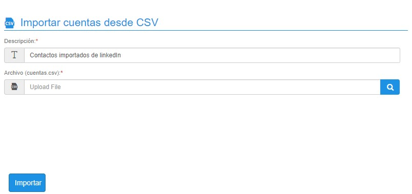
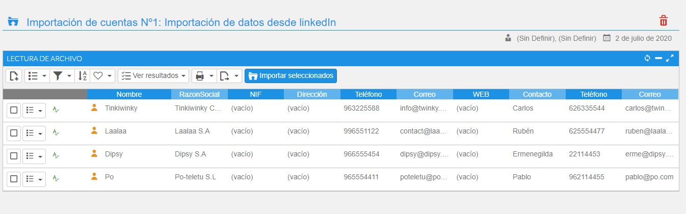
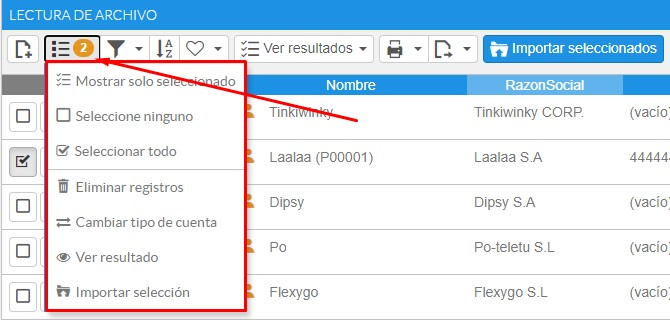
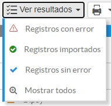
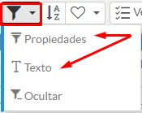

# Importador de cuentas

Mediante esta herramienta podremos importar distintos tipos de cuentas a partir de un fichero plano, en formato CSV y separado por puntos y comas (;).

### Tutorial en vídeo

**Importador de cuentas** — En este vídeo explicaremos cómo importar nuevas cuentas fácilmente a partir de un fichero de texto plano con formato .csv, usando la funcionalidad del CRM Importador de cuentas.

  <iframe src="https://www.youtube.com/embed/Qs4tXT-5MGc" frameborder="0" allowfullscreen></iframe>

**Autor:** Daniel Lutz

Para obtener la plantilla de importación debe entrar en el menú Otros-Importaciones-Cuentas y hacer clic en el título para descargar el archivo "cuentas.csv". También puede hacer clic en el siguiente botón:

<flx-navbutton type="execprocess" processname="Importacion_Cuentas_DescargarCSV" targetid="current" excludehist="false" showprogress="false">
    <button class="btn btn-outstanding">Obtener archivo de importación</button>
</flx-navbutton>

## Consideraciones al completar el archivo

1. No debe eliminar el primer registro correspondiente a las cabeceras descriptivas de columna; de lo contrario la importación dará errores de distinta índole.
2. Es obligatorio completar el nombre de cuenta y razón social. Es la forma que tiene el sistema de poder identificar duplicados.
3. Si además informa el NIF, el proceso también podrá advertir de duplicidades por este campo.
4. El formato de archivo debe ser un texto plano con extensión CSV separado por el carácter ";".
5. Existen varios programas para abrir este tipo de archivos, como por ejemplo Microsoft Excel. Asegúrese de que, al guardar la información, no se guarde el archivo con otra extensión o formato.
6. Si su sistema tiene configurada una parametrización en la cual los clientes no se autonumeran, debe completar el campo IdCliente para todos y cada uno de los registros.
7. Si deja vacío el campo tipo cliente, el sistema entenderá que va a crear un potencial. Si desea indicar un tipo específico debe introducir una de estas opciones numéricas: -1 (Potencial), 0 (Nacional), 1 (Comunitario), 2 (Extranjero). De todos modos, esta opción se puede cambiar desde la pantalla de gestión o desde la pantalla de edición de registros importados.

*Fig.1 - Plantilla de cuentas abierta desde Microsoft Excel.*

## Importador

Pulse el botón importar archivo y complete los datos que se muestran a continuación.

*Fig.2 - Completar datos de subida.*

Una vez pulse el botón importar, el proceso analizará el archivo y mostrará los datos importados. Si detecta coincidencias entre los registros del archivo o coincidencias con cuentas ya introducidas en el sistema, informará de ello en pantalla mediante iconos de advertencia.

*Fig.3 - Asistente de importación.*

## Seleccionar registros a procesar

A continuación debe seleccionar los registros que desea procesar, ya sea haciendo clic en la casilla de selección o desde el menú de procesos - Seleccionar todo.

Una vez seleccionados los registros puede eliminarlos (porque han dado algún error), importarlos como cuentas, o, en el caso de haberse importado, ver el listado de cuentas creadas.

También puede trabajar con los registros de forma individual, haciendo clic en el registro y entrando en la ficha de visualización.

Si desea cambiar el tipo de cuenta a crear, basta con seleccionar los registros deseados, pulsar el menú de procesos y elegir el tipo de cuenta que desea para dichos registros; por defecto se establecen como potenciales.

Para hacer la selección de registros puede ayudarse tanto por el asistente de filtrado como por cualquiera de los dos filtros disponibles (propiedades y texto).

*Fig.4 - Menú de procesos que afecta a los registros de importación.*

*Fig.5 - Pantalla de edición de cabecera y líneas.*

*Fig.6 - Pantalla de visualización.*

## Advertencias

- **Preparado**: registro sin coincidencias, preparado para la importación.
- **Aviso**: el sistema ha encontrado una coincidencia con una cuenta ya existente (mismo NIF o razón social); puede acceder a ella mediante el botón de ver.
- **Importado**: cuenta importada correctamente.
