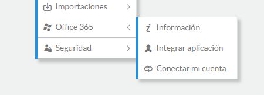
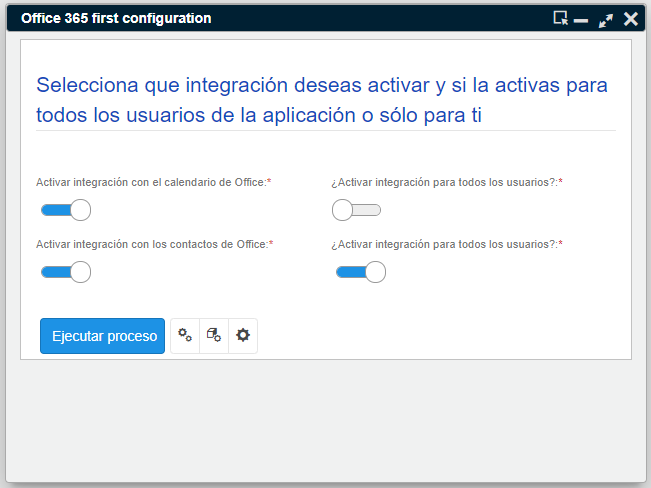
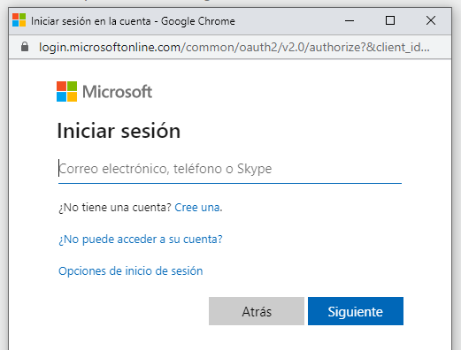
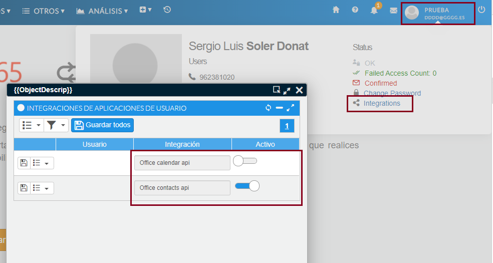

# Integración con Office 365

Ahora puede tener actualizados en su cuenta de Outlook los contactos y las actuaciones de su CRM. Esta primera versión del conector permite enviar la actividad y los contactos a la cuenta de Office 365 de todos y cada uno de los usuarios del CRM.

## Requisitos previos

- Antes que nada, para que funcione la comunicación, el CRM debe estar alojado en un servidor con certificado de seguridad, de modo que se acceda mediante HTTPS.
- El administrador de la aplicación y/o el administrador de la cuenta Azure deberá haber registrado la aplicación y habilitado el acceso a los contactos y la agenda.
- Se deberá trasladar esa información de la cuenta Azure a los settings referentes a 365 en la plataforma Flexygo, tal y como consta en la ayuda integrada de Flexygo sobre Office 365.
- El usuario de la aplicación previamente debe disponer de una cuenta de Office 365 y conocer sus credenciales de acceso, como nombre de usuario y contraseña.
- **Nota importante**: no ejecutar el proceso contra todos los usuarios antes de verificar el correcto funcionamiento con una cuenta específica y haber tenido en cuenta los requisitos anteriores, ya que a los usuarios les aparecerán ventanas emergentes de consentimiento con errores.

## Cómo activar la conectividad con Office 365

- Un usuario con permisos de administrador será el encargado de activar esta nueva utilidad.
- Se activa desde el menú **Otros → Office 365 → Integrar aplicación**, donde se abrirá una pantalla que establecerá una primera configuración con una serie de cambios en la aplicación para que cada usuario pueda conectar su cuenta de Office 365.

*Fig.1 - Menú Office.*

*Fig.2 - Proceso de integración.*

Los controles de la izquierda activan la funcionalidad por tipo de elemento: Calendario y Contactos. Los parámetros de la derecha habilitarán la conexión a Office 365 para todos los usuarios.

## Cómo conectar con mi cuenta de Office 365

Una vez un administrador haya activado la funcionalidad, cada usuario podrá conectar su cuenta.

- Debe acceder al menú **Otros → Office 365 → Conectar mi cuenta**.
- A continuación, el sistema le pedirá que introduzca sus credenciales para conectar con su cuenta de Office 365. Si le abre 2 ventanas, tendrá que indicar la cuenta en ambas; de no visualizarlas, compruebe que no se hayan quedado ocultas detrás del navegador u otra ventana de aplicación que tenga abierta.
- Si, tras seguir los pasos, no le pidió aún la autenticación de inicio de sesión en Microsoft, puede forzarlo pulsando el botón "home" del menú superior.

*Fig.3 - Inicio de sesión en Microsoft.*

## Cómo enviar mis contactos a mi cuenta de Office 365

- A medida que cree o modifique contactos, estos se enviarán automáticamente a su cuenta (\*).
- También dispone de una utilidad en el menú de procesos de cada contacto para enviarlo, o puede hacer una selección de contactos y enviarlos a su cuenta desde la opción de procesos de lista (\*).

## Cómo enviar la actividad al calendario de Office 365

- A medida que genere o modifique acciones en el CRM, estas se enviarán automáticamente a su calendario de Office (\*).
- En el caso de querer enviar toda la actividad desde una fecha determinada, tiene una opción en el menú Calendario – Exportar mis actuaciones a Office 365 (\*).
- También dispone de una utilidad en el menú de procesos de cada acción para poder enviarla, o puede hacer una selección de acciones y enviarlas a su cuenta desde la opción de procesos de lista (\*).

\* El envío de datos a la cuenta de usuario de Office 365 puede tardar un máximo de 5 minutos desde el momento en que se guarda o modifica el registro, aunque el tiempo de sincronización puede cambiarse de acuerdo a la necesidad de la empresa.

## Preguntas frecuentes

**¿Puedo desactivar el envío a Office 365?**

Sí. Debe ir al acceso a su perfil, en la esquina superior derecha, y hacer clic en la opción de integraciones. En la ventana que se abre puede desactivar los elementos que quiera dejar de enviar a su cuenta y guardar los cambios. A partir de aquí el sistema dejará de enviar los elementos que haya seleccionado, pudiéndolo volver a activar en cualquier momento desde el menú Otros-Office365-Conectar mi cuenta.

*Fig.4 - Integraciones del usuario.*

**¿Puedo desactivar la utilidad de integración con Office 365?**

Sí. Un usuario con privilegios de administrador puede ir a los parámetros de la aplicación y desactivar la integración mediante el parámetro "OfficeIntegration".

<flx-navbutton type="execprocess" processname="sysEditSettings" objectname="sysSettings" objectwhere="(Settings.[GroupName]='flx-office')" targetid="popup" excludehist="false" showprogress="false">
    Parámetros de la aplicación
</flx-navbutton>

**¿Puedo acelerar el tiempo máximo de envío?**

Sí. Un usuario administrador puede acceder al cron job encargado de realizar la sincronización con las cuentas y cambiar el tiempo de espera. Debe acceder al área de administración – Lógica y reglas – Tareas Cron, y entrar en la edición de las tareas `crm_office_actuaciones` y `crm_office_contactos`. Por defecto se ejecutan cada 5 minutos.
