# Objetivos

Mediante esta opción podremos definir objetivos para cada empleado y mes del año.

En los cuadros de análisis obtendremos gráficos que nos indicarán cómo va el usuario en base a los objetivos que hemos planteado. Además, podremos configurar equipos de trabajo para evaluar los objetivos de un grupo de empleados.

### Tutoriales en vídeo

**Coberturas** — Define la cobertura de tus cuentas para cumplimentar objetivos y fidelizar a los clientes.

  <iframe src="https://www.youtube.com/embed/55CmhTpKhdA" frameborder="0" allowfullscreen></iframe>

**Autor:** Daniel Lutz

**Objetivos** — Define los objetivos de tu equipo de comerciales.

  <iframe src="https://www.youtube.com/embed/UvIsvcf_84w" frameborder="0" allowfullscreen></iframe>

**Autor:** Daniel Lutz

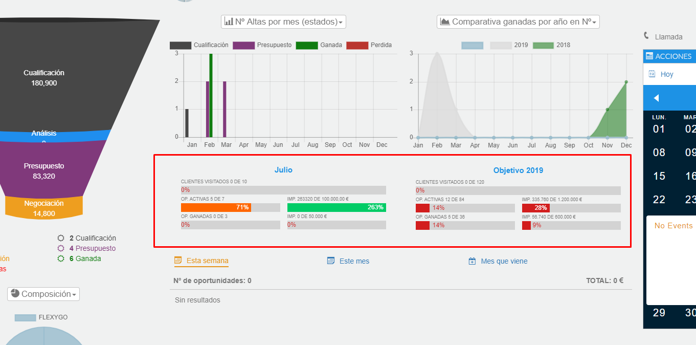
*Fig.1 - Cuadro de mandos de usuario.*

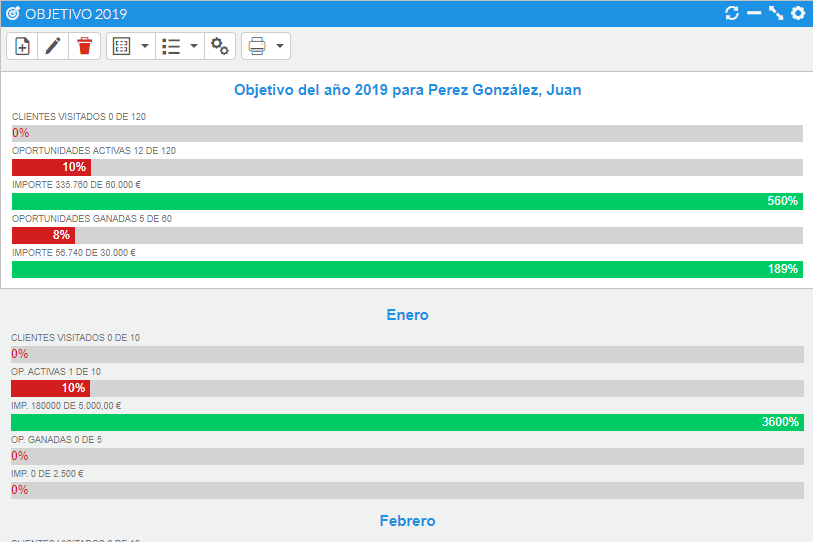
*Fig.2 - Visualización de objetivo.*

## Dar de alta un objetivo

Desde el menú Otros - Objetivos accederemos al listado de objetivos. Desde el listado pulsaremos el botón nuevo y accederemos a la pantalla de alta del objetivo, donde indicaremos el año, el empleado y las notas que queramos definir.

A continuación completaremos los objetivos para cada mes, donde tendremos la opción en el menú de establecer el mismo objetivo para los siguientes meses.

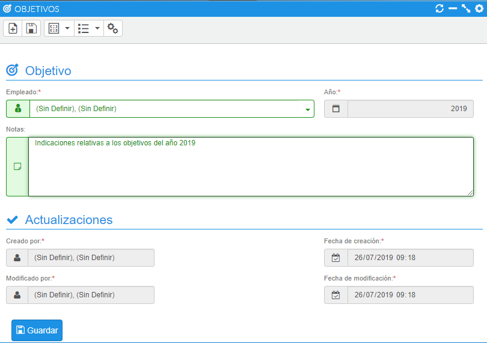
*Fig.3 - Alta/edición de objetivo.*

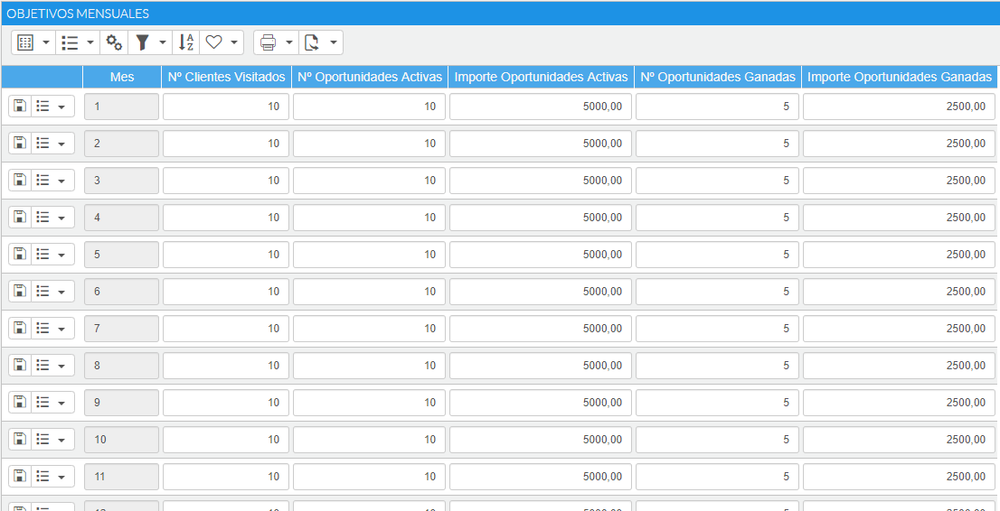
*Fig.4 - Edición de objetivo mensual.*

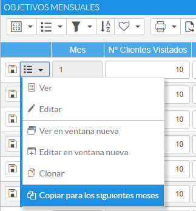
*Fig.5 - Copiar objetivo del mes a los siguientes.*

## Desglosar objetivos por tipología de oportunidades

Desde la propia línea del objetivo mensual tendremos la opción de añadir un desglose para dicho objetivo. Dicho detalle se define por tipos de oportunidad.

En el caso de que queramos trabajar los objetivos por tipos de oportunidad, podemos dar de alta un objetivo mensual con todos los valores a cero y entrar en el apartado indicado con el icono de información. El cómputo global para el mes en cuestión irá cambiando conforme vayamos trabajando en el detalle.

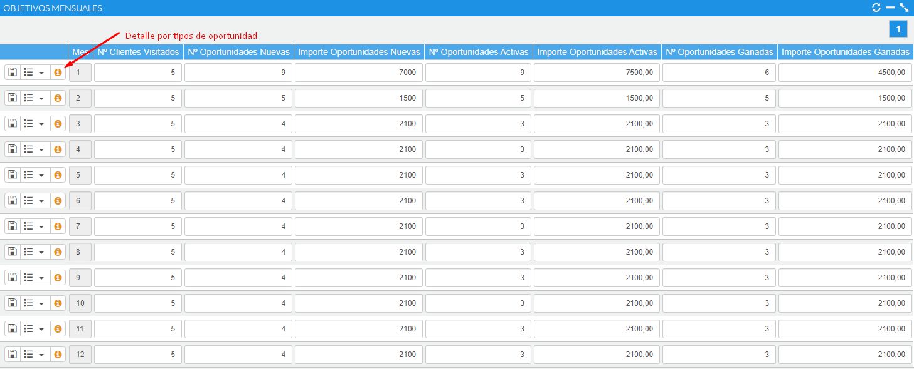
*Fig.6 - Acceso al detalle de objetivos mensuales.*

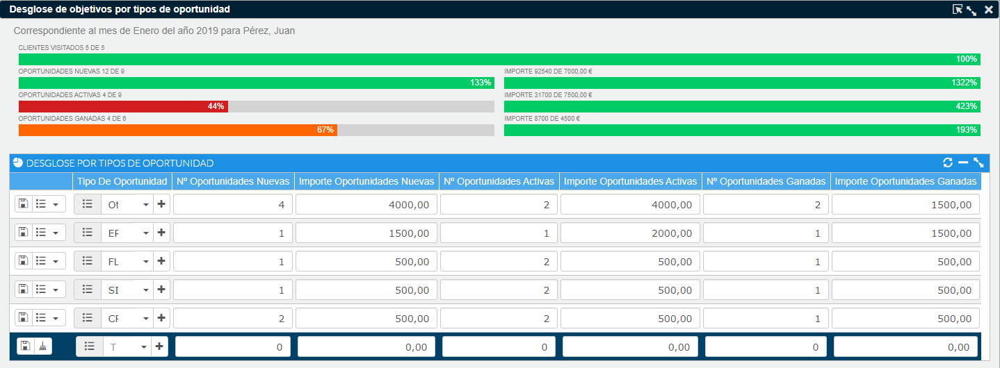
*Fig.7 - Ventana de definición de objetivos por tipos de oportunidad.*

Si desea agilizar la entrada de datos, una vez haya definido un objetivo puede indicar que se copie la definición para todos los tipos de objetivos existentes mediante la opción del menú contextual "Generar copia para todos los tipos de oportunidad".

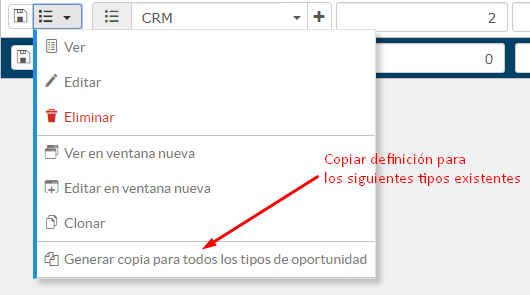
*Fig.8 - Proceso de generación de desglose automático para todos los tipos de oportunidad definidos.*

Cuando trabaja con objetivos por tipos de oportunidad, en los dashboards de usuario y equipo encontrará un icono para acceder al detalle.

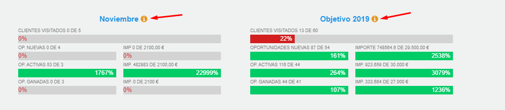
*Fig.9 - Acceso al detalle informativo desde dashboards.*

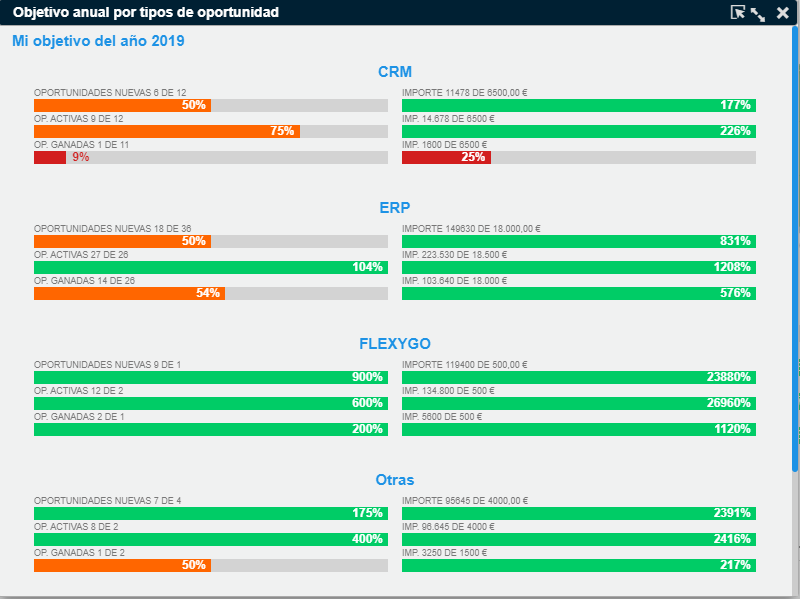
*Fig.10 - Ventana de información de objetivos detallados por tipos de oportunidad.*

## Copiar objetivos

Desde el botón de menú de un objetivo tenemos la opción de copiar dicho objetivo a un empleado/año en particular, para no tener que repetir todo el proceso de alta.

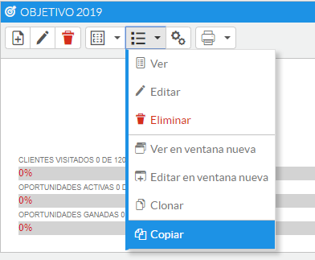
*Fig.11 - Menú copiar objetivo.*

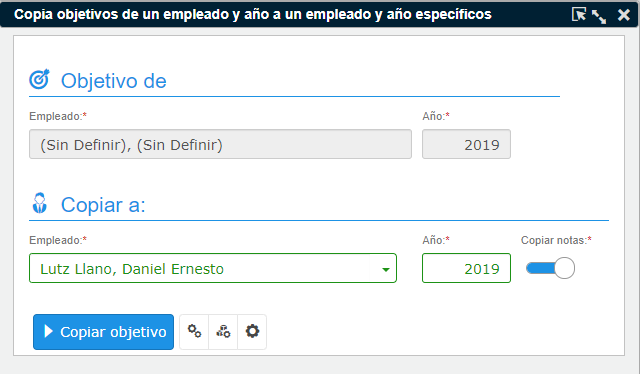
*Fig.12 - Proceso de copiar objetivo.*
