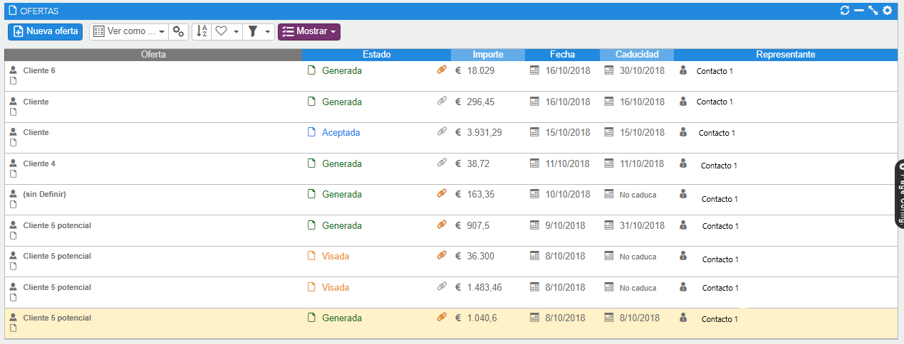
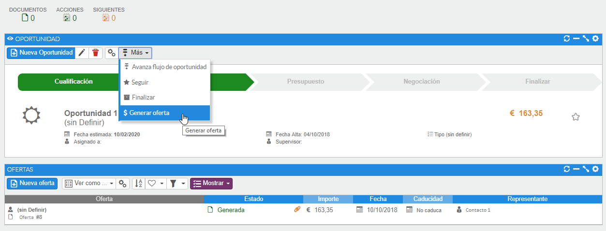
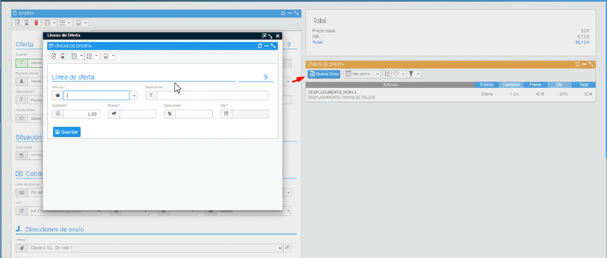

# Ofertas

En esta sección podremos visualizar las ofertas, así como dar de alta y realizar acciones sobre ellas. Para poder generar una oferta, previamente **deberá existir el ejercicio contable asociado al año en curso**; lo mismo ocurre para poder aceptar una oferta.

### Tutoriales en vídeo

**Gestión de ofertas** — Todo lo que debes saber acerca de cómo generar ofertas.

  <iframe src="https://www.youtube.com/embed/2gauD8yMU6Y" frameborder="0" allowfullscreen></iframe>

**Autor:** Daniel Lutz

**Plantillas de ofertas** — Agiliza la creación de ofertas con el uso de las plantillas.

  <iframe src="https://www.youtube.com/embed/K6lXBjVQnKc" frameborder="0" allowfullscreen></iframe>

**Autor:** Daniel Lutz

**Enviar oferta por E-Mail** — Envía tus ofertas por email a tus clientes.

  <iframe src="https://www.youtube.com/embed/vrq0c_5Kbmk" frameborder="0" allowfullscreen></iframe>

**Autor:** Daniel Lutz

**Firma digital de la oferta** — Envía tus ofertas por email y solicita una firma segura.

  <iframe src="https://www.youtube.com/embed/ykcIJiSC4hU" frameborder="0" allowfullscreen></iframe>

**Autor:** Daniel Lutz

**Configuración de la firma digital de la oferta con AHORA SIGN** — Configuración de AHORA SIGN para la autenticación de la firma digital.

  <iframe src="https://www.youtube.com/embed/5lS86EfCJ9M" frameborder="0" allowfullscreen></iframe>

**Autor:** Daniel Lutz

**Artículos, precios y divisas** — ¿Necesitas más artículos para detallar tus ofertas? Aprende a gestionar los artículos y el histórico de precios.

  <iframe src="https://www.youtube.com/embed/beSpLaUhITY" frameborder="0" allowfullscreen></iframe>

**Autor:** Daniel Lutz

La oferta amplía la información de la oportunidad, con la posibilidad de introducir líneas y un importe diferente al de la oportunidad.

Una oportunidad podrá tener varias ofertas, pero solo una sincronizada o vinculada. Cuando sincronicemos una oferta, el importe de la oportunidad cambiará y será el de la oferta asociada. Es importante resaltar que no es obligatorio que una oportunidad tenga una oferta vinculada para poder finalizarse.

La barra de acciones que se muestra en la siguiente captura es totalmente análoga a la de las otras fichas de cuentas, cliente y oportunidad.

*Fig.1 - Listado de ofertas.*

## Dar de alta una oferta

Para dar de alta una oferta tendremos diferentes caminos:

- Desde el menú **Otros**, en la parte superior de la pantalla, se encuentra el acceso a la lista de ofertas. Desde ahí, en la primera opción de su barra de herramientas, veremos la opción de nueva oferta.
- En el formulario de visualización de una oportunidad existe la opción **[Más]**, que será la que nos proporcione la creación de una oferta.
- Para asignar direcciones de envío se utilizan los contactos. Solo permite seleccionar contactos de tipo "facturación"; por defecto asigna los contactos de facturación asignados en la ficha de cliente para tal uso.

*Fig.2 - Formulario de una oportunidad - Crear oferta.*

## Líneas de oferta

Una vez cumplimentada la oferta, pulsaremos el botón guardar y se habilitará la opción de añadir líneas.

Para añadir nuevas líneas pulsaremos el botón "Nueva línea", que abrirá una ventana donde introduciremos los datos de nuestro artículo ofertado.

El precio del artículo que saldrá será el que tenga la lista de precios del cliente; en caso de no tener, saldrá la lista por defecto. El IVA del artículo dependerá del IVA aplicado en la ficha del mismo.

*Fig.3 - Línea de una oferta.*
