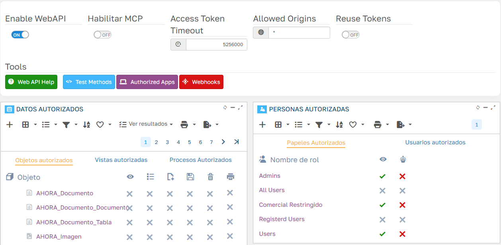

# Web API

El CRM se puede usar desde otros programas a través de su **Web API**: un ERP, una herramienta de automatización como n8n o Power Automate, una hoja de cálculo o un script pueden consultar cuentas, dar de alta actuaciones, crear oportunidades u ofertas y lanzar procesos del CRM, sin abrir la aplicación.

La API es la de Flexygo y sigue el estándar **OpenAPI**: la definición completa está en `https://<tu-aplicación>/webapi` y se puede importar en Postman o en cualquier herramienta compatible (ver [Probar la API con Postman](#probar-la-api-con-postman)). La referencia técnica de todos los métodos está en la ayuda de Flexygo, apartado *Ayuda › Programación › API Web*.

!!! warning "Usa siempre HTTPS"
    La API recibe el usuario y la contraseña para pedir el token. En producción, la aplicación tiene que publicarse con HTTPS.

## Qué se puede hacer con la API

### Objetos

| Qué se puede hacer | Objetos |
|---|---|
| **Consultar, crear, modificar y borrar** | Cuentas (`crm_Cliente`), contactos (`crm_Contacto`), actuaciones: llamadas, visitas, reuniones y tareas (`crm_Actuacion`), oportunidades (`crm_Oportunidad`), notas de cuenta (`crm_Clientes_Nota`) y notas de contacto (`crm_Contactos_Nota`) |
| **Consultar, crear y modificar** (sin borrar) | Ofertas (`crm_Oferta`) y sus líneas (`crm_Oferta_Linea`), gastos (`crm_Gasto`) y sus líneas (`crm_Gasto_Linea`), reservas de recursos (`crm_ReservaRecurso`) |
| **Solo consultar** | Facturas (`crm_ERP_Factura`), cobros pendientes (`crm_ERP_CobroPdte`), artículos y sus precios, listas de precios, empleados, empresa, delegaciones, recursos, el registro de cambios de las oportunidades y las tablas auxiliares: tipos de actividad y de oportunidad, motivos de pérdida, de rechazo y de bloqueo, sectores, orígenes, subtipos, tipos de contacto y de gasto, etiquetas, países, provincias, poblaciones, códigos postales, IVA y monedas |

Cada objeto lleva en la definición de la API una descripción de para qué sirve y de qué significan sus campos codificados (estados, tipos…). Los campos de uso interno no se publican.

!!! note "Los objetos `Offline_*`"
    La definición incluye también los objetos `Offline_*`, que usa la aplicación offline del CRM para sincronizar. Para integraciones hay que usar los objetos `crm_*`.

### Vistas de totales

| Vista | Qué devuelve |
|---|---|
| `crm_Oportunidad/crm_oportunidades_totales` | Embudo de ventas: número de oportunidades e importe previsto, total y por fase |
| `crm_Oportunidad/crm_oportunidades_totales_por_empleado` | El mismo embudo, por empleado responsable |
| `crm_Oferta/crm_oferta_totales` | Número e importe de las ofertas: generadas, visadas, aceptadas y rechazadas |
| `crm_Cliente/Totales_listado_cliente` | Recuento de cuentas: total, activas, bloqueadas, potenciales y clientes |
| `crm_Cliente/crm_cliente_resumen_ventas_anual` | Resumen de ventas de una cuenta: pedidos y albaranes pendientes y facturación de este año y de los dos anteriores |
| `crm_Empleado/crm_comercial_resumen_ventas_anual` | El mismo resumen, de las cuentas de un comercial |
| `crm_ERP_CobroPdte/Totalizador_detalle_Cobros` | Deuda pendiente por cuenta |

### Procesos

| Sobre | Procesos |
|---|---|
| Actuaciones | Marcar como pendiente o como realizada |
| Cuentas | Bloquear y desbloquear, cambiar el estado del lead (prospección, contactado, cualificado), convertir un potencial en cliente (necesita el NIF) y crear una oferta rápida |
| Contactos | Bloquear y desbloquear |
| Oportunidades | Avanzar de fase, finalizar (ganada o perdida) y generar una oferta |
| Ofertas | Marcar como generada, visar, aceptar y rechazar |
| Cobros | Registrar una gestión de cobro |

!!! note "CRM sin AHORA ERP (CRM Lite)"
    En una instalación de CRM Lite no existen las facturas ni los cobros del ERP: no se publican los objetos `crm_ERP_Factura` y `crm_ERP_CobroPdte`, ni la deuda por cuenta ni la gestión de cobro. Tampoco funcionan los resúmenes de ventas anuales (`crm_cliente_resumen_ventas_anual` y `crm_comercial_resumen_ventas_anual`).

## La seguridad es la misma que en la aplicación

La API trabaja **con un usuario del CRM** y aplica sus permisos igual que la aplicación:

- Un usuario con el rol **Comercial Restringido** solo ve las cuentas de su cartera y lo que cuelga de ellas: contactos, oportunidades, ofertas y sus líneas, notas, delegaciones y facturas. Si pide una cuenta de otra cartera, la API responde **403**.
- Con los roles **Comercial Restringido** y **Users**, cada usuario ve solo **sus gastos** y solo puede modificar **sus actuaciones**.
- Los procesos sobre registros que el usuario no puede modificar se rechazan con un mensaje que lo explica.

Por eso conviene crear un usuario propio para cada integración, con el rol que corresponda a lo que tiene que hacer, en lugar de usar el del administrador. Los procesos que asignan responsable (oferta rápida, avanzar o finalizar una oportunidad, cambiar el estado de un lead) usan el **empleado** del usuario: el usuario de la integración tiene que tener un empleado asociado.

## Activar la API

Lo hace un administrador en **Work Area › Admin Work Area › Security › WebAPI**:


*Fig.1 - Configuración de la Web API.*

1. **Enable WebAPI**: enciende la API.
2. **Datos autorizados**: los objetos, vistas y procesos del CRM ya vienen publicados con los permisos de las tablas anteriores. Aquí se pueden retirar, si en tu empresa no se quiere exponer alguno.
3. **Personas autorizadas**: en la pestaña **Papeles autorizados** (roles) o **Usuarios autorizados**, marca la columna del **ojo** en los roles o usuarios que pueden usar la API. El CRM ya trae autorizados los roles Admins, Comercial Restringido y Users.

La columna del **robot** es el permiso para conectar asistentes de IA, que es otra cosa: ver [Asistentes de IA (MCP)](Asistentes%20de%20IA%20(MCP).md).

## Pedir el token

Cada llamada lleva un token, que se pide una vez con el usuario y la contraseña del CRM:

```http
POST https://<tu-aplicación>/token
Content-Type: application/x-www-form-urlencoded

grant_type=password&username=integracion&password=********
```

La respuesta trae `access_token`, que se envía después en la cabecera `Authorization` de cada llamada:

```http
Authorization: Bearer eyJhbGciOiJI...
```

## Ejemplos

Todas las direcciones empiezan por `https://<tu-aplicación>/webapi`.

**Listar cuentas.** Sin filtro devuelve todas las que el usuario puede ver. Cada campo codificado viene acompañado de su texto en un campo `<Campo>_flxtext` (por ejemplo, el nombre del tipo de cuenta además de su código):

```http
GET /webapi/list/crm_Cliente?filter=Clientes_Datos.Cliente LIKE '%García%'&pageSize=100
```

**Ver una cuenta** por su código:

```http
GET /webapi/object/crm_Cliente/00006
```

**Registrar una llamada** en una cuenta. Basta con la cuenta, el asunto y la clasificación (1 = llamada); el CRM completa el contacto principal, el empleado y las horas:

```http
POST /webapi/object/crm_Actuacion
Content-Type: application/json

{ "IdCliente": "00006", "Descrip": "Llamada de seguimiento", "ClasificacionCrm": 1 }
```

**Crear una oportunidad** y, después, **su oferta**:

```http
POST /webapi/object/crm_Oportunidad
{ "IdCliente": "00006", "Descrip": "Renovación anual", "FechaEstamadCierre": "2026-12-31T00:00:00", "IdTipoOportunidad": 0, "ImporteProbable": 1000 }

POST /webapi/exec/CRM_Oportunidad_Generar_Oferta_DLL/crm_Oportunidad/77
{}
```

**Ver una oferta.** Las ofertas tienen clave doble (número y revisión), así que se piden con un filtro:

```http
GET /webapi/object/crm_Oferta?filter=Ofertas_Cli_Cabecera.IdOferta=24 AND Ofertas_Cli_Cabecera.Revision=1
```

**Lanzar un proceso**, por ejemplo marcar una actuación como pendiente:

```http
POST /webapi/exec/crm_ActuacionesPonerPendiente/crm_Actuacion/13
{}
```

**Consultar el embudo de ventas:**

```http
GET /webapi/list/crm_Oportunidad/crm_oportunidades_totales
```

### Los filtros

El parámetro `filter` es una condición SQL sobre los campos del objeto. Para evitar ambigüedades, conviene poner delante el nombre de la tabla:

| Objeto | Tabla |
|---|---|
| Cuentas | `Clientes_Datos` |
| Contactos | `CRM_Clientes_Contactos` |
| Actuaciones | `Seguimiento` |
| Oportunidades | `crm_Oportunidades` |
| Ofertas | `Ofertas_Cli_Cabecera` |
| Gastos | `crm_Gastos` |
| Facturas | `Facturas_Cli_Cab` |
| Cobros pendientes | `Clientes_Efectos` |

En la dirección, el filtro tiene que ir codificado (`%25` en lugar de `%`, `%20` en lugar de los espacios…); Postman y la mayoría de herramientas lo hacen solas. El filtro siempre se suma a la seguridad del usuario: no sirve para ver más de lo que el usuario puede ver. Por seguridad, la API **rechaza con 400** los filtros con comentarios (`--`, `/* */`), con `;` o con paréntesis o comillas sin cerrar.

## Probar la API con Postman

Postman puede cargar la definición de la API y crear una colección con todas las llamadas:

1. En Postman, **Import** y pega la dirección `https://<tu-aplicación>/webapi`. No hace falta token para importarla.
2. Postman crea la colección **FlexygoCRM Web API**, con una carpeta por objeto y las llamadas de cada uno: listar, ver por id, crear, modificar, vistas y procesos.
3. En la pestaña **Authorization** de la colección ya viene configurado **OAuth 2.0** con el tipo *Password Credentials* y la dirección del token. Escribe el usuario y la contraseña del CRM, pulsa **Get New Access Token** y después **Use Token**.
4. La dirección de la aplicación está en la variable `baseUrl` de la colección. Si la aplicación está detrás de un proxy y la dirección no es la correcta, cámbiala ahí.

También puedes consultar la referencia de la API en el navegador, en `https://<tu-aplicación>/scalar`.

## Si algo no sale

| Respuesta | Por qué | Qué hacer |
|---|---|---|
| **401** | Falta el token o ha caducado | Pide un token nuevo |
| **403** | El objeto o el proceso no está publicado, el usuario no tiene permiso de API, o el registro no es suyo (por ejemplo, una cuenta de otra cartera) | Revisa **Datos autorizados**, **Personas autorizadas** y el rol del usuario |
| **400** | El filtro no es válido, o falta un campo obligatorio | El mensaje dice qué falla |
| **409** | El estado del registro no permite el proceso (por ejemplo, finalizar una oportunidad ya cerrada) | Es lo esperado |
| **500** con un mensaje del CRM | Una regla del CRM ha rechazado la operación, como aceptar la oferta de una cuenta potencial o crear un cliente sin NIF | Corrige los datos según el mensaje |
