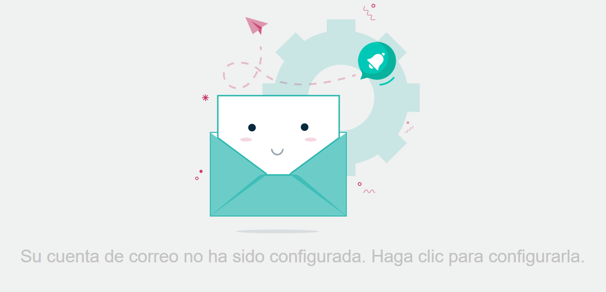
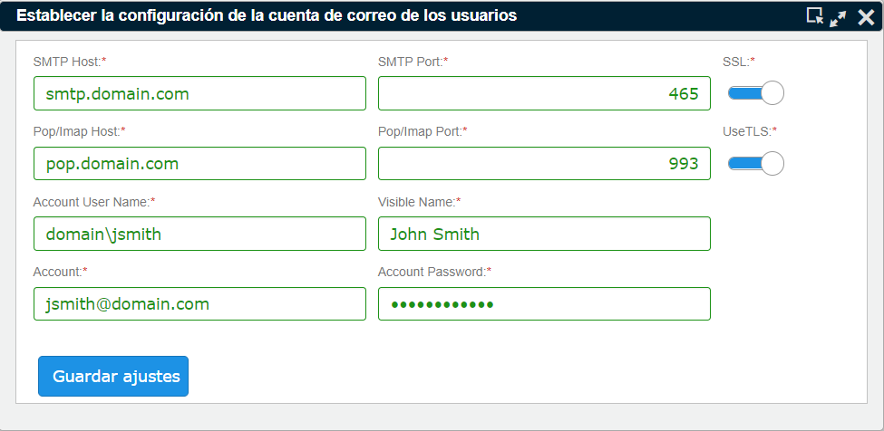
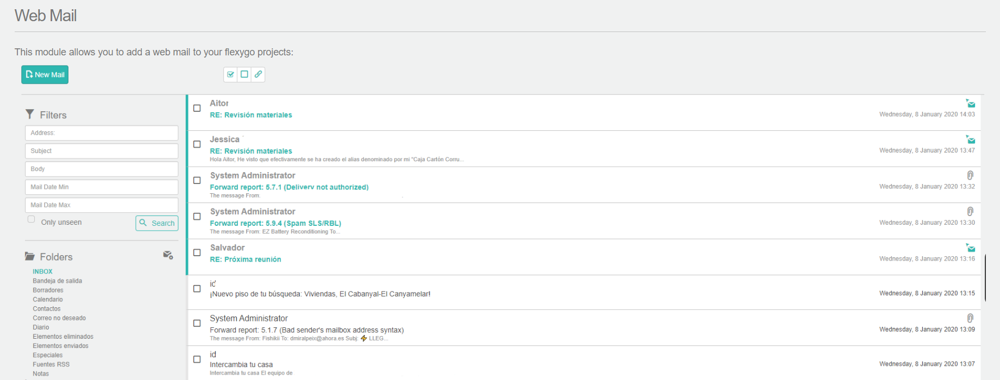
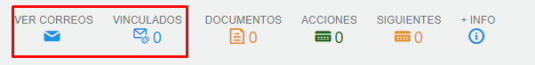
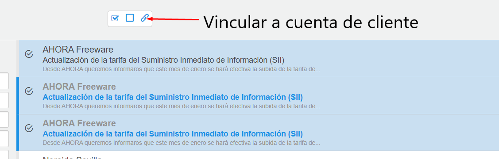
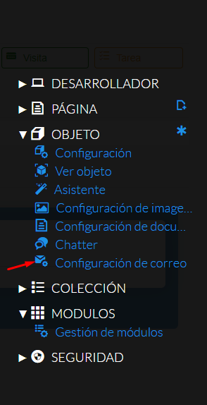
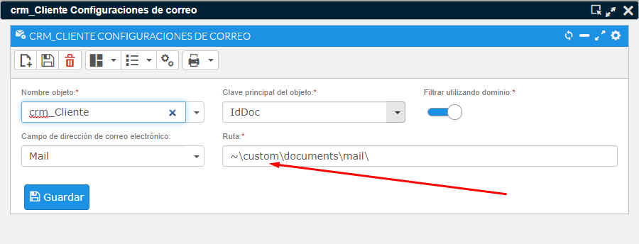
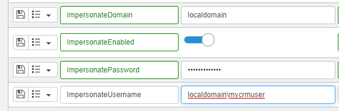
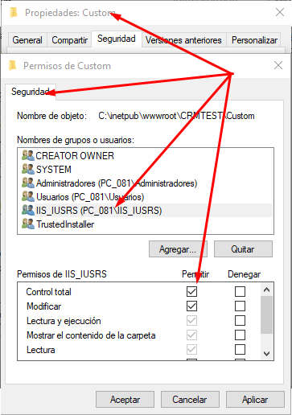

# Web Mail

Con esta utilidad podrá acceder directamente a su cuenta de correo, gestionar su bandeja de entrada, enviar emails, y vincular cada mensaje de correo y adjuntos a cuentas de clientes y potenciales.

Cada usuario de la aplicación puede configurar una única cuenta de correo. No puede acceder a una cuenta diferente de la que tenga configurada.

Si quiere que un mensaje de correo sea visible por otros usuarios, debe vincularlo a una cuenta de cliente o potencial, mediante la opción de vincular mensajes que explicaremos a continuación.

### Tutorial en vídeo

**Establecer cuentas de correo** — En esta lección aprenderemos cómo se configuran y para qué sirven las cuentas de correo. Definiremos la cuenta de correo del sistema, que sirve para validar el correo de los usuarios y recuperar la contraseña. También definiremos las cuentas de perfiles y usuarios, que nos permitirán acceder al apartado de Web Mail y que funcione el proceso de envío de oferta por correo, entre otros.

  <iframe src="https://www.youtube.com/embed/_OZPnZCHmRY" frameborder="0" allowfullscreen></iframe>

**Autor:** Daniel Lutz

## Cómo acceder a su cuenta de correo

Para acceder a su bandeja de correo basta con pulsar en el botón de correo del panel superior. Otra opción es desde el menú superior: **Otros → Gestión de correo → Bandeja de correo**.

Si no tiene configurada una cuenta, al pulsar el botón de correo aparecerá una imagen indicándolo. Haga clic en la imagen para definir su cuenta personal o de empresa; solamente puede tener una única cuenta vinculada a su usuario.

Una vez haya configurado su cuenta correctamente, el icono del menú superior le informará si tiene correos sin leer.

*Fig.1 - Acceso a la bandeja de entrada de correo.*

*Fig.2 - Acceso a la configuración de cuenta de correo.*

*Fig.3 - Configuración de cuenta.*

*Fig.4 - Bandeja de correo.*

## Acceder a los correos de un cliente en concreto

Un correo vinculado se guarda en una carpeta del sistema para que este mensaje pueda ser accesible para otros usuarios de la aplicación. Para poder hacer uso de esta función es necesario que el administrador haya configurado previamente el directorio donde se almacenan los mensajes.

Vaya a una cuenta de cliente o potencial; en la pantalla de visualización encontrará dos iconos, **Ver correos** y **Vinculados**.

*Fig.5 - Acceder a los correos de un cliente o potencial.*

- **Ver correos**: abrirá la bandeja de correos filtrando el campo "De:" por el dominio de la cuenta del cliente. Por ejemplo, si la cuenta del cliente es info@flexygo.com, filtrará todos aquellos correos que vengan de una cuenta del dominio flexygo.com. Es necesario que la cuenta tenga un correo definido para poder usar esta función.
- **Vinculados**: abrirá una pantalla con todos los correos que se hayan vinculado a esta cuenta.

Nota: es necesario que el administrador haya configurado previamente el directorio donde se almacenan los mensajes para poder hacer uso de esta función.

## Vincular mensajes de correo a una cuenta de cliente

Desde la ficha de cliente, pulse en Ver correos; a continuación se abrirá la bandeja de entrada con los correos relacionados con el dominio de la cuenta de email del cliente.

Seleccione los mensajes que desea vincular y pulse el botón de vinculación. Esta acción guardará los mensajes relacionados en el sistema para que puedan ser accesibles a otros usuarios de la aplicación. También puede vincular cualquier otro mensaje que no provenga del cliente en cuestión.

*Fig.6 - Encabezado de cuenta de cliente o potencial.*

## Establecer directorio de almacenado de mensajes

Se puede establecer un directorio genérico alternativo donde almacenar los mensajes que se han vinculado; este será genérico para todos los mensajes. En cualquier caso, el directorio debe contar con permisos de escritura para el usuario del sistema, de lo contrario la aplicación no podrá guardar los mensajes vinculados.

**Para cambiar el directorio (recomendable)**:

- Acceda a la ficha de un cliente en modo administrador. En el menú contextual de la derecha pulse en configuración de correo. En la pantalla de configuración establezca la ruta del servidor donde quiere almacenar los mensajes. Por último, recuerde mover manualmente aquellos mensajes que hayan sido generados.
- Recuerde que debe establecer un usuario de Windows con permisos de escritura sobre el directorio. Esto se notifica en el sistema en los parámetros de impersonate, accesible desde área de diseño-entorno-parámetros.

**Si desea mantener el directorio por defecto que trae el sistema**:

En el caso de mantener el directorio por defecto, debe comprobar que exista el directorio `Custom` y que el usuario de la aplicación tenga acceso de escritura (por defecto suele ser `IIS_IUSRS`). Por defecto el sistema guarda los mensajes vinculados dentro de la ruta de instalación de la aplicación, en la carpeta `~\custom\documents\mail\`. Asegúrese de que exista suficiente espacio en disco en la unidad donde está instalada la aplicación.

*Fig.7 - Acceso a pantalla de configuración de correos.*

*Fig.8 - Pantalla de configuración.*

*Fig.9 - Parámetros de permisos de acceso a directorio.*

*Fig.10 - Seguridad en el directorio Custom de la aplicación.*
