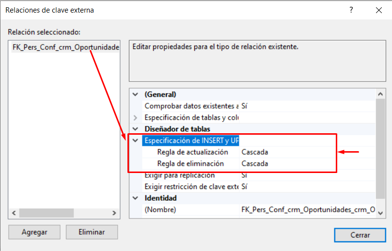
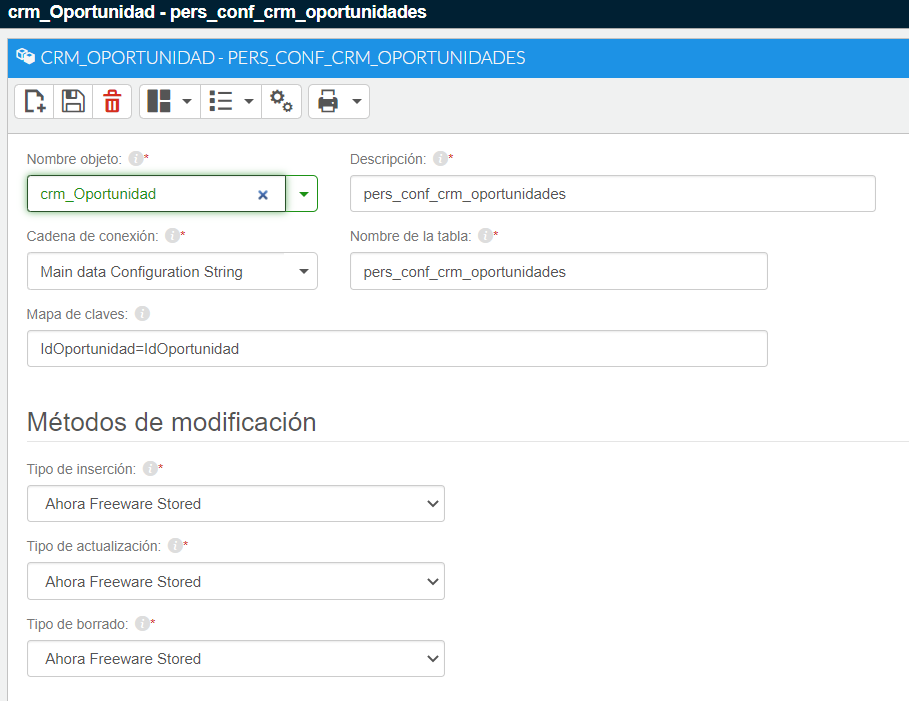

# Añadir campos personalizados al formulario de edición de oportunidad

Para añadir campos personalizados al formulario de edición oportunidades, así como a cualquier otro objeto de la aplicación, es necesario aplicar las reglas de personalización del modelo de datos de AHORA FREEWARE ERP.

Al final de este post se incluye un vídeo explicativo.

  

__Esta guía se aplica cuando los campos que queremos añadir, no existen en la tabla principal del objeto. O sea, queremos añadir campos nuevos/personalizados que no están presentes en tabla y queremos que la información se almacene igualmente.__

 

Debemos seguir los siguientes pasos:

  

## 1- Crear la tabla de campos configurables o también llamada tabla adicional.

Esta será la tabla donde crearemos los campos personalizados o también llamados campos configurables. Nunca añadiremos campos a la tabla principal del objeto, ya que dejaría de funcionar el CRUD del objeto, además de que éstos campos se perderían con cualquier actualización del ERP. La tabla debe tener la misma clave que la tabla principal del objeto, y todos los campos que vayamos a añadir deben tener el prefijo "Pers_"

Ésta debe tener una relación (foreign key) con crm_Oportunidades con una regla de actualización y eliminación en cascada

Nuestra tabla se llamará Pers_Conf_crm_Oportunidades y la crearemos vía scripting desde el Management Studio de SQL Server.

  

Vemos cómo deberíamos de llamar a los campos que creamos, aplicando el prefijo Pers_. Como muestra el siguiente ejemplo. Importante: Los campos añadidos deben permitir valores nulos.

  

    
    

```sql
CREATE TABLE [dbo].[Pers_Conf_crm_Oportunidades](Como instalar el CRM de Flexygo.md)WITH (PAD_INDEX = OFF, STATISTICS_NORECOMPUTE = OFF, IGNORE_DUP_KEY = OFF, ALLOW_ROW_LOCKS = ON, ALLOW_PAGE_LOCKS = ON) ON [PRIMARY]
    ) ON [PRIMARY]
    
    GO
```
```sql
    ALTER TABLE [dbo].[Pers_Conf_crm_Oportunidades]  WITH CHECK ADD  CONSTRAINT [FK_Pers_Conf_crm_Oportunidades_crm_Oportunidades] FOREIGN KEY([IdOportunidad])
    REFERENCES [dbo].[crm_Oportunidades] ([IdOportunidad])
    ON UPDATE CASCADE
    ON DELETE CASCADE
    GO
```

```sql
ALTER TABLE [dbo].[Pers_Conf_crm_Oportunidades] CHECK CONSTRAINT [FK_Pers_Conf_crm_Oportunidades_crm_Oportunidades]
    GO
    zPermisos Pers_Conf_crm_Oportunidades
    GO
```

Además, debemos percatarnos de que todos los registros de la tabla principal tengan su homólogo correspondiente en la tabla de configurables. 

Así que debemos pasar el siguiente script.

  

    
    


```sql
    -- Añadir todos los registros a la tabla de campos configurables

INSERT INTO Pers_Conf_crm_Oportunidades (IdOportunidad) Select IdOportunidad FROM crm_Oportunidades
```
  

## 2- A la tabla de crm_Oportunidades debemos añadirle un trigger personalizado que inserte los registros en la tabla de configurables.
    
```sql
    CREATE Trigger [dbo].[Pers_crm_Oportunidades_ITrig]
    ON [dbo].[crm_Oportunidades]
    FOR INSERT
    AS
        IF EXISTS(SELECT 1 FROM inserted) BEGIN

            Insert into pers_conf_crm_Oportunidades (IdOportunidad) Select IdOportunidad from inserted
        END
    GO
```
  

## 3- La tabla adicional debe llevar las reglas del modelo de datos del ERP: Ahora Freeware Stored.

Así que entraremos en el CRM en modo modo administrador, y en el apartado de Objetos, entraremos en tablas adicionales para crear la siguiente entrada:

  



  

## 5- Recargar caché y recargar la aplicación.

Debemos recargar la caché y volver a reiniciar la aplicación para que los cambios surtan efecto.

  

## 6- Añadir los campos al formulario de edición

  

Entraremos en el modo edición del formulario en cuestión y añadiremos el campo personalizado, para posteriormente definir su configuración y comportamiento.

También podríamos añadir los campos personalizados desde el propio entorno de flexygo, siempre indicando que los campos se deben añadir en la tabla adicional. Nunca en la tabla principal del objeto, ya que ésta pertenece al estándar ERP.

  

 

Para más información, consulta el siguiente vídeo: