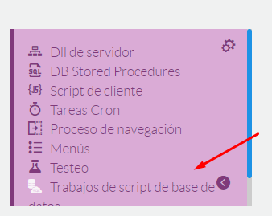
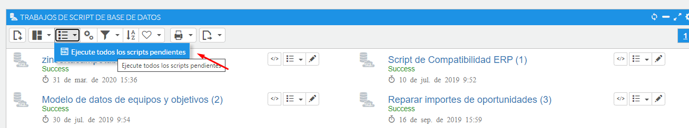

# Error al trasladar el CRM al servidor de producción del Cliente

Situación : preparamos/configuramos un Crm by Flexgo en una máquina de desarrollo para un cliente, instalamos el crm en producción contra la base de datos de configuración que acabamos de "migrar".

  

Errores : En el arranque obtenemos errores relativos a diversos objetos y tablas.

  

Motivo : en una instalación al uso, tras instalar y acceder, la aplicación automáticamente ejecuta una serie de scripts en la base de datos del ERP, y estos scripts quedan marcados como ejecutados, con lo cual al trasladar la base de datos de configuración sobre otra base de datos ERP no se volverán a ejecutar.

  

Resolución : forzaremos la ejecución de los script jobs siguiendo los pasos que comentaremos a continuación.

  

1. - Acceso a los script jobs: Modo Desarrollo -> Area de Diseño -> Logica y Reglas -> Trabajos de script de base de datos....

  

  

1. - Editar todos los trabajos y poner en estado pendiente. Se puede hacer editando cada uno de los trabajos y cambiándole el estado ( lo puedes hacer también en base de datos de configuración con la siguiente instrucción sql "update Scripts_Jobs set State='P' ).

  

2. - Ejecutar el proceso "Ejecutar todos los scripts pendientes"

  

  

Con estos pasos tendría que ser suficiente para solventar cada uno de los errores.