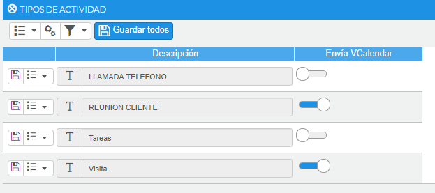

# Sincronización con la agenda de mi cuenta de correo

CRM by flexygo permite generar _entradas en la agenda_ de la cuenta de correo del empleado asignado a ella. 

  

Cuando generamos una acción, el sistema envía un correo al empleado asignado, creando una entrada en la agenda. Ya sea una cuenta de outlook, GMail (creando un elemento en google calendar) o cualquier otra cuenta compatible con vCalendar.

  

Ésto lo consigue mediante el envío de un correo con un archivo adjunto de tipo vCalendar. 

  

## ¿Cómo funciona?

\- Generando una acción que admita el envío de vCalendar

  

¿Qué acciones permiten el envío de vCalendar?

\- Puede configurar las acciones que permiten el envío, yendo al menú Otros-Maestros-Actividad-Envío de VCalendar y activando la opción de envío de vCalendar.

  

## ¿Si modifico la entrada en mi calendario de google, se actualiza en el CRM?

\- No. La comunicación es unidireccional, desde el CRM hacia su cuenta.

  

Precondiciones

 _Cuenta de envío_ : Para que se pueda enviar el correo, primero debe de tener configurada una cuenta de correo de envío (SMTP) en el sistema. Ya sea, porque la ha informado a la hora de instalar la aplicación, o notificándola en el archivo web.config de la aplicación, en la entrada <mailSettings>

  

_Cuenta de destino_ : El empleado asociado a la acción debe tener, en su ficha, una dirección de correo válida.

  

  

## ¿Qué es un archivo vCalendar?

  

Los archivos vCalendar se usan para intercambiar información sobre citas y horarios con otras personas que no están en su grupo de trabajo u organización. También puede usarlos para programar citas con aquellos que usan un software de programación incompatible con el suyo.

Es compatible con programas como google calendar, outlook 2007 y superior, outlook express, apple iCal, entre otros.