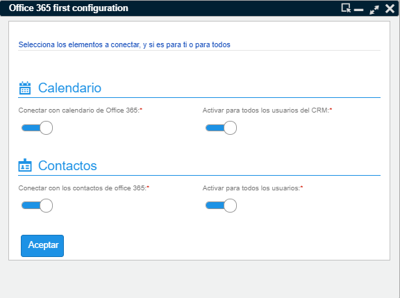
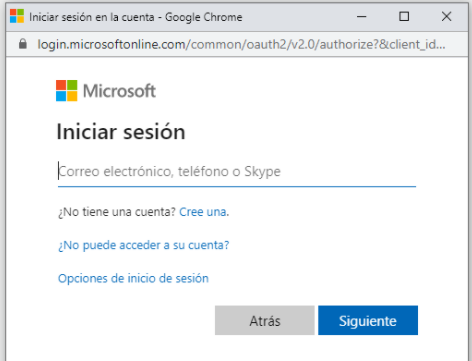
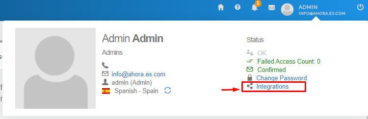
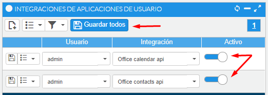
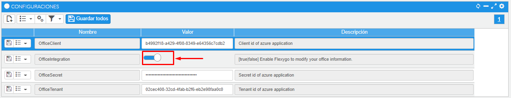
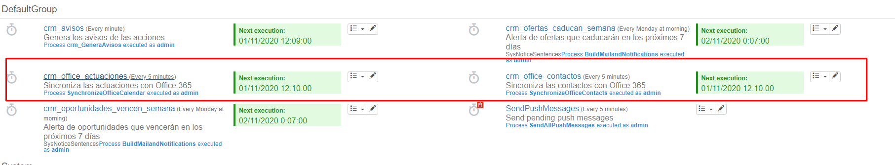

# Conector CRM - Office 365

Esta primera versión del conector permite enviar la actividad y los contactos a la cuenta de office 365 de todos y cada uno de los usuarios del CRM.

## Requisitos previos:

  Antes que nada, para que funcione la comunicación, el CRM debe estar alojado en un servidor con certificado de seguridad, de modo de tener que acceder mediante HTTPS

  

  * El usuario de la aplicación previamente debe disponer deuna cuenta de Office 365 y conocer sus credenciales de acceso, como nombre de usuario y contraseña.

## Cómo activar la conectividad con Office 365:

  * Un usuario con permisos de administrador será el encargado de activar esta nueva utilidad.
  * Se activa desde el menú otros – office 365 – Integrar aplicación. Donde abrirá una pantalla, como muestra la imagen a continuación, donde establecerá una primera configuración que hará una serie de cambios en la aplicación para que cada usuario pueda conectar su cuenta de office 365.

  
Los controles de la izquierda activan la funcionalidad por tipo de elemento: Calendario y Contactos. Mientras que los parámetros de la derecha habilitarán la conexión a office 365 para todos los usuarios.

 Cómo conectar con mi cuenta de Office 365

Una vez un administrador haya activado la funcionalidad, cada usuario podrá conectar su cuenta.

  * Debe acceder al menú Otros-Office365-Conectar mi cuenta.
  * A continuación, el sistema le pedirá que introduzca sus credenciales para conectar con su cuenta de Office 365. Si le abre 2 ventanas, tendrá que indicar la cuenta en ambas. De no visualizarlas, compruebe que no se hayan quedado ocultas detrás del navegador u otra ventana de aplicación que tenga abierta.

## Cómo enviar mis contactos a mi cuenta de Office 365

  * A medida que usted cree o modifique contactos, éstos se enviarán automáticamente a su cuenta. (*)
  * También dispone de una utilidad en el menú de procesos de cada contacto para enviarlo, o puede hacer una selección de contactos y enviarlos a su cuenta desde la opción de procesos de lista. (*)

## Cómo enviar la actividad al calendario de Office 365

  * A medida que usted genere o modifique acciones en el CRM, éstas se enviarán automáticamente a su calendario de office. (*)
  * En el caso de querer enviar toda la actividad desde una fecha determinada, tiene una opción en el menú Calendario – Exportar mis actuaciones a office 365. (*)
  * También dispone de una utilidad en el menú de procesos de cada acción para poder enviarla, o puede hacer una selección de acciones y enviarlas a su cuenta desde la opción de procesos de lista. (*)

El envío de datos a la cuenta de usuario de office 365 puede tardar un máximo de 5 minutos desde el momento en que se guarda o modifica el registro. Aunque el tiempo de sincronización puede cambiarse de acuerdo a la necesidad de la empresa.

## FAQ ¿Puedo desactivar el envío a office 365?

Si. Debes ir al acceso a tu perfil, en la esquina superior derecha, y hacer clic en la opción de integraciones. En la ventana que abre a continuación puedes desactivar los elementos que quieras dejar de enviar a tu cuenta y guardar los cambios.

A partir de aquí, el sistema dejará de enviar los elementos que haya seleccionado, pudiéndolo volver a activar en cualquier momento, desde el menú Otros-Office365-Conectar mi cuenta.

En el caso de ser un usuario administrador, tendrá acceso a la configuración de todos los usuarios de la aplicación.

## ¿Puedo desactivar la utilidad de integración con office 365?

Si. Un usuario con privilegios de administrador puede ir a los parámetros de la aplicación y desactivar la integración, mediante el parámetro “OfficeIntegration”.

## ¿Puedo cambiar el tiempo de sincronización?
Si. Un usuario administrador, puede acceder al cron job encargado de realizar la sincronización con las cuentas y cambiar el tiempo de espera.

Debe acceder al área de administración – Lógica y reglas – Tareas Cron. Entrar en la edición de las tareas crm_office_actuaciones y crm_office_contactos. Por defecto se ejecutan cada 5 minutos.

  

