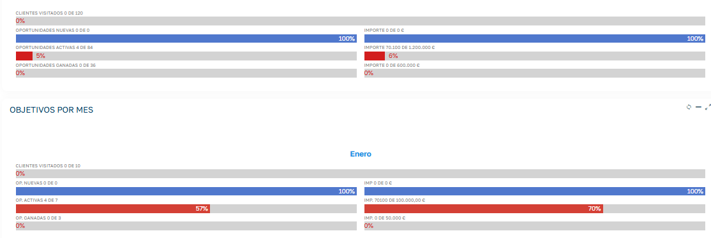

# ¿Sabías que en la aplicación CRM puedes establecer Objetivos?

Establecer objetivos a los comerciales te beneficia principalmente porque **alinea el esfuerzo del equipo con las metas financieras de tu empresa**, aumenta la motivación, y te proporciona métricas claras para evaluar el rendimiento de los mismos.

Dispones de un mantenimiento para dar de alta cada año y para cada comercial los objetivos a alcanzar, así como visualizar el estado actual de los mismos.

Podrás acceder desde el apartado Otros -> Objetivos.

